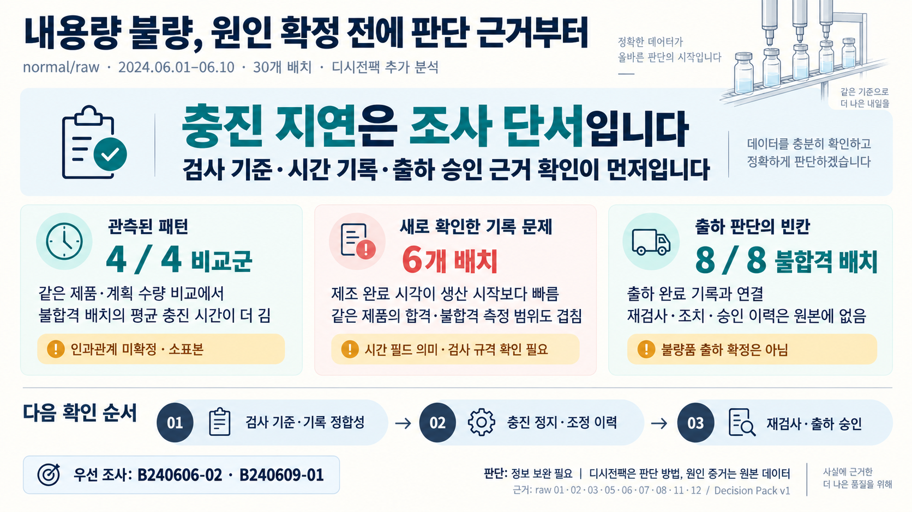
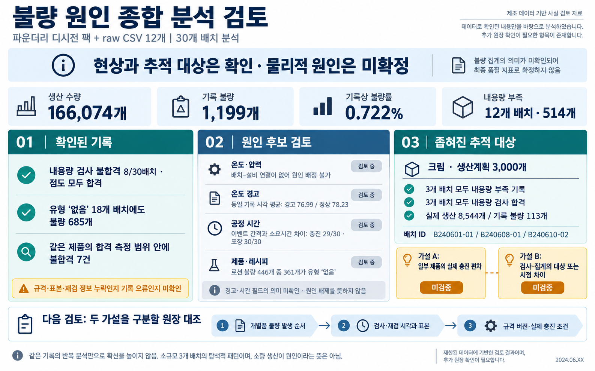
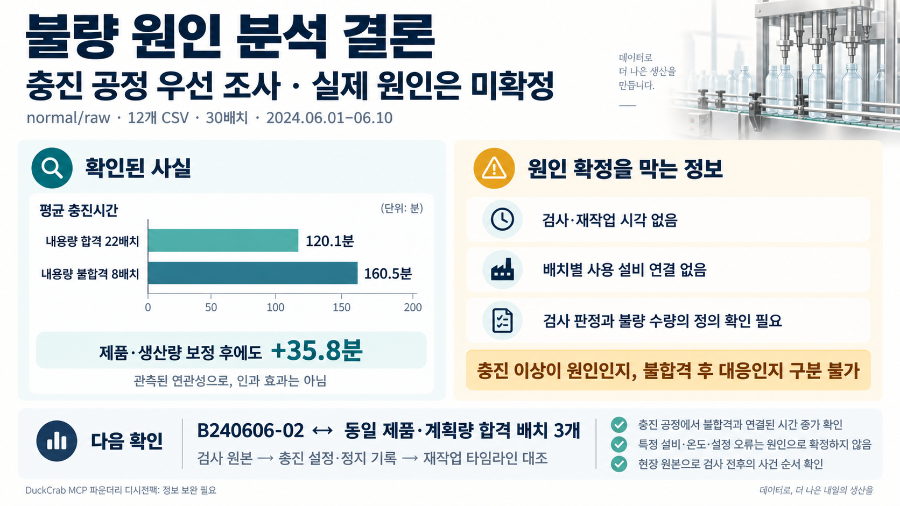
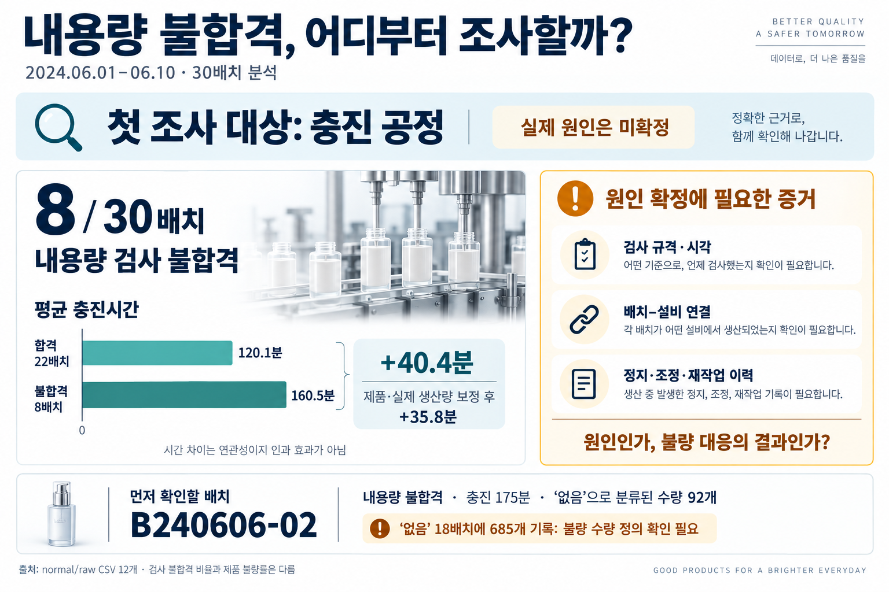
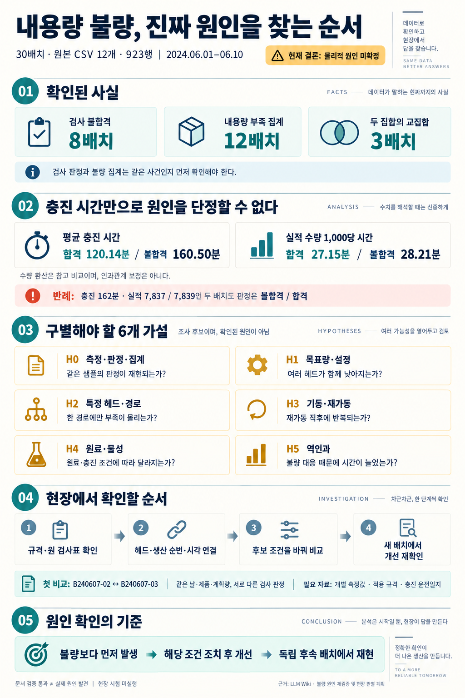
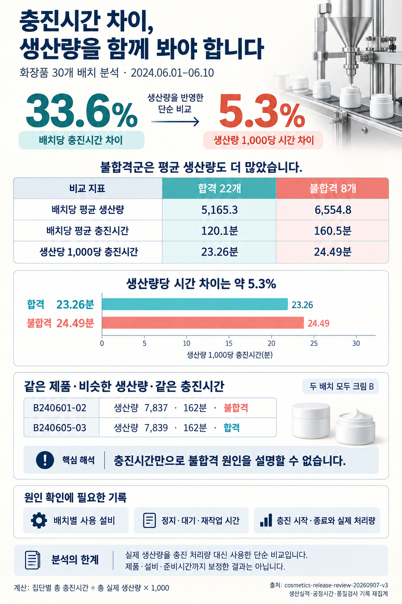
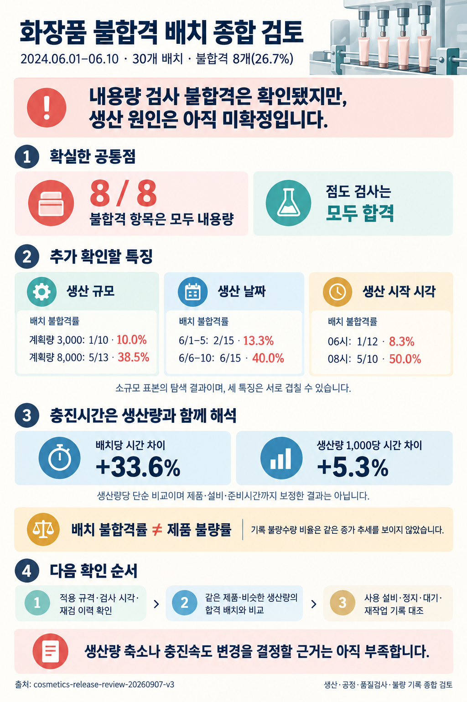

같은 화장품 생산 데이터를 분석해도, 어떤 지식과 분석 방식을 적용하느냐에 따라 결론에서 강조하는 내용이 달라질까요?

일반 분석에 디시전 팩을 더했을 때, 루프를 적용했을 때, LLM Wiki나 온톨로지로 분석했을 때의 결론을 각각 이미지로 정리했습니다. 아래는 그 일곱 결과입니다. 각 이미지가 무엇을 먼저 확인하고, 어떤 근거로 조사 대상을 좁히며, 어디까지 결론을 내리는지 비교해 보면 차이가 드러납니다.

## 그냥 분석 + 디시전 팩

충진 지연을 원인으로 확정하기 전에 검사 기준, 시간 기록, 출하 승인 근거부터 확인하자는 결론입니다. 관측된 패턴과 기록의 문제, 출하 판단에 필요한 정보를 나누고 확인 순서를 제시합니다.

## 디시전 팩만 사용

생산·불량 수량과 검사 기록을 종합한 뒤, 온도·압력·공정 시간·제품별 원인 후보를 검토합니다. 물리적 원인은 미확정으로 남겨두고 실제 충진 편차와 검사·집계의 차이를 구별할 원장 대조를 다음 과제로 잡습니다.

## 디시전팩 + 루프

합격·불합격 배치의 충진시간 차이를 근거로 충진 공정을 우선 조사 대상으로 좁힙니다. 동시에 충진 이상이 불량의 원인인지, 불합격에 대응하느라 시간이 늘어난 것인지 구분할 정보가 부족하다고 명시합니다.

## 루프 엔지니어링

충진 공정을 먼저 조사한다는 결론을 현장에서 확인할 항목으로 풀어냅니다. 검사 규격·시각, 배치와 설비의 연결, 정지·조정·재작업 이력을 제시하고 먼저 확인할 배치도 지정합니다.

## llm wiki 분석

검사 불합격과 내용량 부족 집계를 구분하고, 충진시간만으로 원인을 단정하기 어려운 반례를 제시합니다. 측정·판정, 설정, 충진 경로, 재가동, 원료·물성, 역인과로 가설을 나눠 무엇을 확인해야 가설을 구별할 수 있는지 전개합니다.

## 데이터팩 온톨로지 분석

충진시간 차이를 생산량과 함께 해석하는 데 초점을 둡니다. 배치당 시간 차이와 생산량 1,000개당 시간 차이를 나란히 놓고, 비슷한 생산량과 같은 충진시간에도 검사 판정이 달라지는 사례를 제시합니다. 생산량 환산 역시 인과관계를 확정하는 분석은 아니라는 한계를 남깁니다.

## 온톨로지화 + 루프 분석

불합격 배치의 공통점을 확인하고 생산 규모·날짜·시작 시각의 특징까지 함께 살펴봅니다. 충진시간은 생산량과 함께 해석하고, 배치 불합격률과 제품 불량률을 구분합니다. 마지막에는 생산량 축소나 충진속도 변경을 결정할 근거가 아직 부족하다고 정리합니다.

## 나란히 놓고 보면

디시전 팩을 적용한 결과에서는 판단 근거와 기록의 빈칸이, 루프를 적용한 결과에서는 우선 조사 대상과 다음 확인 순서가 눈에 들어옵니다. LLM Wiki 결과는 가설과 반례를 펼쳐 보이고, 데이터팩 온톨로지 결과는 생산량을 반영했을 때 달라지는 시간 비교에 집중합니다. 온톨로지화와 루프를 함께 적용한 결과는 여러 특징을 종합하면서 실제 조치를 결정할 수 있는 범위를 구분합니다.

일곱 이미지 모두 실제 원인은 미확정으로 남겨둡니다. 이 결과물만으로 어느 방식의 정확도가 더 높다고 단정할 수는 없습니다. 비교할 지점은 **결론을 얼마나 강하게 말했느냐보다, 다음에 무엇을 확인해야 하는지가 얼마나 구체적으로 달라졌느냐**입니다.
