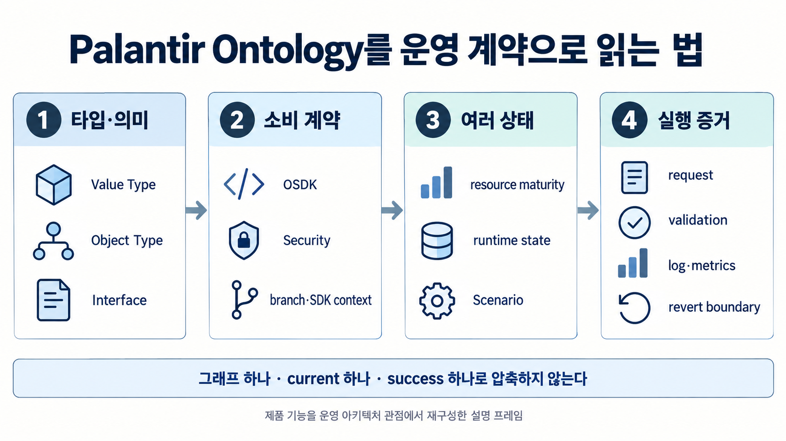
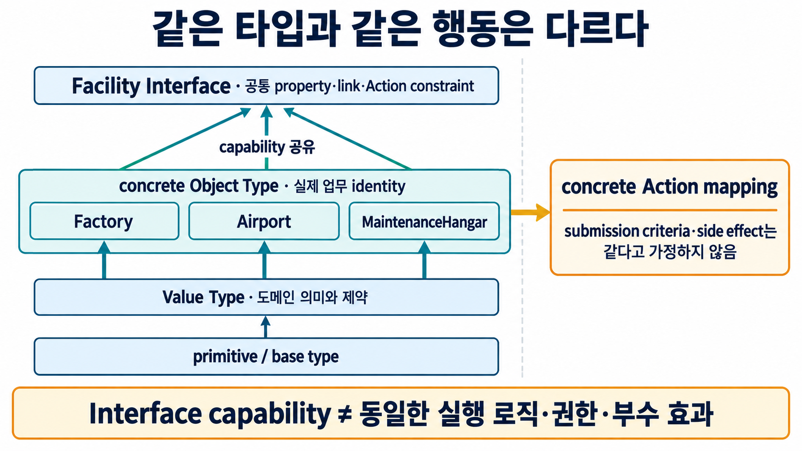
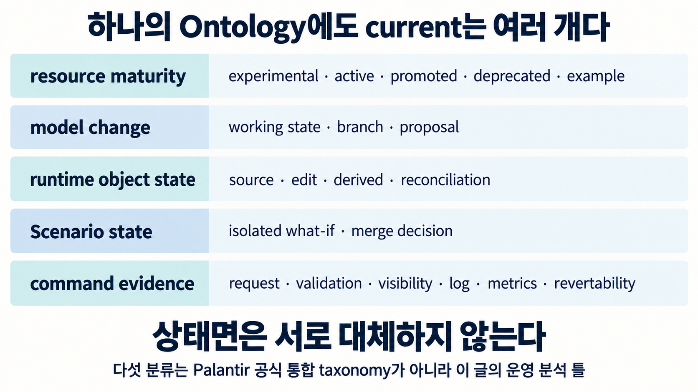
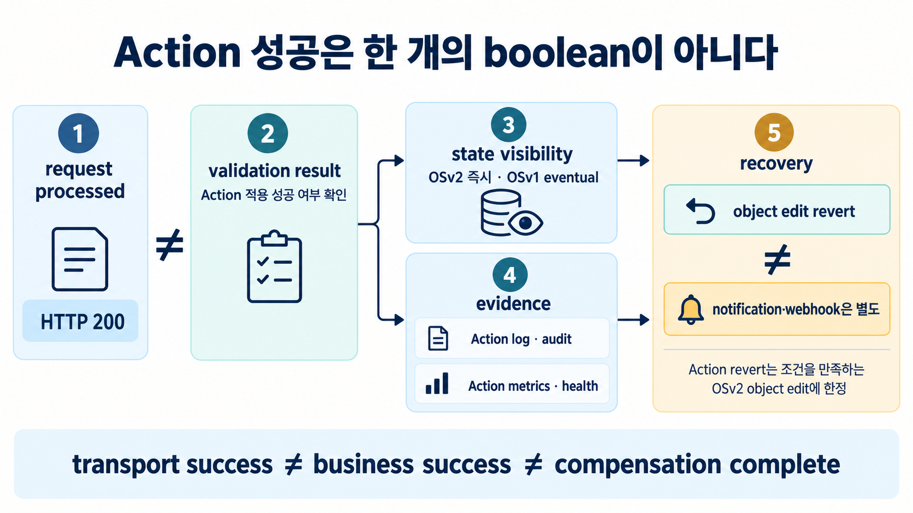

공장 설비를 다루는 세 애플리케이션이 있다고 가정해 보겠습니다. 정비 앱에는 `Factory`, 공항 시설 앱에는 `Airport`, 창고 앱에는 `MaintenanceHangar`가 있고 셋 모두 이름과 위치를 가지며 정비 일정을 잡을 수 있습니다. 사람에게는 모두 “시설”로 보이지만 Agent에게 `이 시설의 정비를 예약해`라고 시키는 순간 질문이 달라집니다. 어떤 타입을 같은 종류로 취급해도 되는지, 호출 가능한 Action은 무엇인지, 그 Action이 지금 운영에서 믿을 수 있는 상태인지까지 코드가 알아야 하기 때문입니다.

그래프에 세 객체를 `Facility`와 연결하는 것만으로 이 문제는 끝나지 않습니다. 공통 속성과 능력을 어떤 계약으로 묶을지, 그 계약을 앱과 SDK가 어떻게 소비할지, 실험 중인 타입과 운영 중인 타입을 어떻게 구분할지, 가상 시나리오에서 허용한 변경을 본 운영에도 허용할지를 각각 정해야 합니다. Palantir Ontology에는 같은 도메인 모델을 여러 사용자·앱·Agent가 어떤 상태와 권한에서 재사용할지 관리하는 운영 기능이 함께 붙습니다.

> [!summary] 그래프보다 넓은 계약
> Palantir Ontology는 여기서 공식 제품 정의가 아니라 **shared operational domain/API contract**라는 분석 프레임으로 다룹니다. Value Type·Object Type·Interface가 의미와 capability를 만들고, OSDK와 Security가 소비 경계를 만들며, resource status·branch·Scenario·runtime state·Action 결과가 “지금 무엇을 믿어도 되는가”를 서로 다른 상태로 나눕니다.

## 같은 객체를 묶는 것보다 같은 계약을 묶는 일이 어렵습니다

Foundry Ontology의 Object·Property·Link·Action·Function·Security를 한 그림에 놓으면 “같은 업무 객체를 여러 시스템이 공유할 수 있는가”라는 질문이 먼저 보입니다. [[notes/온톨로지/opencrab-foundry-ontology-reinterpretation|OpenCrab과 팔란티어 Foundry를 비교한 글]]이 이 큰 경계를 다뤘다면, 운영에서는 한 단계 더 구체적인 문제가 생깁니다. 같은 업무 객체를 찾은 뒤에도 서로 다른 애플리케이션이 **어떤 속성과 행동을 공통 계약으로 믿어도 되는가**를 정해야 합니다.

Palantir의 현재 공식 문서는 Ontology를 조직의 디지털 자산을 현실의 객체와 연결하는 운영 계층으로 설명하며, semantic elements인 objects·properties·links와 kinetic elements인 actions·functions·dynamic security를 함께 둡니다. ([Ontology overview](https://www.palantir.com/docs/foundry/ontology/overview)) 이 설명만으로 Ontology를 일반적인 프로그래밍 언어의 타입 시스템이라고 부를 수는 없습니다. 다만 애플리케이션 아키텍처 관점에서는 데이터 스키마보다 넓은 **도메인 계약**으로 읽을 근거가 생깁니다.

그 계약의 아래쪽에는 Value Type이 있습니다. Value Type은 문자열이나 정수 같은 기본 타입 위에 도메인 의미와 검증 제약을 붙여 같은 space 안에서 여러 property가 재사용할 수 있는 타입입니다. 이메일 주소나 조직 내부 식별자처럼 같은 의미를 반복해서 쓰는 값을 property마다 제각각 정의하지 않고 공통 타입으로 묶을 수 있습니다. ([Value types overview](https://www.palantir.com/docs/foundry/object-link-types/value-types-overview), [Value type versions](https://www.palantir.com/docs/foundry/object-link-types/value-types-versions))

그 위에는 실제 업무 정체성을 가진 Object Type이 있고, 여러 Object Type이 공통으로 구현할 수 있는 Interface가 있습니다. 이 계층을 아주 단순화하면 다음과 같습니다.

```text
primitive / base type
        ↓
Value Type
도메인 scalar + 재사용 제약
        ↓
Object Type
실제 업무 identity + backing data
        ↓
Interface
여러 concrete type이 공유하는 capability contract
```



## Interface를 붙였다고 행동까지 같아지는 것은 아닙니다

처음에는 Interface가 문제를 거의 해결한 것처럼 보입니다. Palantir의 Interface는 데이터셋에 직접 연결되는 concrete type이 아니라 여러 Object Type이 구현할 수 있는 추상 Ontology type입니다. 구현하는 Object Type은 Interface가 요구하는 property·link·Action constraint를 자기 concrete resource에 매핑합니다. 예를 들어 `Airport`, `Factory`, `MaintenanceHangar`가 모두 `Facility`를 구현한다면 지원하는 제품 표면에서는 공통 Interface를 기준으로 이들을 다룰 수 있습니다. ([Interfaces overview](https://www.palantir.com/docs/foundry/interfaces/interface-overview), [Implement an interface](https://www.palantir.com/docs/foundry/interfaces/implement-interface))

하지만 여기에서 한 번 더 멈춰야 합니다. Interface의 Action type constraint는 “이 capability를 구현하려면 어떤 Action shape가 있어야 하는가”를 표현하지만, 각 concrete Action의 실행 로직과 submission criteria, side effect까지 동일하게 만들어 주지는 않습니다. OSDK에서도 Interface constraint 자체를 곧바로 실행하는 것이 아니라 concrete Object Type에 매핑된 Action을 해석해야 합니다. ([Interface action type constraints](https://www.palantir.com/docs/foundry/interfaces/interface-action-type-constraints))

따라서 `Facility`에 `scheduleMaintenance`라는 capability가 있다는 사실은 “모든 Facility가 같은 사람에게 같은 조건으로 같은 부수 효과를 내며 정비를 예약한다”는 뜻이 아닙니다. 공항과 공장의 승인 규칙이 다를 수 있고, 한쪽 Action만 외부 알림을 보낼 수도 있습니다. **공통 capability는 호출 가능한 모양을 공유하게 해 주지만, concrete behavior 전체를 하나로 압축하지 않습니다.** 이 경계를 놓치면 Interface를 발견한 Agent가 실제 권한과 실행 조건까지 이미 해결됐다고 오해하기 쉽습니다.

## Ontology가 코드의 계약이 되는 순간은 OSDK에서 더 선명해집니다

도메인 모델이 문서에만 있다면 사람은 읽을 수 있어도 애플리케이션이 안정적으로 의존하기 어렵습니다. Palantir Developer Console에서는 애플리케이션이 사용할 Ontology resource를 고르고 OSDK package를 생성하며, 선택한 entity는 generated language bindings와 기본 애플리케이션 접근 범위에 연결됩니다. ([Create a new application](https://www.palantir.com/docs/foundry/developer-console/create-application)) 이 지점에서 Ontology 정의는 화면에 그리는 모델을 넘어 코드가 소비하는 API surface가 됩니다.

여기서도 두 번째로 그럴듯한 성공 장면이 나옵니다. Ontology metadata를 한 번 받아 두면 현재 계약 전체를 저장했다고 생각하기 쉽습니다. 그러나 현재 `fullMetadata` API는 preview이며 OSDK workflow를 위해 objects·links·actions·queries·interfaces·value types 등을 한 요청에 최대한 많이 돌려주도록 설계됐지만, 일부 entity를 생략하고도 요청 자체는 성공할 수 있다고 문서화돼 있습니다. branch 역시 별도 query parameter로 들어갑니다. ([Get Ontology Full Metadata](https://www.palantir.com/docs/foundry/api/ontologies-v2-resources/ontologies/get-ontology-full-metadata))

그래서 machine-readable metadata를 운영 계약의 스냅샷으로 쓸 때는 응답 성공 여부만 남기기보다 **어느 branch와 consumer SDK 맥락을 봤는지, 응답이 완전하다고 가정해도 되는지**를 따로 기록하는 편이 안전합니다. `metadata response success = complete portable snapshot`이라고 놓으면 API는 성공했는데 필요한 타입 하나가 빠진 상태를 같은 것으로 취급할 수 있습니다.

## 하나의 Ontology에도 하나의 “현재”만 있는 것은 아닙니다

타입과 API 계약을 정리하고 나면 더 까다로운 문제가 나타납니다. “지금 이 Ontology가 어떤 상태인가?”라는 질문에 한 개의 버전 번호만 답하면 충분할까요? 현재 Palantir 제품 표면을 운영 관점에서 분해하면 적어도 resource maturity, model change, runtime object state, Scenario state, command evidence라는 서로 다른 상태면을 따로 보는 편이 설명력이 높습니다. 이 다섯 분류는 Palantir가 제시한 공식 통합 taxonomy가 아니라 여러 공식 기능을 한 운영 프레임으로 재배치한 해석입니다.

```text
resource maturity
experimental · active · promoted · deprecated · example

model change
working state · branch · proposal

runtime object state
source-backed · user edit · edit-only · derived · reconciliation

scenario state
isolated what-if edits · merge decision

command evidence
request · validation · visibility · log · metrics · revertability
```



Resource status만 봐도 schema가 존재한다는 사실과 운영에서 의존해도 된다는 판단은 다릅니다. 현재 공식 문서에서 새 Ontology resource는 기본적으로 `experimental`이며, `active`는 사용자 애플리케이션에서 실제로 의존하는 resource라는 신호와 함께 삭제나 API name 변경 같은 파괴적 작업을 제한합니다. Object Type에는 더 높은 신뢰와 중앙 관리 의미를 가진 `promoted` 상태도 있습니다. ([Metadata statuses](https://www.palantir.com/docs/foundry/object-link-types/metadata-statuses))

상태는 단순 라벨이 아니라 dependency와도 연결됩니다. Object Type이나 foreign-key property가 `experimental`·`deprecated` 등으로 내려가면 관련 Link Type도 유효하지 않은 production 상태를 피하도록 함께 조정될 수 있습니다. 반대로 property를 `active`로 올렸다고 dependent Link Type이 자동으로 `active`가 되지는 않습니다. 아래쪽 dependency가 준비됐다는 사실과 위쪽 계약을 운영 승격했다는 판단을 같은 사건으로 보지 않는 셈입니다.

## Branch와 Scenario는 모두 격리하지만 격리하는 것이 다릅니다

“운영에 바로 반영하지 않고 먼저 시험한다”는 말도 하나의 기능처럼 들리지만, 현재 문서에서는 Global Branching과 Ontology Scenario가 다른 변경을 격리합니다. Global Branching은 builder가 disruptive한 end-to-end workflow나 schema 변경을 개발·시험하는 표면이고, Ontology Scenario는 사람과 Agent가 main 데이터를 건드리지 않고 Action을 적용해 보는 what-if sandbox입니다. Scenario는 과거 시점의 snapshot을 꺼내는 data-versioning 도구가 아니며 현재 Beta입니다. 기본 TTL은 30일이고 base 위로 10분마다 auto-rebase됩니다. ([Ontology scenarios](https://www.palantir.com/docs/foundry/ontology/overview-ontology-scenario))

이 차이는 Agent 권한을 설계할 때 특히 중요합니다. Scenario 안에서는 더 완화된 submission criteria로 Action을 시험하게 하면서 main Ontology에 같은 Action을 적용할 권한은 주지 않을 수 있습니다. Scenario의 결과를 main에 반영하는 일은 별도 merge Action의 submission criteria로 통제됩니다. 즉 `Scenario에서 실행 가능`과 `production 변경 가능`, `시나리오가 유용했다`와 `merge가 승인됐다`는 서로 다른 판단입니다.

이 구조를 일반화하면 Agent 평가 환경과 실제 운영 변경 권한을 분리하는 설계가 보입니다. Agent가 여러 what-if를 계산하고 추천하는 것은 허용하면서 그 결과를 실제 상태로 병합하는 명령은 다른 주체와 정책이 맡게 할 수 있습니다. 다만 Scenario가 Beta라는 점과 실제 tenant에서의 운영 비용·안전 효과를 이 글에서 측정하지 않았다는 점 때문에, 이 구조를 곧바로 “Agent 변경이 안전해진다”는 성과 주장으로 확대해서는 안 됩니다.

## HTTP 200을 받았는데 Action이 성공하지 않았을 수 있습니다

운영 계약의 마지막 구간은 명령 이후의 증거입니다. 현재 Ontologies v2 `Apply Action` API는 HTTP 200이 request가 서버에 도착해 처리됐다는 뜻일 뿐이고, 실제 Action 적용 성공 여부는 response의 validation result를 확인해야 한다고 명시합니다. Object Storage v2의 edit는 Action 완료 뒤 즉시 보이지만 Object Storage v1은 eventual consistency일 수 있다는 차이도 함께 문서화돼 있습니다. ([Apply Action](https://www.palantir.com/docs/foundry/api/ontologies-v2-resources/actions/apply-action))

여기서 `성공`을 하나의 boolean으로 만들면 여러 층이 섞입니다. 전송은 성공했지만 business validation이 실패할 수 있고, Action이 적용됐지만 아직 state observation 조건이 다를 수 있으며, 나중에 되돌릴 수 있는지와 외부 side effect를 보상할 수 있는지도 별개입니다. 이 때문에 Action을 named governed mutation boundary라고 부를 수는 있어도 모든 외부 효과까지 하나의 범용 transaction으로 보는 것은 과합니다.

Action revert가 그 경계를 잘 보여 줍니다. 현재 문서에서 revert는 Object Storage v2의 조건을 만족하는 object edit를 되돌릴 수 있지만, 이후 다른 edit가 생기면 실패할 수 있고 notification이나 webhook 같은 side effect는 되돌리지 않습니다. ([Undo or revert Actions](https://www.palantir.com/docs/foundry/action-types/action-reverts)) 코드에서 상태를 되돌린 것과 이미 외부로 나간 업무 효과를 취소한 것이 다르다는 점은 [[notes/온톨로지/palantir-apollo-operating-change|Apollo의 소프트웨어 롤백과 업무 복구]]에서 살펴본 경계와도 이어집니다.



Action log와 metrics도 같은 영수증이 아닙니다. Action log는 성공한 submission과 관련 context를 Ontology Object로 남기는 감사·결정 기록에 가깝고, Action metrics는 성공·실패 수와 failure category, P95 실행 시간 같은 운영 health를 추적합니다. 공식 문서는 metrics가 action log 없이도 존재할 수 있다고 설명합니다. ([Action log](https://www.palantir.com/docs/foundry/action-types/action-log), [Action metrics](https://www.palantir.com/docs/foundry/action-types/action-metrics)) 한 번의 의사결정 기록이 남았다는 사실과 해당 Action Type이 시간에 걸쳐 건강하게 동작한다는 증거는 다릅니다.

## OWL의 형식 의미론과 경쟁하는 개념은 아닙니다

여기까지 오면 Palantir Ontology를 “OWL보다 더 실용적인 온톨로지”처럼 비교하고 싶어질 수 있습니다. 하지만 둘은 같은 책임을 두고 경쟁한다고 보기 어렵습니다. W3C OWL 2의 중심은 형식 의미론과 entailment, consistency 같은 논리적 해석에 있고, Palantir Ontology의 제품 표면은 business identity·data binding·capability·governed command·security·mutable runtime state·application API를 함께 운영하는 데 초점을 둡니다. ([OWL 2 Direct Semantics](https://www.w3.org/TR/owl2-direct-semantics/))

```text
formal ontology contract
semantics · entailment · consistency

operational domain/API contract
identity · capability · command · authorization · state · consumer API
```

RDF/OWL도 update 계층과 결합할 수 있고, 형식 온톨로지 위에 권한과 command API를 설계할 수 있습니다. Palantir Ontology에 형식 의미론이 필요 없다는 뜻도 아닙니다. 차이는 무엇을 **first-class 책임**으로 제공하는가에 있습니다. [[notes/온톨로지/shacl-pass-validation-boundary|SHACL PASS의 검증 경계]]가 형식 검증 결과의 범위를 좁혀 읽는다면, 운영 계약은 그 바깥에서 상태와 실행 증거를 추가로 다뤄야 합니다.

## 팔란티어 없이 가져간다면 무엇을 남겨야 할까요

특정 제품을 쓰지 않더라도 이 구조에서 가져갈 수 있는 설계 질문은 꽤 구체적입니다. 먼저 primitive field와 domain scalar를 구분하고, 실제 business identity를 가진 concrete type을 정한 뒤, 여러 타입이 공통으로 약속할 capability를 따로 선언합니다. 그 다음에는 consumer가 어떤 schema/branch/version을 바라보는지, resource가 실험 상태인지 운영 상태인지, 사용자·Agent의 what-if와 production mutation을 어디서 나눌지를 기록해야 합니다.

명령을 실행하는 순간에는 더 많은 영수증이 필요합니다. `request accepted`, `business validation passed`, `state visible`, `audit log recorded`, `health metric observed`, `revert possible`, `external side effect compensated`를 하나의 `success=true`로 접지 않는 편이 좋습니다. 모든 시스템에 이 필드가 필요한 것은 아니지만 장애가 났을 때 “무엇까지 성공했고 어디부터 실패했는가”를 다시 계산할 수 있어야 합니다.

그리고 가장 중요한 질문은 하나입니다. **지금 소비자가 믿는 ‘현재’는 정확히 어느 상태의 현재인가?** promoted resource를 보고 있는지, 특정 branch를 보고 있는지, Scenario 안의 가상 상태인지, source와 operator edit가 합쳐진 runtime state인지, 최근 Action 한 건의 성공인지 장기간의 health인지 구분되지 않는다면 “Ontology가 현재 상태를 보여 준다”는 문장은 너무 많은 것을 한꺼번에 말합니다.

Palantir의 현재 문서들을 이 관점으로 읽으면 Ontology는 지식그래프에 Action을 하나 붙인 구조라기보다, **도메인 타입과 capability, 변경 명령, 여러 상태의 수명주기, 소비자 API와 실행 증거를 같은 조직 모델 주변에 결속하는 운영 계약**에 가깝습니다. 이것은 Palantir의 공식 정의를 그대로 옮긴 문장이 아니라 제품 표면을 운영 아키텍처 관점에서 종합한 해석입니다. 실제 tenant에서 Interface·Scenario·OSDK·Action failure/revert를 재현하거나 성능·ROI를 측정한 결과도 아니므로, 기능 계약과 효과 증거는 계속 분리해 읽어야 합니다.

## 관련 글

[[notes/온톨로지/opencrab-foundry-ontology-reinterpretation|같은 온톨로지, 다른 책임: OpenCrab과 Palantir Foundry]]

[[notes/온톨로지/palantir-foundry-aip-operational-loop|팔란티어 AIP는 왜 기업용 챗봇이 아닌가]]

[[notes/온톨로지/shacl-pass-validation-boundary|SHACL PASS는 무엇을 증명하는가]]

[[notes/온톨로지/palantir-apollo-operating-change|팔란티어 Apollo는 운영의 변경을 어떻게 다루는가]]
