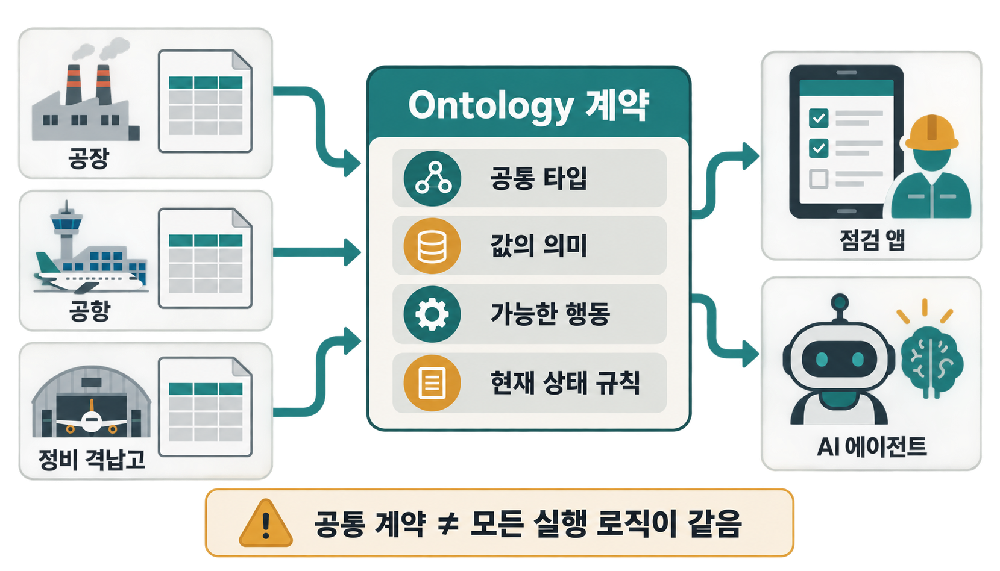
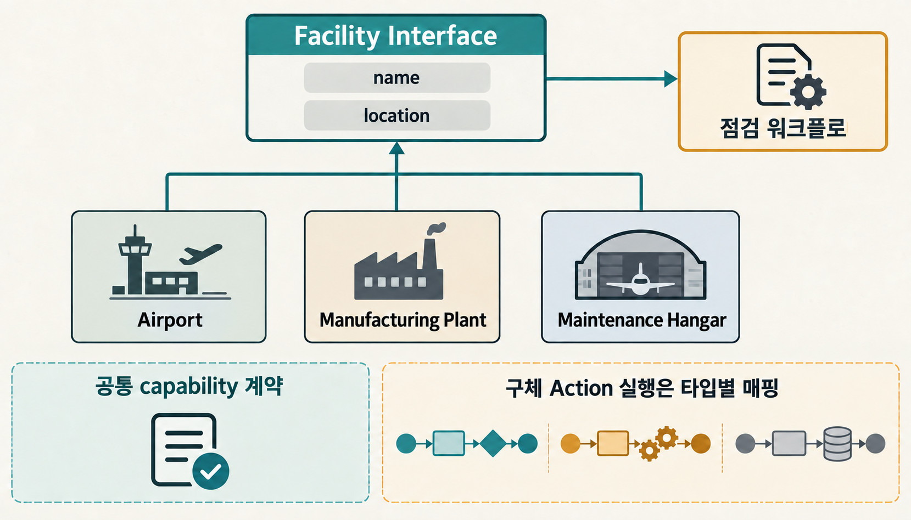
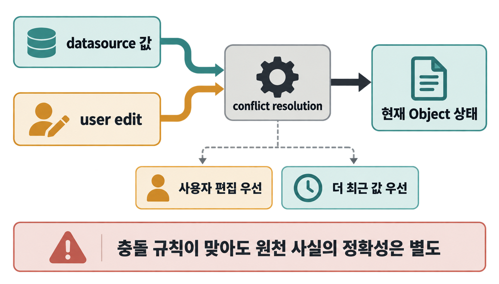
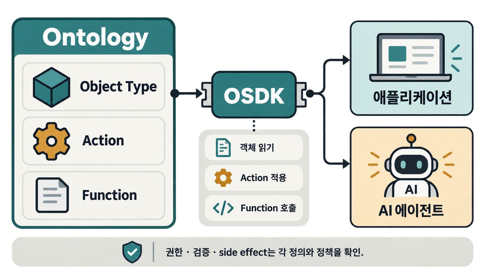

공장 점검 앱과 창고 점검 앱을 따로 만들었는데, 같은 질문에 서로 다른 이름과 규칙으로 답한다면 어떨까요? 여기에 AI 에이전트까지 붙으면 문제는 더 커집니다. 한 시스템은 `시설`, 다른 시스템은 `사업장`, 또 다른 시스템은 데이터베이스의 테이블 이름만 알고 있다면 “점검이 필요한 시설을 찾아 예약하라”는 간단한 업무도 시스템마다 다시 번역해야 합니다.

Palantir의 Ontology는 이 간극을 줄이기 위한 **운영 계층**입니다. 공식 문서는 Ontology가 데이터셋·가상 테이블·모델 위에서 현실의 설비, 제품, 주문 같은 대상을 객체와 관계로 표현하고, 여기에 객체 상태를 바꾸는 업무 동작과 계산 로직, 접근 권한 같은 운영 요소를 연결한다고 설명합니다. 뒤에서는 상태를 바꾸는 이름 붙은 업무 동작을 `Action`, 계산 로직을 `Function`이라고 부르겠습니다. 처음 접한다면 “관계를 그리는 그래프”보다 **여러 앱과 사람이 같은 업무 대상과 가능한 행동을 공유하게 하는 층**이라고 이해하는 편이 쉽습니다. [Palantir Ontology 개요](https://www.palantir.com/docs/foundry/ontology/overview)

> [!summary] 지금 알아둘 핵심
> 그래프에 `시설 A가 공장 B에 있다`는 관계를 저장하는 것만으로는 여러 앱이 같은 업무를 수행하기 어렵습니다. Palantir Ontology는 여러 대상에서 공통으로 볼 속성, 값의 의미, 가능한 행동과 현재 상태의 결정 규칙을 함께 정의하고, 애플리케이션은 이 계약을 코드에서 재사용할 수 있습니다. 다만 같은 행동을 요청할 수 있다는 공통 규칙이 있다고 해서 실제 처리 로직, 권한, 후속 알림까지 같아지는 것은 아닙니다.

## 그래프를 그린 다음에 남는 문제가 있습니다

지식 그래프를 처음 배우면 객체와 관계부터 떠올리기 쉽습니다. `공장 → 보유한다 → 설비`, `설비 → 위치한다 → 구역`처럼 연결하면 흩어진 데이터보다 업무 맥락이 잘 보입니다. 이전 글에서도 Palantir Foundry의 Ontology를 Object·Property·Link·Action·Function 같은 구성요소로 나눠 살펴봤습니다. [[notes/온톨로지/opencrab-foundry-ontology-reinterpretation|Palantir Foundry의 Ontology를 OpenCrab 관점에서 다시 읽기]]

그런데 앱을 만드는 순간 질문이 바뀝니다. “무엇과 무엇이 연결되어 있는가?”뿐 아니라 “서로 다른 시설을 같은 종류의 대상으로 다룰 수 있는가?”, “점검 예약이라는 행동을 어떤 대상에서 호출할 수 있는가?”, “데이터 원본과 사용자가 수정한 값이 충돌하면 현재 값은 무엇인가?”가 필요합니다. 이 질문들은 그래프 모양만으로 해결되지 않습니다.

가상의 시설 운영 시스템을 생각해 보겠습니다. 여기서 Object Type은 `공장`, `공항`처럼 같은 종류의 업무 객체가 어떤 속성을 갖는지 정한 타입입니다. 공장, 공항, 정비 격납고를 각각 별도 Object Type으로 관리하면서도 점검 앱과 AI 에이전트는 모두 `Facility`라는 공통 관점으로 시설 이름과 위치를 읽고 싶습니다. 사용자가 “점검이 필요한 모든 시설을 보여줘”라고 했을 때 앱이 세 타입을 하나씩 하드코딩하지 않아도 되는 구조가 필요합니다. 이 예시는 설명을 위한 가상 업무 흐름이며 실제 고객 구축 사례가 아닙니다.

## Interface는 서로 다른 타입에 공통 얼굴을 붙입니다

Palantir 문서의 Interface 예시도 `Facility`에서 시작합니다. 여기서 Interface는 서로 다른 Object Type이 공통으로 제공할 속성과 기능의 틀을 적는 Ontology 타입입니다. 예를 들어 `Airport`, `Manufacturing Plant`, `Maintenance Hangar`가 모두 `Facility` Interface를 구현하면, 점검 워크플로는 세 타입의 내부 구조를 전부 알지 않아도 시설 이름과 위치처럼 약속된 공통 속성을 기준으로 함께 다룰 수 있습니다. 뒤에서 나오는 capability는 이처럼 여러 타입에서 공통으로 기대할 수 있는 기능 계약을 뜻합니다. [Interfaces 개요](https://www.palantir.com/docs/foundry/interfaces/interface-overview)

프로그래밍의 인터페이스를 떠올리면 비슷합니다. `Facility`가 `name`, `location` 같은 공통 속성을 요구한다면 구체적인 시설 타입은 자기 데이터 구조를 그 속성에 매핑합니다. 새 시설 타입이 같은 Interface를 구현하면 기존 워크플로가 그 공통 모양을 이용할 수 있습니다. 이 지점에서 Ontology는 단순한 분류표보다 **소비자가 기대할 수 있는 공통 형태**에 가까워집니다.

여기서 한 번 멈춰야 합니다. 공통 Interface가 있다고 해서 모든 시설이 완전히 같은 방식으로 행동한다는 뜻은 아닙니다. Palantir의 Interface action type constraint는 여러 타입에서 공통으로 지원할 행동의 이름과 입력 형태를 맞추는 규칙입니다. 그러나 실제 Action이 어떻게 처리되는지, 실행 전에 어떤 조건을 통과해야 하는지(submission criteria), 알림·웹훅처럼 객체 변경 밖에서 어떤 후속 동작이 일어나는지(side effect)까지 대신 정의하지는 않습니다. 구체 Object Type마다 어떤 Action이 그 capability를 구현하는지 따로 매핑합니다. [Interface Action Type Constraints](https://www.palantir.com/docs/foundry/interfaces/interface-action-type-constraints)

가상 예시에서 `scheduleMaintenance`라는 capability를 공통으로 노출해도 공장의 예약 규칙과 공항의 승인 절차가 같다고 단정할 수 없는 이유가 여기에 있습니다. **같은 일을 요청할 수 있다는 계약과, 같은 방식으로 처리된다는 보장은 다릅니다.**

## 값 하나도 업무 의미를 공유해야 합니다

공통 타입만 맞추고 속성 값의 뜻이 제각각이면 또 다른 번역 문제가 생깁니다. 예를 들어 한 시스템은 설비 상태를 자유 문자열로 적고 다른 시스템은 코드값으로 저장한다면 `상태`라는 이름이 같아도 앱이 기대할 수 있는 값의 범위는 다릅니다.

Palantir의 Value Type은 기본 필드 타입 위에 메타데이터와 제약을 얹는 재사용 가능한 의미 단위입니다. 공식 문서는 이메일 주소, URL, UUID, enumeration 등을 예로 들며 여러 곳에서 같은 도메인 의미와 검증 규칙을 재사용하는 용도로 설명합니다. [Value Types 설명](https://www.palantir.com/docs/foundry/object-link-types/type-reference#value-types)

시설 예시에서는 `MaintenancePriority` 같은 도메인 값의 의미를 여러 Object Type에서 공유한다고 생각할 수 있습니다. 이것이 실제로 어떤 Value Type으로 설계되어야 하는지는 조직의 모델링 선택입니다. 중요한 점은 숫자나 문자열이라는 저장 형식보다 **그 값이 업무에서 무엇을 뜻하는지**를 소비자와 함께 고정할 수 있다는 것입니다.

## 더 어려운 문제는 “지금 값이 무엇인가”입니다

이제 점검 담당자가 시설의 우선순위를 수정했다고 가정해 보겠습니다. 잠시 뒤 원천 데이터 파이프라인에서도 같은 속성의 새 값이 들어왔습니다. 둘 중 어느 값이 현재 업무 상태일까요? 그래프에 노드와 속성을 잘 정의했더라도 이 충돌 규칙이 없으면 앱과 에이전트가 서로 다른 현재를 볼 수 있습니다.

Object Storage v2에서 Palantir은 입력 datasource와 user edit가 같은 객체에 값을 제공할 때 conflict resolution strategy를 둡니다. 문서에는 사용자 편집을 우선하는 기본 전략과, datasource의 timestamp와 편집 시각을 비교해 더 최근 값을 적용하는 전략이 설명되어 있습니다. 전략은 datasource별로 다르게 설정할 수도 있습니다. [사용자 편집과 datasource 충돌 처리](https://www.palantir.com/docs/foundry/object-edits/how-edits-applied#resolve-conflicting-user-edits-and-datasource-updates)

이 부분은 Ontology를 “업무의 현재 상태를 읽는 계약”으로 볼 때 중요합니다. 어떤 값이 최신인지 결정하는 책임이 앱마다 흩어져 있으면 점검 화면과 AI 에이전트가 같은 객체를 읽고도 다른 결론을 낼 수 있습니다. 반대로 상태 결정 규칙이 Ontology 계층에 명시되어 있으면 소비자는 적어도 **현재 어떤 규칙으로 합쳐진 객체를 읽고 있는지** 추적할 기준을 갖습니다.

그렇다고 Ontology가 모든 시스템의 최종 진실을 자동으로 판정하는 것은 아닙니다. 원천 데이터 자체가 틀렸거나 사람이 잘못 수정했다면 충돌 규칙을 올바르게 적용해도 업무 사실은 틀릴 수 있습니다. 앞서 SHACL을 설명할 때 “규칙을 통과했다”와 “내용이 사실이다”를 나눴던 이유와 비슷합니다. [[notes/온톨로지/shacl-pass-validation-boundary|SHACL은 무엇이고, 왜 알아야 할까]]

## Action이 읽기 모델을 실제 업무 변화와 연결합니다

시설을 읽는 것만으로 업무가 끝나지 않습니다. 점검 일정을 잡거나 담당자를 바꾸려면 상태를 바꾸는 경계가 필요합니다. Palantir 문서에서 Action Type은 객체·속성·링크에 적용할 변경 묶음과 입력 파라미터, 규칙, side effect 등을 정의합니다. [Action Types 개요](https://www.palantir.com/docs/foundry/action-types/overview)

가상 시설 앱에서 사용자가 `점검 예약`을 누르는 상황을 생각하면 됩니다. 앱이 데이터베이스 컬럼을 직접 갱신하는 대신 정의된 Action을 요청하면, 어떤 입력을 받고 어떤 Ontology 객체를 바꾸는지가 하나의 이름 있는 경계로 모입니다. Interface가 “이 종류의 대상에서 어떤 capability를 기대할 수 있는가”를 보여 준다면, 구체 Action은 “이 대상의 상태를 실제로 어떻게 바꿀 것인가”를 맡습니다.

다만 Action이라는 이름만 보고 객체 변경과 외부 알림을 포함한 업무 전체가 언제나 한 번에 성공하거나 실패하고, 필요하면 모두 되돌릴 수 있다고 해석하면 안 됩니다. 문서에는 Action에 알림·웹훅 같은 후속 동작(side effect)이 포함될 수 있고 권한과 되돌리기 기능도 별도 주제로 다뤄집니다. 따라서 외부 시스템 알림이나 후속 업무까지 포함한 실패 복구는 각 구현의 범위와 문서를 따로 확인해야 합니다.

## 앱과 AI는 OSDK를 통해 이 업무 언어를 소비할 수 있습니다

여기까지 모델이 잘 만들어져도 앱마다 다시 문자열과 엔드포인트를 손으로 맞추면 공통 계약의 장점이 줄어듭니다. Palantir의 Ontology SDK(OSDK)는 선택한 Ontology 리소스에서 Python·Java·TypeScript용 SDK를 생성하고, 애플리케이션에서 Object Type을 읽거나 Action을 적용하고 Function을 호출할 수 있게 합니다. [Developer toolchain](https://www.palantir.com/docs/foundry/dev-toolchain/overview) [OSDK 개요](https://www.palantir.com/docs/foundry/ontology-sdk/overview)

이 지점까지 오면 “왜 그래프 이상인가”가 보입니다. 객체와 관계는 업무 세계를 표현하고 Interface와 Value Type은 소비자가 기대할 공통 모양과 값의 의미를 만들며 상태 충돌 규칙은 현재 객체를 구성하는 방식을 정합니다. Action은 허용된 변화를 이름 있는 경계로 만들고 OSDK는 그 모델을 애플리케이션 코드에서 소비할 통로를 제공합니다.

그래서 이 연구에서는 Palantir Ontology를 **공유되는 운영형 도메인/API 계약에 가깝다**고 해석합니다. 이것은 Palantir 문서의 고유한 공식 분류명이 아니라 문서에 나타난 구조를 묶어 설명하기 위한 분석 표현입니다. 형식 논리의 의미론과 추론을 정의하는 OWL 같은 표준 온톨로지 언어와도 역할이 같다고 볼 수 없습니다.

## 어디까지 알아야 할까요?

업무 사용자가 Palantir의 모든 타입 시스템과 API 문법을 외울 필요는 없습니다. “여러 앱과 AI가 같은 객체 이름만 공유하는 것이 아니라, 공통 속성·가능한 행동·현재 상태의 결정 규칙까지 공유할 수 있다”는 그림을 이해하면 충분합니다. 그러면 새로운 플랫폼을 볼 때도 “그래프가 있나?” 대신 “소비자는 어떤 계약을 보고, 상태 변경은 어디서 통제되며, 그 계약은 어떻게 버전 관리되는가?”를 물을 수 있습니다.

반면 Ontology를 설계하거나 여러 앱·에이전트를 연결하는 플랫폼 담당자라면 Interface의 지원 범위, Action 권한과 side effect, OSDK에 노출할 리소스, 상태 충돌 전략을 구체적으로 확인해야 합니다. 특히 Interface action type constraint 같은 일부 기능은 문서에서 Beta로 표시되는 영역이 있어 현재 지원 범위를 공식 문서에서 다시 확인하는 편이 안전합니다.

이번 판단의 근거는 Palantir의 공개 제품 문서와 이를 정리한 로컬 연구입니다. 실제 Palantir tenant에서 동일한 설계를 구현해 성능·비용·운영 효과를 측정한 결과는 아닙니다. 따라서 “이 구조가 기업 성과를 높인다”거나 “모든 Action이 동일한 트랜잭션·복구 의미를 가진다”는 결론까지 확장하지 않습니다.

여러 앱이 같은 업무 세계를 공유해야 하는 프로젝트라면 가장 작은 질문부터 시작할 수 있습니다. **앱마다 따로 하드코딩하고 있는 공통 대상 하나와 공통 행동 하나가 무엇인지** 찾아보세요. 그 둘을 하나의 안정적인 계약으로 만들 가치가 있는지가 운영형 온톨로지를 도입할 첫 판단 기준이 됩니다.

## 관련 글

[[notes/온톨로지/opencrab-foundry-ontology-reinterpretation|Palantir Foundry의 Ontology를 OpenCrab 관점에서 다시 읽기]]

[[notes/온톨로지/palantir-foundry-aip-operational-loop|Palantir Foundry와 AIP가 하나의 운영 루프가 되는 방식]]

[[notes/온톨로지/shacl-pass-validation-boundary|SHACL은 무엇이고, 왜 알아야 할까]]
