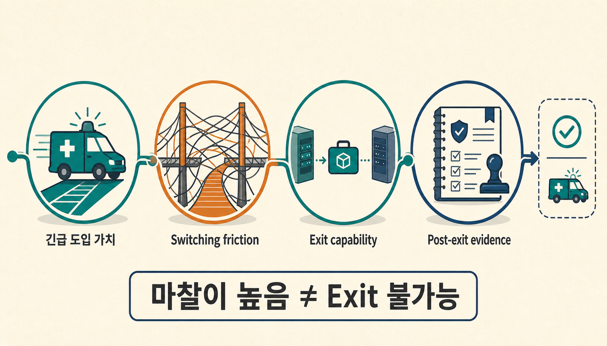
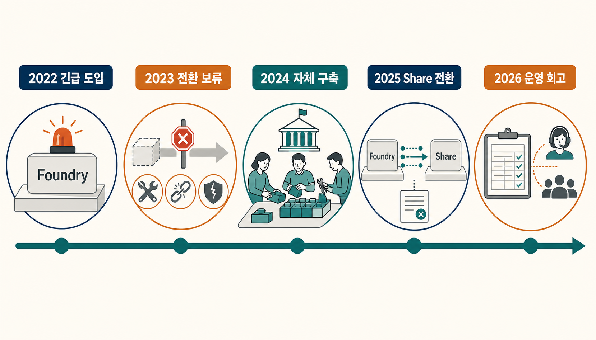
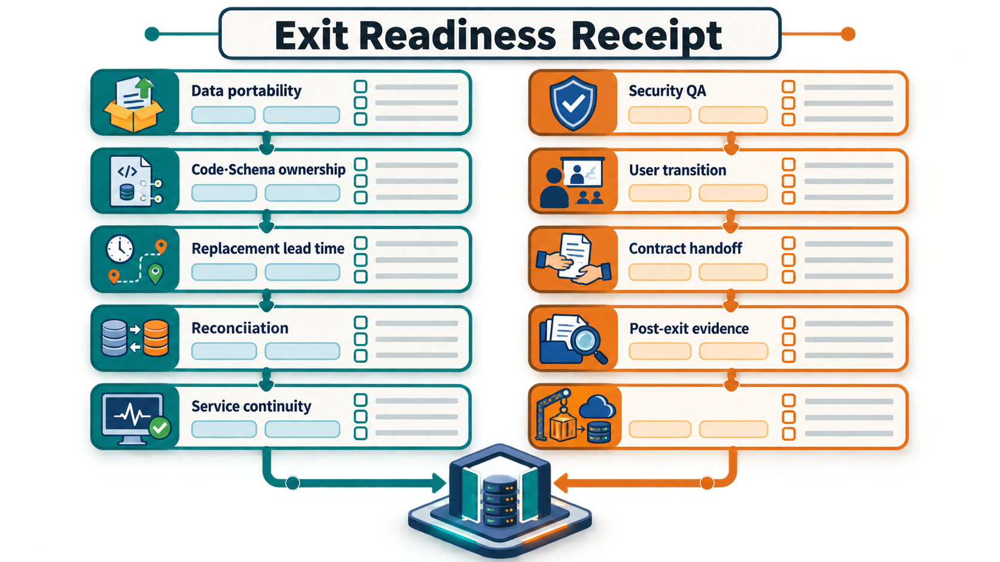
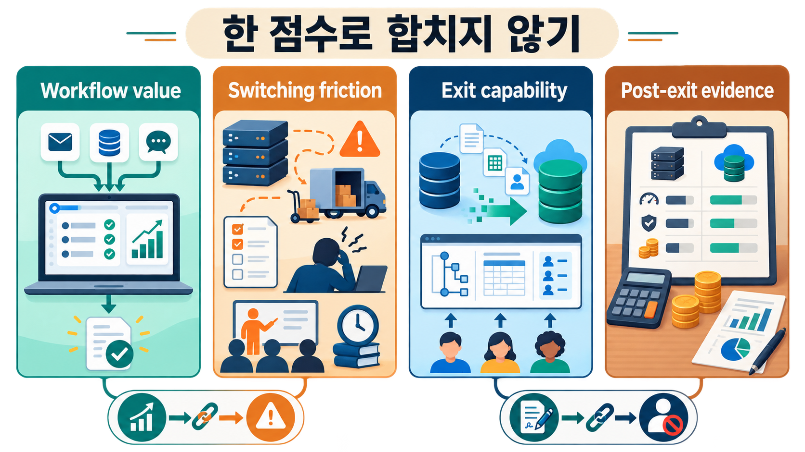

한 플랫폼이 지금 큰 가치를 만들고 있다면, 나중에 그 플랫폼을 떠날 준비까지 지금 해야 할까요? 보통은 도입 효과와 기능을 먼저 봅니다. 하지만 운영 데이터와 업무 흐름이 깊게 묶일수록 더 어려운 질문은 계약이 끝날 때 시작됩니다. 데이터를 옮길 수 있는지, 업무를 멈추지 않고 새 시스템으로 전환할 수 있는지, 사용자를 다시 교육할 수 있는지, 전환 뒤 비용과 품질을 같은 기준으로 비교할 수 있는지를 확인해야 합니다.

영국의 Homes for Ukraine 서비스는 이 질문을 한 번에 보여 주는 드문 공개 사례입니다. 2022년 긴급 상황에서는 Palantir 기반 시스템이 빠른 서비스 가동에 기여했습니다. 이후 정부는 데이터·업무 이전(migration) 비용과 일정·품질·보호·안전(safeguarding) 위험 때문에 즉시 교체하지 않았고, 몇 년 뒤에는 실제로 Foundry에서 자체 Share 시스템으로 데이터를 옮겨 공급자 계약을 종료했습니다. ([National Audit Office](https://www.nao.org.uk/reports/investigation-into-the-homes-for-ukraine-scheme/), [MHCLG system change survey](https://consult.communities.gov.uk/digital-delivery/homes-for-ukraine-new-platform-survey/), [MHCLG Digital retrospective](https://mhclgdigital.blog.gov.uk/2026/04/09/from-emergency-to-sustainability-creating-share-homes-for-ukraine-data/))

> [!summary] 먼저 결론
> **Exit readiness(전환 준비도)는 현재 공급자 없이도 데이터와 업무 의미를 넘겨받아 대체 시스템으로 서비스를 이어갈 준비 상태입니다.** 공급자 교체가 어려운 상태를 뜻하는 **벤더 락인(vendor lock-in)**을 `나갈 수 있다 / 없다`로만 보지 말고, 교체에 드는 비용·위험인 **switching friction(전환 마찰)**과 이를 감수하고 실제 전환을 수행하는 **exit capability(전환 실행 능력)**를 나눠 봐야 합니다. 도입 효과와 전환 뒤 비용·품질을 다시 확인하는 **post-exit evidence(전환 후 증거)**도 별도로 관리해야 합니다.

## 빠르게 도입했다는 사실과 오래 남아야 한다는 결론은 다릅니다

2022년 3월 영국 정부는 Homes for Ukraine 제도를 매우 짧은 시간 안에 가동해야 했습니다. 영국 감사원(NAO, National Audit Office)은 Palantir이 6개월 동안 무상 지원을 제공했고, 이 선택이 제도를 빠르게 시작하는 데 도움이 됐다고 기록합니다. 동시에 통상적인 사전 사용자 조사와 충분한 시험을 거치기 어려웠고 일부 지방정부 사용자는 시스템을 혼란스럽게 느꼈다고 지적했습니다. ([NAO, Investigation into the Homes for Ukraine scheme](https://www.nao.org.uk/reports/investigation-into-the-homes-for-ukraine-scheme/))

여기서 첫 번째 경계가 생깁니다.

```text
긴급 상황에서 빠른 도입이 가치 있었음
≠ 같은 플랫폼을 장기적으로 유지해야 함

나중에 교체를 검토함
≠ 초기 도입이 잘못이었음
```

급한 상황에서는 빠른 배치가 가장 중요한 outcome일 수 있습니다. 요구사항이 안정된 뒤에는 비용, 소유권, 유지보수 방식과 대체 가능성이 더 중요해질 수 있습니다. 같은 선택도 시간에 따라 평가 기준이 달라집니다.

[[notes/온톨로지/palantir-case-evidence-receipt|29번 글]]에서는 고객 사례를 `도입됨 → 사용됨 → 효과가 남 → 제품이 원인임`이라는 한 줄로 읽지 않고 사용 상태와 효과 증거를 분리했습니다. 그때 `exit readiness`는 공개 근거가 있을 때 추가할 수 있는 빈칸으로 남겼습니다. Homes for Ukraine의 시간축은 그 빈칸을 실제 사례로 채웁니다.

## Switching friction은 “못 나간다”와 다릅니다

NAO 기록에 따르면 영국 레벨링업·주택·커뮤니티부(DLUHC, Department for Levelling Up, Housing and Communities)는 Palantir 무료 지원 기간 이후 유상 계약을 맺었습니다. 이후 대안을 검토했지만 새로운 공급자로 옮길 때 필요한 초기 비용, 일정과 품질 위험, 보호·안전 서비스 중단 가능성 때문에 2023년에는 데이터·업무 이전을 바로 실행하지 않았습니다. ([NAO](https://www.nao.org.uk/reports/investigation-into-the-homes-for-ukraine-scheme/))

이 상태를 곧바로 `vendor lock-in`이라고 부르면 중요한 정보가 사라집니다. 교체를 미루는 이유는 하나가 아니기 때문입니다.

- 데이터를 새 구조로 옮기는 비용이 큽니다.
- 기존 업무 규칙과 화면을 다시 만들어야 할 수 있습니다.
- 새 시스템과 기존 시스템의 결과를 대조해야 합니다.
- 전환 중 서비스가 중단되면 안 됩니다.
- 권한과 보안 조건을 다시 검증해야 합니다.
- 사용자가 익숙한 작업 방식을 바꿔야 합니다.

이런 부담을 여기서는 **switching friction**이라고 부르겠습니다. 마찰이 높다는 사실은 교체가 비싸고 위험하다는 뜻일 수 있지만, 교체가 불가능하다는 뜻은 아닙니다.



Homes for Ukraine는 실제로 다음 단계까지 갔습니다. 2025년 영국 주택·커뮤니티·지방정부부(MHCLG, Ministry of Housing, Communities and Local Government)의 사용자 조사 페이지는 조사 목적을 **Foundry에서 새로운 Share Homes for Ukraine Data 시스템으로 전환하는 과정**이라고 명시합니다. 2026년 MHCLG Digital 회고는 정부팀이 2024년 여름부터 자체 시스템을 만들기 시작했고 약 3년치 운영 데이터를 이관한 뒤 2025년 9월 Share를 가동해 공급자 계약을 종료했다고 설명합니다. ([MHCLG system change survey](https://consult.communities.gov.uk/digital-delivery/homes-for-ukraine-new-platform-survey/), [MHCLG Digital retrospective](https://mhclgdigital.blog.gov.uk/2026/04/09/from-emergency-to-sustainability-creating-share-homes-for-ukraine-data/))

따라서 이 사례가 직접 보여 주는 비동치는 명확합니다.

```text
switching friction이 높음
≠ exit 불가능
```

반대 방향도 같습니다. 한 번 exit에 성공했다고 다른 조직도 쉽게 옮길 수 있다는 뜻은 아닙니다. 공공 서비스의 safeguarding 요구와 데이터 구조, 조직 역량은 제조·보험·민간 의료와 다를 수 있습니다.

## Exit readiness는 계약 조항보다 실행 능력에 가깝습니다

계약에 break clause가 있다고 해서 전환이 준비된 것은 아닙니다. 데이터를 내보낼 수 있어도 새 시스템이 같은 업무를 수행하지 못하면 서비스는 멈춥니다. 코드를 소유해도 데이터 의미와 권한 규칙이 문서화돼 있지 않으면 새 환경에서 재구축하기 어렵습니다.

앞서 짧게 정의한 exit readiness를 실제 운영 기준으로 풀면 `전환할 수 있는가`와 `그 전환을 지금 실행할 준비가 됐는가`를 나눠 볼 수 있습니다.

> **Exit capability는 실제 전환을 수행할 능력이고, exit readiness는 그 능력을 필요한 시점에 실행할 수 있도록 데이터·업무 의미·권한·사람·계약 준비를 미리 확인해 둔 상태입니다.**

이 구분은 Palantir의 공식 용어가 아니라 이번 연구를 바탕으로 만든 프로젝트 분석 프레임입니다.

실제 전환을 준비하려면 적어도 다음 질문에 답할 수 있어야 합니다. 아래에서 상태 대조(reconciliation)는 기존 시스템과 새 시스템의 상태가 일치하는지 확인하는 일이고, 품질보증(QA, Quality Assurance)은 전환 과정에서 권한·데이터 무결성·감사 조건을 다시 점검하는 절차입니다.

```yaml
exit_readiness_receipt:
  data_portability: 어떤 데이터와 이력을 어떤 형식으로 내보낼 수 있는가
  code_schema_ownership: 업무 로직·schema·config를 누가 소유하는가
  replacement_lead_time: 대체 시스템을 마련하는 데 어느 정도 작업이 필요한가
  reconciliation: 기존 시스템과 새 시스템의 상태를 어떻게 대조할 것인가
  service_continuity: 전환 중 절대로 멈추면 안 되는 업무는 무엇인가
  security_qa: 권한·데이터 무결성·감사 요구를 어떻게 재검증할 것인가
  user_transition: 사용자 교육·지원·업무 변경을 누가 책임지는가
  contract_handoff: 종료 시 지원·자료·지식 이전 계약은 무엇인가
  migration_cost: 일회성 전환 비용을 어떻게 기록할 것인가
  post_exit_evidence: 전환 뒤 비용·품질·사고·업무 부담을 어떻게 비교할 것인가
```



이 영수증을 채우는 목적은 플랫폼에 점수를 매기는 데 있지 않습니다. 빈칸을 찾는 것입니다. `data_portability`는 명확한데 `user_transition`과 `reconciliation`이 비어 있다면, 기술적 export가 가능해도 실제 운영 전환(cutover)은 아직 준비되지 않은 상태입니다.

## 백업과 복구가 가능해도 독립적인 exit가 되는 것은 아닙니다

[[notes/온톨로지/palantir-foundry-aip-operational-loop|28번 글]]에서는 Palantir Global Branching의 변경 검토와 병합(merge), 복구(recovery), 보존(retention)을 서로 다른 책임으로 나눠 봤습니다. Palantir 공식 문서상 branch는 변경을 격리하고 검토하는 데 쓸 수 있지만 부분 병합 실패(partial merge failure)에서는 일부 resource만 반영될 수 있고 자동 되돌리기(revert)가 보장되지 않습니다. 비활성·보관 상태(inactive·archived)의 branch 전용 데이터도 보존 설정의 영향을 받습니다. ([Global Branching core concepts](https://www.palantir.com/docs/foundry/global-branching/core-concepts), [June 2026 lifecycle announcement](https://www.palantir.com/docs/foundry/announcements/2026-06))

여기서 exit readiness와 연결되는 새로운 경계가 하나 더 생깁니다.

```text
공급자 플랫폼 안에서 restore 가능
≠ 공급자 없이 독립적으로 운영 가능

vendor-native retention
≠ portable replacement capability
```

이 둘은 경쟁 관계가 아닙니다. 운영 중에는 공급자 내부의 backup·branch·recovery 기능이 중요합니다. Exit readiness는 다른 질문입니다. 현재 플랫폼이 사라지거나 계약을 끝내도 **업무의 의미와 상태, 권한, 데이터 품질, 사용자 절차를 다른 실행 환경에서 다시 세울 수 있느냐**를 묻습니다.

그래서 데이터 export 파일 하나만 받아보는 것으로는 부족합니다. 데이터와 함께 무엇이 빠지는지 확인해야 합니다. 예를 들어 object와 relation의 의미, workflow state, 권한 정책, business rule, 실행 이력과 사람이 하던 예외 처리가 새 시스템에서 어떻게 표현될지까지 봐야 합니다.

## Migration은 파일 복사가 아니라 서비스 전환 프로그램입니다

MHCLG Digital의 회고가 유용한 이유는 기술 선택보다 전환 작업을 구체적으로 적고 있기 때문입니다. 정부팀은 기존 운영 데이터를 옮기는 것과 함께 phased migration, 품질 대조, security assurance, 사용자 조사와 training을 진행했다고 설명합니다. ([MHCLG Digital](https://mhclgdigital.blog.gov.uk/2026/04/09/from-emergency-to-sustainability-creating-share-homes-for-ukraine-data/))

이 흐름은 migration을 다음처럼 바꿔 보게 합니다.

```text
데이터 export
→ 새 schema와 업무 규칙에 적재
→ old/new 상태 reconciliation
→ 권한·보안 검증
→ 제한 사용자 전환
→ 서비스 cutover
→ 운영 결과 재측정
```

이 가운데 하나라도 빠지면 “데이터를 옮겼다”와 “서비스를 옮겼다” 사이에 틈이 생깁니다. 특히 운영 AI나 Ontology 기반 시스템은 단순한 테이블보다 **업무 객체, 상태, 관계, action과 permission**이 함께 움직이기 때문에 이 틈이 더 중요해질 수 있습니다.

> [!important] Exit 성공은 비용 우위를 자동으로 증명하지 않습니다
> MHCLG Digital 팀은 Share 전환 뒤 연간 수백만 파운드 규모의 running cost 절감을 보고했습니다. 하지만 공개 자료에는 동일 scope로 정규화한 상세 총소유비용(TCO, Total Cost of Ownership), 내부 인력 비용, 일회성 migration 비용과 독립 감사가 없습니다. 따라서 이 숫자를 `Palantir은 일반적으로 더 비싸다`거나 `in-house가 항상 싸다`는 결론으로 확대하면 안 됩니다. ([MHCLG Digital](https://mhclgdigital.blog.gov.uk/2026/04/09/from-emergency-to-sustainability-creating-share-homes-for-ukraine-data/))

새 시스템은 요구사항이 안정된 뒤 만들어졌고, 그동안 사용자 연구와 운영 경험도 축적됐습니다. 공급자 가격, scope 변화, 내부 역량, 기술 선택 가운데 무엇이 비용 차이를 만들었는지는 공개 자료만으로 분리하기 어렵습니다.

## Vendor lock-in을 하나의 점수로 만들지 않는 편이 낫습니다

플랫폼을 평가할 때 다음 네 질문을 따로 두면 판단이 훨씬 선명해집니다.

| 질문               | 확인하려는 것                          | 혼동하면 생기는 오류                         |
| ------------------ | -------------------------------------- | -------------------------------------------- |
| Workflow value     | 지금 실제 업무에 어떤 가치를 주는가    | 가치가 있으면 장기 계약도 자동으로 맞다고 봄 |
| Switching friction | 바꿀 때 어떤 비용·위험이 생기는가      | 마찰이 크면 exit가 불가능하다고 봄           |
| Exit capability    | 조직이 실제 전환을 실행할 수 있는가    | export 기능만 있으면 준비됐다고 봄           |
| Post-exit evidence | 전환 뒤 비용·품질·업무 결과가 어땠는가 | 운영비 한 항목만으로 전체 TCO를 결론 냄      |



이 네 축을 분리하면 `vendor lock-in`이라는 표현도 더 구체적인 질문으로 바뀝니다. 예를 들어 한 플랫폼이 매우 큰 운영 가치를 주고 switching friction도 높을 수 있습니다. 그래도 데이터·업무 규칙·사람·계약 인수 계획을 갖춰 exit capability를 유지하는 선택이 가능합니다.

반대로 계약상 해지가 쉽고 데이터를 다운로드할 수 있어도 실제 replacement lead time이 길고 서비스 continuity를 검증하지 못했다면 exit readiness는 낮을 수 있습니다.

## 도입 전에 가장 작은 exit drill을 해볼 수 있습니다

전사 migration을 미리 할 필요는 없습니다. 대신 도입 초기에 작은 **exit drill**을 한 번 수행하는 방법을 제안할 수 있습니다. 이것은 이번 연구에서 도출한 설계 제안이며, 실제 Palantir tenant에서 검증한 표준 절차는 아닙니다.

가정해 보겠습니다. 한 운영팀이 여러 공장의 품질 데이터를 인공지능 플랫폼에 묶으려 합니다. 첫 실제 운영(production) 전 다음 정도만 확인합니다.

1. 대표적인 업무 객체와 이력 일부를 실제 export합니다.
2. 외부의 작은 중립 schema에서 원래 의미를 복원할 수 있는지 확인합니다.
3. 플랫폼 밖에서 최소 read-only workflow 하나를 다시 실행해 봅니다.
4. 원본과 대체 경로의 레코드 수, 핵심 상태와 권한을 대조합니다.
5. 어느 자산이 공급자 전용이고 어느 자산이 조직 소유인지 기록합니다.
6. 전환에 필요한 사람, 승인, 교육과 service-continuity 작업을 추정합니다.

이 실험의 목표는 “곧 떠나겠다”는 선언이 아닙니다. 나중에 떠나야 할 때 무엇이 부족한지를 싼 시점에 찾는 것입니다.

## 더 얇은 시스템이 오히려 맞는 경우도 있습니다

Exit readiness 비용은 통합이 깊어질수록 커질 수 있습니다. 그렇다고 항상 얇은 stack이 낫다는 뜻은 아닙니다. 여러 workflow가 같은 데이터와 권한, 업무 객체를 재사용한다면 통합 플랫폼이 운영 복잡도를 줄일 수도 있습니다. 현재 연구에는 이 총비용을 동일 조건으로 비교한 실험이 없습니다.

다음 조건에서는 더 얇은 기준 구성(baseline)을 먼저 검토할 만합니다.

- 읽기 전용 dashboard나 문서 검색이 중심입니다.
- 실제 write action과 복잡한 승인 흐름이 없습니다.
- 업무 객체와 관계를 여러 use case가 재사용하지 않습니다.
- 데이터 이동성과 공급자 교체 가능성이 핵심 요구입니다.
- 팀이 Ontology·permission·workflow를 장기 유지할 운영 역량이 없습니다.

반대로 여러 부서가 같은 operational model을 쓰고, action·approval·evaluation·observability를 일관되게 연결해야 한다면 통합의 가치가 커질 수 있습니다. 그때도 exit readiness를 포기할 이유는 없습니다. 통합의 이득과 전환 비용을 **같은 lifecycle의 서로 다른 항목**으로 기록하면 됩니다.

## 최종 판단

Homes for Ukraine 사례를 `Palantir 성공`이나 `Palantir 실패` 한 단어로 정리하면 시간에 따라 바뀐 의사결정이 사라집니다. 긴급 상황에서는 빠른 배치가 가치가 있었습니다. 이후에는 비용과 소유권, 지속 가능성이 더 중요해졌고, migration 위험 때문에 교체가 한동안 미뤄졌습니다. 그다음 정부팀은 별도의 전환 프로그램으로 데이터를 옮기고 새 시스템을 가동해 공급자 계약을 종료했습니다.

이 시간축이 보여 주는 것은 “lock-in이 없다”도 “lock-in에서 탈출했다”도 아닙니다. **운영 가치, switching friction, exit capability와 post-exit evidence를 따로 측정해야 한다**는 점입니다.

인공지능 플랫폼을 선택할 때도 같은 질문을 적용할 수 있습니다. **Exit readiness는 공급자 없이도 데이터·업무 의미·권한·사용자를 대체 환경으로 옮겨 서비스를 이어갈 준비가 됐는지를 묻는 기준입니다.** `이 플랫폼으로 무엇을 더 잘할 수 있는가`와 함께 `다른 실행 환경으로 옮기려면 무엇이 필요한가`를 적어 보십시오. 빈칸이 많다면 아직 전환 준비도가 증명되지 않은 것입니다. 가장 작은 다음 행동은 계약 종료를 상상하는 일이 아니라, 대표 데이터와 workflow 하나로 실제 export·상태 대조·대체 경로를 시험해 보는 것입니다.

## 함께 읽기

- [[notes/온톨로지/palantir-case-evidence-receipt|29. 팔란티어 실사용 사례를 읽는 법]]
- [[notes/온톨로지/palantir-foundry-aip-operational-loop|28. 팔란티어 AIP는 왜 기업용 챗봇이 아닌가]]
- [[notes/온톨로지/agent-evaluation-evidence-ladder|24. 합성 검사를 통과한 에이전트는 왜 아직 검증되지 않았는가]]

## 참고 자료

- National Audit Office, [Investigation into the Homes for Ukraine scheme](https://www.nao.org.uk/reports/investigation-into-the-homes-for-ukraine-scheme/)
- Ministry of Housing, Communities and Local Government, [Homes for Ukraine system change survey](https://consult.communities.gov.uk/digital-delivery/homes-for-ukraine-new-platform-survey/)
- MHCLG Digital, [From emergency to sustainability: creating Share Homes for Ukraine data](https://mhclgdigital.blog.gov.uk/2026/04/09/from-emergency-to-sustainability-creating-share-homes-for-ukraine-data/)
- Palantir, [Global Branching core concepts](https://www.palantir.com/docs/foundry/global-branching/core-concepts)
- Palantir, [June 2026 announcements — Global Branch lifecycle features](https://www.palantir.com/docs/foundry/announcements/2026-06)
