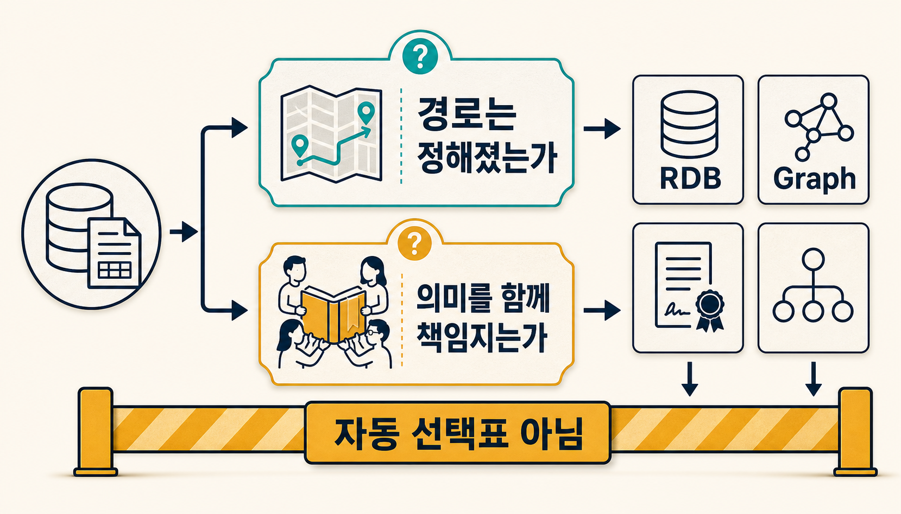
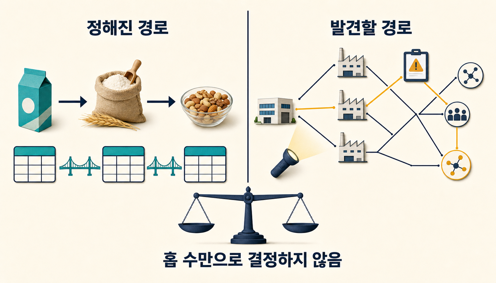
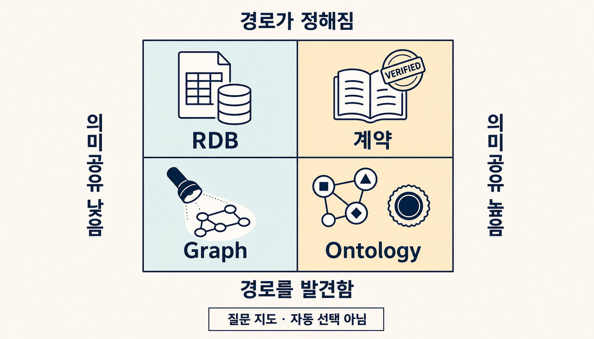
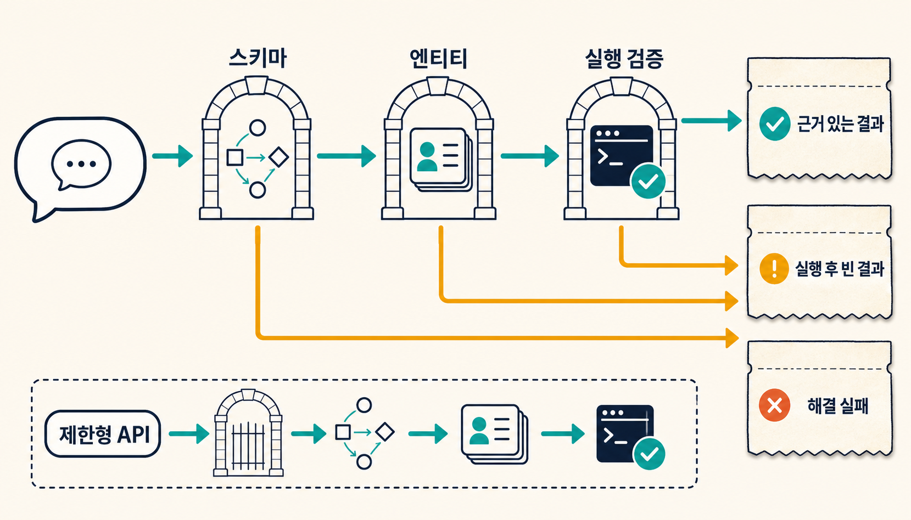

> [!summary] 핵심 결론
> 연결된 데이터가 있다는 이유만으로 GraphDB가 필요한 것은 아니며, 여러 용어를 쓴다는 이유만으로 온톨로지가 필요한 것도 아닙니다. 먼저 **답을 찾기 전에 경로를 적을 수 있는가**, 그리고 **식별자·관계·정책·변경의 의미를 여러 질문과 시스템이 함께 책임져야 하는가**를 따로 물어야 합니다. 이 두 축으로 후보를 줄인 뒤, 같은 데이터·질문·예산에서 더 단순한 기준선을 실제로 이길 때만 graph runtime과 의미 계층을 추가합니다.

한 식품 쇼핑몰이 “이 상품을 땅콩 알레르기가 있는 고객에게 보여 줘도 되는가?”를 판단한다고 가정해 보겠습니다. 상품에서 원재료로, 원재료에서 알레르겐으로 이어지는 경로와 식별자를 이미 알고 있다면 관계형 테이블의 JOIN으로 충분할 수 있습니다.

그런데 질문이 “최근 공급사 변경과 교차 오염 공지를 거쳐 새로 생긴 위험 경로는 무엇인가?”로 바뀌면 이야기가 달라집니다. 어느 관계를 따라가야 하는지 찾는 과정 자체가 답의 일부가 됩니다. 그래프 질의가 유력한 후보로 올라옵니다.

여기에 세 번째 문제가 겹칩니다. `땅콩 함유`, `땅콩을 처리하는 시설에서 생산`, `검사 결과 미확정`을 여러 서비스가 서로 다르게 해석한다면 저장소만 바꿔서는 해결되지 않습니다. 누가 같은 식별자와 관계 의미를 쓰며, 변경을 승인하고, 과거 판단을 어떻게 되돌릴지 정하는 의미 계약이 필요합니다.

이 세 문제는 자주 한 문장으로 뭉칩니다.

```text
관계가 있다
→ 그래프가 필요하다
→ 온톨로지가 필요하다
→ GraphRAG를 붙인다
```

하지만 각 화살표는 자동으로 성립하지 않습니다. 이 글은 제품 목록 대신 두 질문으로 이 연쇄를 끊어 보려 합니다.

> [!important] 근거 범위
> 이 글은 W3C 표준, 데이터베이스·Text2Cypher 연구와 2024–2026년 RAG 연구를 종합한 의사결정 프레임입니다. 실제 프로젝트에서 RDB·SQL/PGQ·native graph database·GraphRAG·온톨로지 스택을 같은 workload로 비교하지는 않았습니다. 따라서 특정 제품의 성능, 비용, ROI나 보편 임계값을 제시하지 않습니다.

## 1. 먼저 네 가지 등식을 버려야 합니다

첫 번째 혼동은 RAG를 vector database와 같은 것으로 보는 데서 시작합니다. RAG는 외부 근거를 찾아 생성에 제공하는 구조이고, 벡터 검색은 그 후보를 찾는 한 방법입니다. BM25, metadata filter, SQL, API와 graph query도 검색 경로가 될 수 있습니다.

두 번째는 관계 정보와 graph runtime을 같은 것으로 보는 혼동입니다. 엔티티 설명에 안정적인 1-hop 관계를 함께 적은 문서만으로도 관계의 가치가 생길 수 있습니다. 반대로 관계가 자주 바뀌거나 질문마다 경로를 계산해야 하면 graph query의 가치가 커집니다.

세 번째는 GraphDB와 온톨로지를 같은 것으로 보는 혼동입니다. 그래프 저장소에 node와 edge를 넣었다고 관계의 의미, 허용 범위, 검증 규칙과 변경 책임자가 자동으로 생기지는 않습니다. OWL은 선언적 지식표현 언어이며 database framework나 입력 데이터 검증 스키마가 아닙니다. RDF 데이터 검증은 SHACL 같은 별도 책임으로 나눌 수 있습니다.[src_001](#src-001)[src_002](#src-002)

마지막은 검색량과 답의 품질을 같은 것으로 보는 혼동입니다. 검색기가 정답 근거를 찾았어도 긴 문맥에서 빠지거나, 생성기가 사용하지 않거나, 인용이 다른 문장을 가리킬 수 있습니다. RAGChecker는 검색기의 claim recall·context precision과 생성기의 context utilization·faithfulness를 분리해 진단합니다.[src_003](#src-003)

```text
RAG ≠ vector database
관계 정보 ≠ graph runtime
GraphDB ≠ ontology
retrieval coverage ≠ generation utilization
```

이 구분이 필요한 이유는 단순합니다. 책임을 섞으면 실패했을 때 고칠 곳도 섞이기 때문입니다. 검색 누락을 온톨로지로 고치려 하거나, 의미 불일치를 그래프 저장소 교체로 고치거나, 생성 실패를 검색량 증가로 덮게 됩니다.

## 2. 첫 번째 질문: 답을 찾기 전에 경로를 적을 수 있습니까



경로 예측 가능성은 홉 수보다 먼저 볼 만한 질문입니다.

`상품 → 원재료 → 알레르겐`처럼 어떤 테이블과 키를 거칠지 미리 적을 수 있다면 실행의 중심은 조회·집계·검증입니다. 경로가 두 홉이라는 사실만으로 native graph storage를 요구하지 않습니다. PostgreSQL의 `WITH RECURSIVE`는 traversal, 탐색 순서, cycle detection과 path tracking을 지원합니다.[src_004](#src-004) SQL/PGQ도 관계형 테이블 위에 property graph view를 정의하고 graph pattern과 path finding을 SQL과 결합합니다.[src_005](#src-005)

반대로 다음 질문은 경로 발견이 답의 일부입니다.

- 어느 공급사·공장·리콜 공지를 거쳐 위험이 전파됐는가
- 예상하지 못한 소유·의존 관계가 장애 범위를 어떻게 넓혔는가
- 여러 조건을 동시에 만족하는 경로 가운데 어떤 것이 가장 짧거나 설명 가능한가

이때 graph pattern과 path algorithm은 표현과 탐색을 단순하게 만들 수 있습니다. 다만 `경로가 답이다`라는 문장도 저장소 판정은 아닙니다. SQL/PGQ와 standalone graph query language는 표현력과 실행 방식에서 서로 다른 장단점을 가지며, graph-specific compact representation과 path algorithm이 유리한 workload도 있습니다.[src_005](#src-005)[src_006](#src-006)

그래서 첫 질문은 후보를 줄이는 데 쓰고, 마지막 결정은 workload로 내려야 합니다.

| 확인할 항목 | 비교할 조건                                          |
| ----------- | ---------------------------------------------------- |
| 경로        | 고정/발견, bounded/unbounded, shortest/all paths     |
| 데이터      | node·edge 수, degree 분포, 최대 frontier, cycle      |
| 질의 혼합   | lookup·집계·traversal·centrality·community 비율      |
| 변경        | write 빈도, relation churn, backfill, revision       |
| 운영        | transaction, backup, 관측성, 팀 역량, migration 비용 |

LDBC도 graph data management를 홉 수 하나가 아니라 interactive query, business intelligence와 graph algorithm을 포함한 workload로 평가합니다.[src_007](#src-007) 이번 조사에는 홉 깊이를 늘리며 RDB·SQL/PGQ·native graph의 지연과 비용을 직접 비교한 실험이 없습니다. 따라서 결론은 “홉 수가 중요하지 않다”가 아니라 **“홉 수만으로 저장소를 고를 수 없다”**입니다.

## 3. 두 번째 질문: 그 의미를 누가 함께 책임져야 합니까

경로가 정해져 있어도 의미가 흔들리면 답은 달라집니다. `고객`, `활성 계약`, `위험 공급사`, `승인됨`이 서비스마다 다른 뜻이라면 같은 JOIN도 서로 다른 결론을 냅니다.

온톨로지의 고전적 정의에서 핵심은 다른 회사가 반드시 재사용해야 한다는 조직 경계가 아니라, 의도된 공동체가 공유하고 재사용할 개념화를 명시한다는 데 있습니다.[src_008](#src-008) 따라서 한 조직 안에서도 여러 팀·서비스·에이전트가 같은 식별자와 관계를 반복해서 사용하고, 의미 변경이 여러 소비자에게 전파된다면 application ontology나 더 가벼운 semantic contract가 후보가 될 수 있습니다.

그렇다고 공용 용어집이 모두 온톨로지는 아닙니다. 아래 의무가 실제로 필요한지 살펴봐야 합니다.

- 같은 entity identity와 relation direction을 여러 소비자가 재사용하는가
- domain·range·inverse·제약과 예외를 기계적으로 검사해야 하는가
- 출처, 유효 시점, revision과 변경 이유를 추적해야 하는가
- 의미 변경이 어떤 query·policy·서비스를 깨뜨리는지 검토해야 하는가
- 승인·폐기·대체 상태를 운영할 책임자가 있는가

시간과 관점이 바뀐다는 이유만으로 온톨로지가 불가능한 것도 아닙니다. PROV-O는 provenance를, OWL-Time은 시간 위치와 간격 관계를 표현하며, RDF dataset은 default graph와 named graph를 구분합니다.[src_009](#src-009)[src_010](#src-010)[src_011](#src-011) 다만 이 표준들이 `승인`, `논쟁 중`, `대체됨`의 업무 의미와 전이를 자동으로 정해 주지는 않습니다.

즉 표현 가능성과 운영 가능성을 나눠야 합니다.

```text
시간·관점을 표현할 수 있다
≠ 변경 합의와 revision 운영이 싸다
≠ 그래프 안의 사실이 자동으로 참이 된다
```

의미 권위가 낮다면 glossary, schema와 validation rule로 충분할 수 있습니다. 의미 권위가 높아질수록 versioned semantic contract, provenance, validation과 제한된 ontology를 검토할 이유가 생깁니다. 오른쪽으로 갈수록 기술보다 합의와 수명주기 비용이 커집니다.

## 4. 두 질문을 교차하면 네 후보 영역이 보입니다



두 축을 교차하면 저장소 제품표가 아니라 질문 지도가 나옵니다.

|                       | 의미 권위·재사용 낮음            | 의미 권위·재사용 높음                                    |
| --------------------- | -------------------------------- | -------------------------------------------------------- |
| 경로가 사전에 정해짐  | RDB·view·Advanced RAG            | RDB + versioned semantic contract·필요한 범위의 ontology |
| 경로 발견이 답의 일부 | 선택적 graph query·GraphRAG 후보 | typed graph + provenance·validation·승격 거버넌스 후보   |

왼쪽 위는 가장 단순한 영역입니다. 문서 검색, metadata, SQL과 view로 충분한지 먼저 봅니다. 오른쪽 위는 경로보다 뜻의 일관성이 문제입니다. 저장소를 graph로 바꾸기 전에 기존 RDB 위에 canonical ID, versioned relation vocabulary와 validation을 둘 수 있습니다.

왼쪽 아래는 의미를 조직 전체의 공식 계약으로 만들 필요는 없지만, 질문에 따라 관계를 발견해야 하는 영역입니다. 선택적 graph query나 문서 GraphRAG를 후보로 올리되, 더 단순한 text·SQL·relation-enriched document와 비교합니다.

오른쪽 아래는 가장 무겁습니다. 경로 발견과 공유 의미가 모두 중요하므로 typed graph, provenance, validation과 변경 거버넌스를 함께 검토할 수 있습니다. 규제 판단, 공급망 영향 분석, 여러 에이전트가 공유하는 정책·행동 계약처럼 실패 비용이 큰 좁은 영역이 후보입니다.

이 표에서 특히 조심할 점이 있습니다.

> 아래로 내려갔다고 자동으로 GraphDB를 사는 것도 아니고, 오른쪽으로 갔다고 OWL 전체를 도입하는 것도 아닙니다.

표는 무엇을 benchmark하고 누가 책임져야 하는지 정하는 출발점입니다. graph query와 native graph storage, glossary와 formal ontology, OWL inference와 data validation은 각각 별도 선택입니다.

## 5. GraphRAG는 어느 칸에서든 마지막이 아니라 후보입니다

원형 Microsoft GraphRAG는 비정형 문서에서 entity graph와 community summary를 만들고, corpus 전체의 주제처럼 global sensemaking이 필요한 질문을 처리하기 위해 제안됐습니다.[src_012](#src-012) 문서는 대표적인 사용례지만 GraphRAG의 유일한 범위라고 단정할 수는 없습니다.

다만 관계 정보가 필요하다는 사실과 graph retrieval runtime이 필요하다는 사실은 분리해야 합니다. `Is GraphRAG Needed?`의 STaRK-Prime·Claude 3.7 Sonnet 한정 실험에서는 1-hop 관계를 엔티티 문서에 붙인 relation-enriched document가 강한 기준선이었습니다. 검색 범위를 넓힌 일부 설정에서도 retrieval coverage 증가가 end-to-end entity 지표의 비례 상승으로 이어지지 않았습니다.[src_013](#src-013)

이 결과는 GraphRAG 무용론이 아닙니다. 단일 데이터셋·모델·구현의 저자 보고이며, global summarization이나 다른 query subset으로 일반화할 수 없습니다. 실무적으로 남는 메시지는 두 가지입니다.

1. 관계의 가치를 검증하려면 graph runtime이 없는 relation-enriched document 기준선도 둡니다.
2. graph가 찾은 고유 근거가 최종 답·인용·판단에 실제로 사용됐는지 따로 측정합니다.

[[notes/graphrag-adoption-gate|21번 글]]은 이 비교를 GraphRAG의 단계적 승격 문제로 다뤘습니다. [[notes/graphrag-retrieval-routing-stopping|23번 글]]은 도입 뒤 어떤 경로로 검색하고 언제 멈출지를 다뤘습니다. 이번 두 축은 그보다 앞단에서 **문제가 저장·탐색의 문제인지, 공유 의미의 문제인지 먼저 분류하는 역할**을 맡습니다.

## 6. LLM이 graph를 쓸 때 빈 결과의 뜻을 분리합니다



사람 눈에 graph가 직관적이라고 해서 LLM이 relation name, 방향과 entity identifier를 정확히 아는 것은 아닙니다. `Mind the Query`와 CypherBench는 Text2Cypher 평가에서 schema·value·runtime validation, full-scale schema와 실행 가능한 질문이 별도 난점임을 보여 줍니다.[src_014](#src-014)[src_015](#src-015) 한국 기업 KG를 다룬 KG2Cypher 저자 보고에서도 prompt-only 모델은 실행 가능한 Cypher를 만들고도 잘못된 relation, 환각된 entity ID와 literal format 때문에 틀릴 수 있었습니다.[src_016](#src-016)

이 근거의 범위는 **개방형 자연어를 실행 가능한 graph query로 변환하는 과제**입니다. 허용 relation과 query template이 좁게 고정된 API까지 전면 schema discovery가 필요하다는 뜻은 아닙니다. 제한형 API는 제공된 계약의 grounding과 인자 검증부터 시작할 수 있습니다.

어느 방식이든 빈 결과 하나로 모든 실패를 합치면 안 됩니다.

```text
SCHEMA_UNRESOLVED
ENTITY_UNRESOLVED
QUERY_INVALID
QUERY_EXECUTED_EMPTY
EVIDENCE_UNAVAILABLE
AUTHORIZED_EMPTY
SUPPORTED_RESULT
```

이 상태 목록은 표준이 아니라 운영을 위한 설계 제안입니다. 핵심은 `query가 실행됐지만 사실이 없었다`와 `query를 만들거나 실행하는 데 실패했다`를 구분하는 것입니다. 그래야 schema 문제를 데이터 부재로 오인하지 않고, 권한으로 가려진 결과를 공개된 사실 부재처럼 말하지 않을 수 있습니다.

## 7. 실제 도입은 저장소가 아니라 실패 영수증에서 시작합니다

두 질문을 조직에 적용할 때는 기술 목록보다 반복되는 실패를 먼저 모으는 편이 좋습니다.

### 1단계 — 질문과 답변 의무를 적습니다

대표 질문을 직접 사실, 고정 경로, 경로 발견, 전체 corpus 종합, 의미·정책 판정으로 나눕니다. 각 질문에서 반드시 보여 줘야 할 근거 경로, 보류 조건과 허용 지연을 함께 기록합니다.

### 2단계 — 의미 책임의 범위를 적습니다

같은 identity·relation·policy를 누가 재사용하는지, 변경 승인자와 소비자가 누구인지 확인합니다. 한 팀의 임시 분류라면 무거운 의미 계층보다 schema와 테스트가 낫습니다. 여러 시스템의 판단이 같은 뜻에 묶여야 한다면 versioned contract가 필요해집니다.

### 3단계 — 가장 얇은 기준선을 만듭니다

문서 QA는 BM25·vector·metadata·reranker를, 고정 경로는 RDB·view·recursive SQL을, 관계 질문은 relation-enriched document를 먼저 둡니다. 이 기준선이 있어야 graph runtime과 ontology가 만든 순증가를 분리할 수 있습니다.

### 4단계 — 한 층씩 추가합니다

```text
문서·SQL 기준선
→ 관계 증강 문서
→ 선택적 graph query
→ typed graph + provenance·validation
→ 필요한 최소 의미만 semantic contract·ontology로 승격
```

실제 시스템에서는 graph query와 의미 계약의 순서가 서로 바뀔 수 있습니다. 중요한 것은 한 번에 묶어 도입하지 않고, 어떤 실패를 고치기 위해 어느 책임을 추가했는지 남기는 것입니다.

### 5단계 — 서로 다른 전환율을 측정합니다

```text
retrieval coverage
→ context retention
→ generation utilization
→ citation faithfulness
→ task outcome
```

각 화살표에서 무엇이 사라졌는지 따로 봅니다. 저장소 benchmark에는 latency·cost·frontier·write와 운영 복잡성을, 의미 계층에는 변경 영향·검증 실패·감사 시간과 합의 비용을 포함합니다.

## 8. 이 지도에서 바로 결정할 수 없는 것

이 글의 두 축은 다음 결정을 대신하지 않습니다.

- 몇 홉부터 graph database가 빠른지 알려 주지 않습니다.
- 어떤 ontology profile이나 reasoner를 써야 하는지 정하지 않습니다.
- GraphRAG가 특정 corpus와 모델에서 품질을 높일지 보장하지 않습니다.
- 관계 증강 문서를 만드는 upstream 구축·동기화 비용을 없애지 않습니다.
- ontology가 graph 안의 사실성이나 LLM의 생성 충실도를 자동 보장하지 않습니다.
- 조직마다 다른 권한·transaction·운영 인력·migration 비용을 한 점수로 환산하지 않습니다.

이번 근거 검토의 2026년 연구 중 일부는 preprint이며, ontology evolution과 collaborative ontology 연구 일부는 공개 초록·서지 범위만 확인됐습니다. 실제 A–F 통합 비교, 홉·degree·frontier 변화에 따른 저장소 성능, 제한형 API와 개방형 Text2Cypher 비교는 수행하지 않았습니다.

따라서 이 지도는 자동 추천기가 아니라 **잘못 묶인 문제를 다시 분해하는 질문 장치**입니다. 최종 선택은 같은 데이터 revision, 질문, 모델, 권한, token·latency 예산과 운영 조건을 고정한 비교 뒤에 내려야 합니다.

## 결론: 그래프보다 먼저 책임의 모양을 그립니다

연결된 데이터가 보이면 graph를 떠올리기 쉽습니다. 여러 시스템이 다른 말을 쓰면 ontology를 떠올리고, LLM이 검색하면 GraphRAG까지 한꺼번에 묶기 쉽습니다. 그러나 관계의 존재, 경로 탐색, 저장 방식, 의미 합의와 생성 이용률은 서로 다른 문제입니다.

먼저 답을 찾기 전에 경로를 적을 수 있는지 묻습니다. 적을 수 있다면 RDB·view·recursive SQL과 관계 증강 문서가 강한 기준선입니다. 적을 수 없다면 graph query와 GraphRAG가 후보가 되지만, native graph storage는 실제 workload 비교 뒤에 정합니다.

그다음 identity·relation·policy·revision의 의미를 누가 함께 책임져야 하는지 묻습니다. 한 질문의 임시 해석이면 glossary와 schema가 나을 수 있습니다. 여러 팀·서비스·에이전트가 같은 뜻을 재사용하고 변경을 감사해야 한다면 versioned semantic contract, provenance, validation과 필요한 범위의 ontology를 검토합니다.

두 질문에 모두 “그렇다”고 답해도 바로 무거운 스택을 사는 것은 아닙니다. 더 단순한 기준선이 놓친 근거를 graph가 찾았는지, 그 근거가 실제 답에 쓰였는지, 의미 계층이 오류·변경 범위·감사 시간을 줄였는지, 그 이익이 합의·운영 비용을 넘는지 확인합니다.

그래프의 가치는 연결선의 개수가 아니라 **발견해야 할 경로의 반복적 기여**로 증명해야 합니다. 온톨로지의 가치는 클래스의 개수가 아니라 **함께 책임져야 할 최소 의미의 재사용과 검증**으로 증명해야 합니다.

## 출처

- <a id="src-001"></a> W3C OWL Working Group. (2012). [OWL 2 Web Ontology Language Primer (Second Edition)](https://www.w3.org/TR/owl2-primer/).
- <a id="src-002"></a> W3C Data Shapes Working Group. (2017). [Shapes Constraint Language (SHACL)](https://www.w3.org/TR/shacl/).
- <a id="src-003"></a> Ru, D. et al. (2024). [RAGChecker: A Fine-grained Framework for Diagnosing Retrieval-Augmented Generation](https://proceedings.neurips.cc/paper_files/paper/2024/hash/27245589131d17368cccdfa990cbf16e-Abstract.html). NeurIPS 2024.
- <a id="src-004"></a> PostgreSQL Global Development Group. (2023). [PostgreSQL 16 Documentation: WITH Queries](https://www.postgresql.org/docs/16/queries-with.html).
- <a id="src-005"></a> ten Wolde, D. et al. (2023). [DuckPGQ: Efficient Property Graph Queries in an Analytical RDBMS](https://vldb.org/cidrdb/papers/2023/p66-wolde.pdf). CIDR 2023.
- <a id="src-006"></a> Gheerbrant, A. et al. (2025). [GQL and SQL/PGQ: Theoretical Models and Expressive Power](https://doi.org/10.14778/3725688.3725707). PVLDB 18(6).
- <a id="src-007"></a> Erling, O. et al. (2015). [The LDBC Social Network Benchmark: Interactive Workload](https://doi.org/10.1145/2723372.2742786). SIGMOD 2015.
- <a id="src-008"></a> Gruber, T. R. (1993). [A Translation Approach to Portable Ontology Specifications](https://doi.org/10.1006/knac.1993.1008). Knowledge Acquisition 5(2).
- <a id="src-009"></a> W3C Provenance Working Group. (2013). [PROV-O: The PROV Ontology](https://www.w3.org/TR/prov-o/).
- <a id="src-010"></a> W3C Spatial Data on the Web Working Group. (2022). [Time Ontology in OWL](https://www.w3.org/TR/owl-time/).
- <a id="src-011"></a> W3C RDF Working Group. (2014). [RDF 1.1 Concepts and Abstract Syntax](https://www.w3.org/TR/rdf11-concepts/).
- <a id="src-012"></a> Edge, D. et al. (2024). [From Local to Global: A Graph RAG Approach to Query-Focused Summarization](https://www.microsoft.com/en-us/research/publication/from-local-to-global-a-graph-rag-approach-to-query-focused-summarization/). Microsoft Research.
- <a id="src-013"></a> Chen, L. et al. (2026). [Is GraphRAG Needed? From Basic RAG to Graph-/Agentic Solutions with Context Optimization](https://arxiv.org/abs/2606.25656). ACL 2026 GEM Workshop / arXiv:2606.25656.
- <a id="src-014"></a> Chauhan, V., Raj, S., Mujumdar, S., Saha, A., & Jain, A. (2025). [Mind the Query: A Benchmark Dataset towards Text2Cypher Task](https://aclanthology.org/2025.emnlp-industry.133/). EMNLP 2025 Industry Track.
- <a id="src-015"></a> Feng, Y., Papicchio, S., & Rahman, S. (2025). [CypherBench: Towards Precise Retrieval over Full-scale Modern Knowledge Graphs](https://aclanthology.org/2025.acl-long.438/). ACL 2025.
- <a id="src-016"></a> Choi, M. et al. (2026). [KG2Cypher: Data-Centric Pipeline for Building Enterprise Text-to-Cypher Systems](https://arxiv.org/abs/2606.27742). arXiv:2606.27742.
