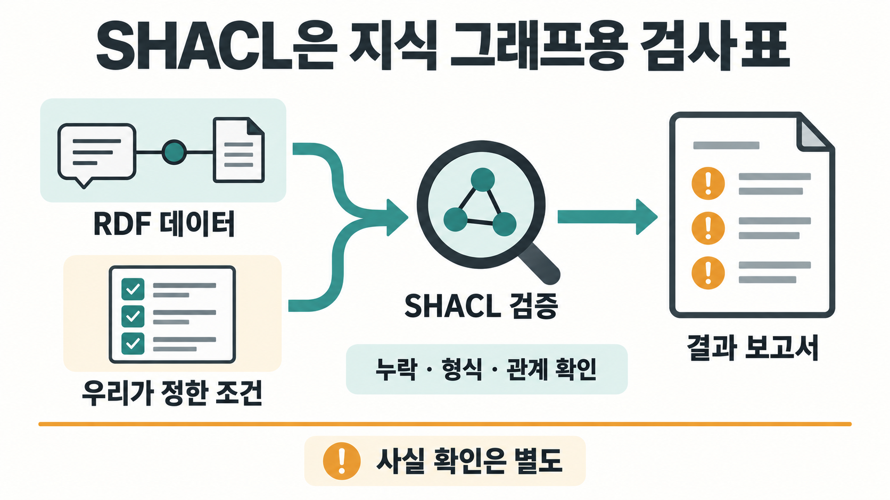
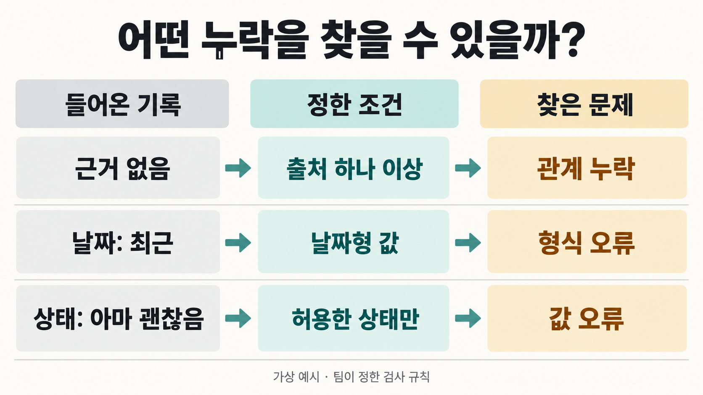
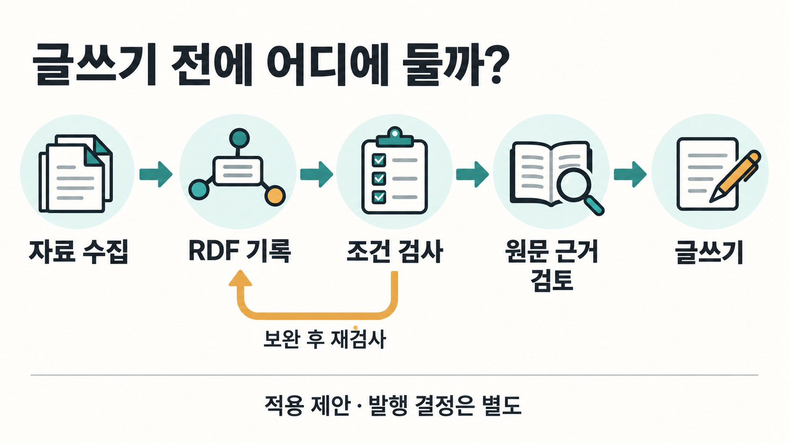
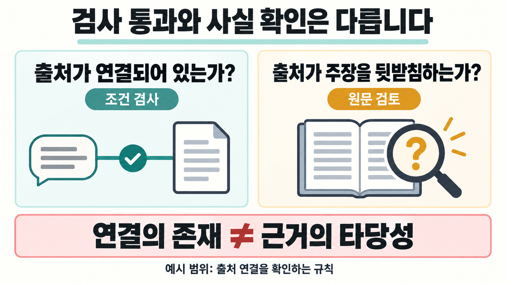

AI가 여러 자료를 읽고 지식을 정리해 줬는데, 정작 중요한 주장에 출처가 빠져 있다면 어떻게 할까요? 문장은 자연스럽고 내용도 그럴듯해 보이지만 그대로 블로그의 근거로 쓰기는 어렵습니다. 자료가 쌓일수록 이런 누락을 사람이 매번 찾아내는 일도 부담이 됩니다.

SHACL은 이런 문제를 다루는 한 가지 방법입니다. 여기서 지식 그래프는 주장과 출처 같은 기록을 관계로 연결한 것입니다. **지식 그래프에 들어 있는 데이터가 우리가 정한 조건을 지키는지 검사하기 위한 표준 언어**입니다. 이름은 Shapes Constraint Language의 약자이며 W3C가 정의했습니다. 처음에는 '지식 그래프용 검사표를 컴퓨터가 읽을 수 있게 적는 방법'이라고 생각하면 됩니다. [W3C SHACL 표준](https://www.w3.org/TR/2017/REC-shacl-20170720/)

여기서 중요한 것은 새로운 용어를 외우는 일이 아닙니다. 데이터를 잘 만들었을 것이라고 믿는 대신, 무엇이 빠지면 안 되는지를 미리 적어 두고 같은 기준으로 확인하는 것입니다. 자료를 모아 지식으로 저장하거나, AI가 만든 기록을 다음 작업에 넘기는 사람에게 필요한 관점입니다.

> [!summary] 지금 알아둘 핵심
> SHACL은 RDF 지식 그래프의 필수 항목·값의 형식·관계 조건 등을 검사합니다. 누락과 규칙 위반을 찾는 데 쓰지만, 검사를 통과했다고 기록의 내용까지 사실로 확인된 것은 아닙니다.

## 출처가 빠진 주장 하나에서 시작해 보겠습니다

AI가 문서를 읽고 '어떤 도구를 사용하면 업무 오류가 줄어든다'라는 주장을 저장했다고 가정해 보겠습니다. 이 기록에는 근거 문서가 연결되어 있지 않고, 확인 날짜에는 '최근'이라고 적혀 있습니다. 검토 상태는 '아마 괜찮음'입니다. 실제 고객 사례나 실험 결과가 아니라, 어떤 데이터를 점검해야 하는지 보여주기 위한 가상 상황입니다.

이 기록을 다음 글의 근거로 넘기기 전에 팀에서 최소 조건을 정할 수 있습니다. 발행 후보 주장에는 출처가 하나 이상 있어야 하고, 확인 날짜는 날짜형 값이어야 하며, 검토 상태는 팀이 허용한 값이어야 한다고 정하는 것입니다. 그 조건과 입력을 나란히 놓으면 문제가 구체적으로 보입니다. 마지막 행은 출처를 보완하면서 문서 대신 사람을 연결한 경우의 별도 예시입니다.

| 팀이 정한 규칙의 예                      | 들어온 기록                       | 발견하려는 문제                 |
| ---------------------------------------- | --------------------------------- | ------------------------------- |
| 근거 문서를 하나 이상 연결한다.          | 근거 연결이 없다.                 | 필요한 관계가 빠졌다.           |
| 확인 날짜는 날짜형 값이어야 한다.        | '최근'이라는 문자열이다.          | 값의 형식이 맞지 않는다.        |
| 상태는 미검토·검토완료·기각 중 하나다.   | '아마 괜찮음'이다.                | 허용하지 않은 상태 값이다.      |
| 근거의 연결 대상은 문서 유형이어야 한다. | 문서가 아닌 사람 유형을 연결했다. | 연결 대상의 유형이 맞지 않는다. |

위 규칙은 SHACL이 모든 시스템에 강제하는 기본 정책이 아닙니다. 우리가 해당 작업에 맞춰 정한 예시입니다. SHACL은 값의 개수, 자료형, 허용값, 연결 대상의 유형 같은 조건을 표현할 수 있도록 합니다. 표의 규칙에 해당하는 데이터와 검사 규칙을 준비하면 검증 프로그램이 둘을 대조할 수 있습니다. [SHACL의 제약 조건](https://www.w3.org/TR/2017/REC-shacl-20170720/#core-components)

검사의 가치는 막연히 '이 데이터가 이상하다'고 말하는 대신 어떤 항목을 고쳐야 하는지 찾아주는 데 있습니다. 위 사례라면 담당자는 근거 문서를 확인해 연결하고, 날짜와 검토 상태를 바로잡을 수 있습니다. 기록을 더 많이 쌓는 것보다 다음 사람이 사용할 수 있는 상태로 넘기는 일이 먼저인 셈입니다.

## 온톨로지가 있는데 검사표도 필요한 이유

온톨로지와 지식 그래프라는 말도 처음에는 어렵게 들릴 수 있습니다. 이 예시에서는 온톨로지가 '주장', '문서', '작성자' 같은 대상과 '근거로 삼는다' 같은 관계의 의미를 정한다고 생각하면 됩니다. 지식 그래프에는 그 의미를 사용한 실제 기록이 연결됩니다. RDF는 이런 연결을 '주장 A → 근거로 삼는다 → 문서 B'처럼 주체·관계·대상의 묶음으로 표현하는 표준 데이터 모델입니다. [RDF 입문](https://www.w3.org/TR/rdf11-primer/)

그런데 '근거로 삼는다'는 관계가 무엇인지 정의했다고 해서 발행 후보 주장마다 실제 근거가 연결되어 있는 것은 아닙니다. 관계의 뜻을 정하는 일과, 지금 들어온 기록이 필수 조건을 충족하는지 검사하는 일은 구분해야 합니다. SHACL은 후자의 요구를 명시할 때 사용합니다.

SHACL에서 말하는 Shape는 화면에 그리는 도형이 아니라 데이터가 만족해야 할 조건 묶음입니다. '발행 후보 주장용 검사표'에 출처·날짜·상태에 대한 조건을 적고, 어떤 기록에 그 검사표를 적용할지도 지정하는 식입니다. [Shapes와 검사 대상](https://www.w3.org/TR/2017/REC-shacl-20170720/#shapes)

정확한 적용 범위도 알아둘 필요가 있습니다. SHACL의 표준 검사 대상은 RDF 그래프입니다. Markdown 위키 파일이나 일반적인 JSON에 SHACL을 실행하면 곧바로 문장 품질을 판정하는 것이 아닙니다. 온톨로지 팩이라는 이름을 붙였다고 자동으로 SHACL을 사용하게 되는 것도 아닙니다. 파일 형식 검사만 필요하다면 그 형식에 맞는 더 단순한 검사를 선택할 수도 있습니다.

## 실제 작업에서는 어디에 넣을까요?

자료를 모아 지식 그래프에 저장한 뒤 블로그 초안을 만든다고 해보겠습니다. 이 작업에서는 SHACL 검사를 근거 데이터를 준비하는 단계에 둘 수 있습니다. 새 기록에 필요한 정보가 빠졌는지 먼저 찾고, 보완된 기록의 실제 출처를 검토한 다음 글쓰기에 사용하는 흐름입니다. 이는 적용 제안이며, 특정 OpenCrab 팩이나 현재 블로그 예약 작업에 이미 이런 검사가 구현되어 있다는 뜻은 아닙니다.

여기서 역할은 세 가지로 나뉩니다. 사람이 업무에 맞는 조건을 정하고, 검증 프로그램이 그 조건과 데이터를 비교하며, 사용하는 프로그램이나 담당자가 결과에 따라 수정을 요청하거나 다음 단계로 넘깁니다. SHACL 검증은 결과 보고서를 만들 수 있지만, 그 보고서를 보고 저장·발행을 보류하는 처리는 별도로 연결해야 합니다. [SHACL 검증 보고서](https://www.w3.org/TR/2017/REC-shacl-20170720/#validation-report)

예를 들어 출처 연결이 없는 기록을 발견하면 그대로 초안 작성에 넘기지 않고 보완 대상으로 돌릴 수 있습니다. 기록을 고친 뒤에는 같은 조건으로 다시 확인합니다. 이렇게 해두면 담당자가 바뀌어도 무엇을 최소 조건으로 삼았는지 공유할 수 있습니다. W3C의 사용 사례 문서도 데이터 통합과 다른 도구가 만든 데이터의 품질 점검을 SHACL의 활용 맥락으로 다룹니다. [SHACL 사용 사례](https://www.w3.org/TR/shacl-ucr/)

검사표를 만드는 비용은 남습니다. 어떤 항목이 필수인지 합의해야 하고 업무가 바뀌면 규칙도 수정해야 합니다. 자동 검사를 추가했다고 출처를 읽거나 규칙을 유지하는 일이 사라지는 것은 아닙니다. 반복되는 누락을 같은 기준으로 찾는 데서 이 방법의 가치를 판단하는 편이 좋습니다.

## 검사를 통과하면 믿을 수 있는 지식일까요?

출처가 빠진 문제를 고쳤으니 이제 안심해도 될 것 같습니다. 그런데 가상의 기록에 연결된 문서를 열어보니, 주장과 관계없는 내용을 다룬 문서였다면 어떨까요? '근거 문서가 하나 이상 연결되어 있다'는 조건은 만족할 수 있지만, 그 문서가 주장을 뒷받침하는지는 아직 확인되지 않았습니다.

**검사표를 통과했다는 것과 내용이 사실이라는 것은 다릅니다.** SHACL은 정해진 조건에 대한 데이터의 적합성을 검사합니다. 출처의 존재만 검사하도록 작성한 규칙이 문서의 내용까지 읽어 주장의 진위를 확인해 주지는 않습니다. 이 차이는 검증이 부족해서가 아니라, 우리가 그 검사에 맡긴 질문이 무엇인지에 관한 문제입니다. [SHACL의 적합성 검사 범위](https://www.w3.org/TR/2017/REC-shacl-20170720/#conformance-definition)

앞의 사례에 남은 질문은 명확합니다. '근거가 연결되어 있는가?'는 검사 규칙으로 확인하고, '그 근거가 실제로 이 주장을 뒷받침하는가?'는 원문 검토로 확인해야 합니다. 검토 상태가 '검토완료'라는 허용값이라고 해서 누군가 제대로 검토했다는 사실까지 증명되지는 않습니다. 상태 값의 적합성과 실제 검토 행위를 혼동하지 않는 것이 중요합니다.

## 지금 꼭 SHACL을 배워야 할까요?

온톨로지 팩을 찾아 읽고 블로그를 쓰는 사용자라면 문법부터 공부할 필요는 없습니다. 먼저 '검증 통과'라는 말을 볼 때 어떤 항목을 검사했는지 묻는 습관이면 충분한 출발점입니다. 누락을 검사한 것인지, 근거 내용을 검토한 것인지, 실제 서비스의 동작까지 시험한 것인지를 나눠보면 됩니다.

반면 RDF 지식 그래프를 직접 만들거나, 여러 자료를 자동으로 합치거나, AI가 생성한 기록을 일정한 조건으로 받아들이는 시스템을 설계한다면 SHACL을 자세히 살펴볼 이유가 생깁니다. 반복해서 들어오는 데이터를 어떤 기준으로 받을지 명시하고 점검하는 것이 그 용도이기 때문입니다. [데이터 검증 요구와 활용 맥락](https://www.w3.org/TR/shacl-ucr/)

시작할 때는 거대한 규칙집보다 자주 겪는 누락 하나를 고르는 편을 권합니다. 발행 후보 주장에서 출처가 자주 빠진다면 '근거 문서가 하나 이상 있어야 한다'는 조건부터 적어 보세요. 그다음에는 출처가 없는 기록, 출처가 있는 기록, 출처는 있지만 내용이 관련 없는 기록을 나란히 비교할 수 있습니다. 마지막 기록이 조건 검사를 통과할 수 있다는 점까지 이해하면 검사와 사실 확인의 역할이 분명해집니다.

## 직접 구현할 때는 PASS 옆의 조건도 남깁니다

이제 SHACL이 무엇을 검사하는지 이해했다면 'SHACL PASS는 무엇을 증명하는가'라는 질문도 풀립니다. PASS는 그때 사용한 데이터와 검사표, 검증 조건에 대한 결과입니다. 검사표가 달라지거나 검증 전에 추론을 수행하면 검사가 바라보는 조건이나 입력도 달라질 수 있습니다. 여기서 추론은 이미 있는 관계와 규칙에서 새 관계를 이끌어 내는 일입니다. 어떤 추론을 검증 전에 수행할지는 별도로 살펴야 합니다. [SHACL과 RDFS 추론](https://www.w3.org/TR/2017/REC-shacl-20170720/#x1.5-relationship-between-shacl-and-rdfs-inferencing)

구현 담당자에게는 어떤 데이터와 규칙의 버전을 사용했는지, 어떤 검증 프로그램과 설정으로 실행했는지, 결과 보고서를 어디에 남겼는지 함께 기록할 것을 권합니다. 이것은 재현을 위한 운영 제안이지 모든 도구에 공통으로 강제되는 단일 저장 형식은 아닙니다. 검증 프로그램이 실행을 마친 것, 데이터가 조건을 만족한 것, 발행을 승인한 것도 각각 구분해야 합니다.

SHACL을 처음 접했다면 여기까지 알면 됩니다. 지식의 연결 구조를 정했다면 그 안에서 무엇이 빠지거나 잘못되면 안 되는지도 정할 수 있습니다. SHACL은 그 조건을 반복해서 검사하는 방법이며, 검사를 통과한 지식이 정말 믿을 만한지는 남은 근거를 확인해 판단합니다.

## 관련 글

[[notes/온톨로지/ontology-registry-migration|온톨로지를 업데이트했는데 무엇이 아직 낡았을까]]

[[notes/온톨로지/ontology-judge-loop-agent-validation|온톨로지 기반 Judge Loop와 에이전트 검증 설계]]
