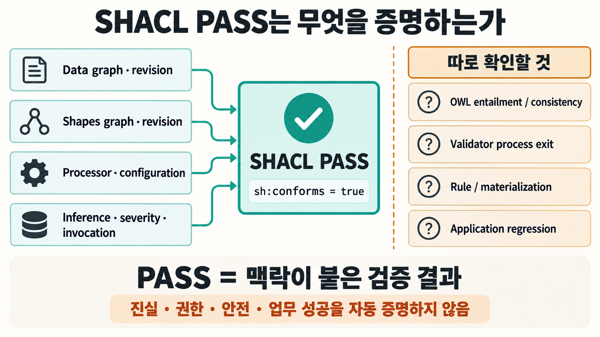
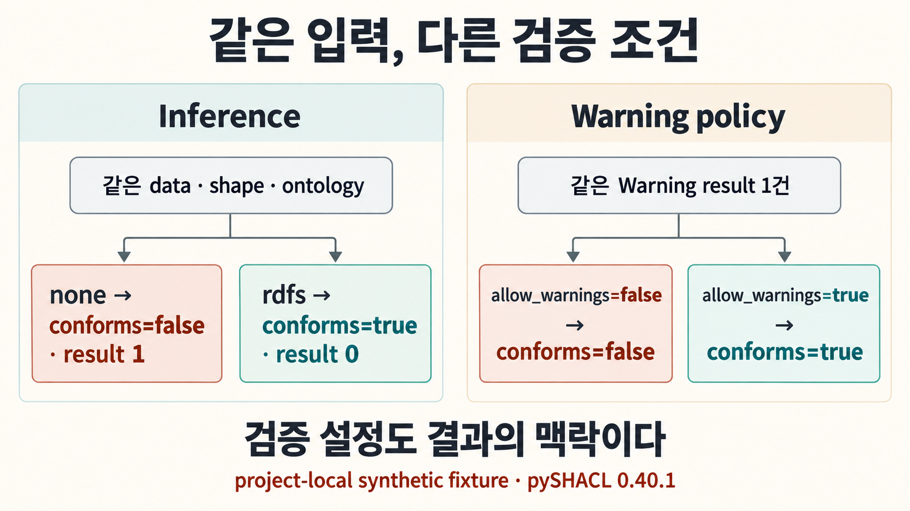
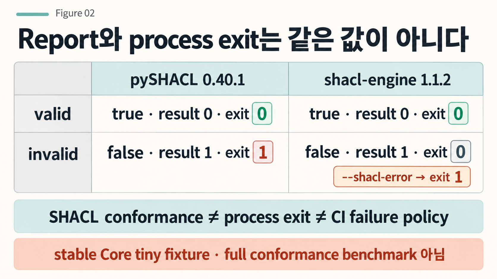
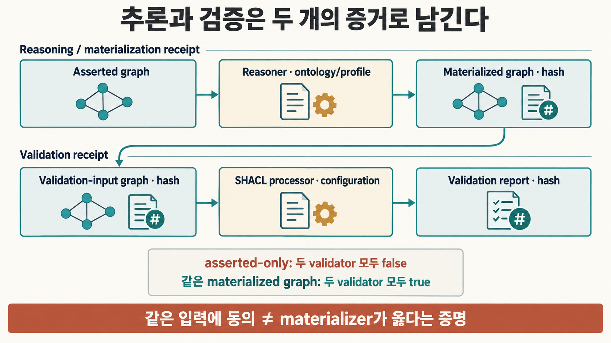

CI 화면에 초록색 `PASS`가 떴습니다. 이 한 단어만 남아 있다면 우리는 무엇이 통과했다는 사실까지 재현할 수 있을까요? 같은 데이터와 같은 shape를 다시 넣어도 추론 설정이나 severity 정책이 달라지면 결과가 바뀔 수 있고, 같은 non-conforming report를 두 도구가 만들면서도 프로세스 종료 코드는 서로 다를 수 있습니다. 검증은 끝난 것처럼 보이지만, 무엇을 어떤 조건에서 검증했는지 모르면 그 초록색 표시는 생각보다 많은 맥락을 잃습니다.

> [!summary] PASS보다 중요한 것은 PASS를 만든 조건입니다
> SHACL의 `sh:conforms=true`는 특정 data graph를 특정 shapes graph와 검증 조건으로 검사한 결과입니다. 이를 배포나 승격의 증거로 쓰려면 graph revision, processor와 설정, severity·추론 정책, 실행 방식과 결과 artifact를 함께 남기고 OWL 추론·SHACL conformance·process exit·application regression을 서로 다른 판단으로 관리해야 합니다.

## 같은 graph인데 PASS가 달라질 수 있습니다

가상의 지식그래프 파이프라인을 생각해 보겠습니다. `ex:childOf`가 `ex:relatedTo`의 sub-property라는 온톨로지 지식이 있고, shape는 어떤 노드에 `ex:relatedTo` 값이 있어야 한다고 요구합니다. 데이터에는 `ex:childOf` triple만 직접 들어 있습니다. 이때 검증기가 RDFS 추론을 쓰지 않으면 필요한 `ex:relatedTo`가 보이지 않지만, 추론을 켜면 그 관계가 consequence로 나타날 수 있습니다.

프로젝트의 synthetic fixture를 `pySHACL 0.40.1`, `RDFLib 7.6.0`, `OWL-RL 7.6.2`로 실행했을 때 같은 data·shape·ontology에서 다음처럼 갈렸습니다.

```text
inference=none → conforms=false · result 1
inference=rdfs → conforms=true  · result 0
```

이 결과는 pySHACL 한 구현체에서 재현한 작은 사례입니다. SHACL 전체나 여러 reasoner의 동등성을 증명하지는 않습니다. 다만 `data graph + shapes graph`만 저장해 두고 “그때 PASS였다”고 말하는 것으로는 실행 맥락이 부족할 수 있다는 점은 분명하게 보여 줍니다. [SHACL 1.2 Core](https://www.w3.org/TR/shacl12-core/)도 validation report가 `sh:usedDataGraph`, `sh:usedShapesGraph`, `sh:usedConfiguration`으로 검증 당시의 맥락을 식별할 수 있도록 정의하고 있습니다.



## Warning 하나도 정책에 따라 PASS와 FAIL이 갈립니다

설정이 결과에 들어오는 또 다른 경로는 severity입니다. 현재 SHACL 1.2 Core Working Draft에는 `sh:conformanceDisallows`가 있으며, 어떤 severity를 conformance 실패로 취급할지 validation report에 나타낼 수 있습니다. 따라서 Warning이 존재한다는 사실과 top-level `sh:conforms` 값은 같은 정보가 아닙니다.

프로젝트의 두 번째 synthetic fixture에서는 warning-level result 하나를 유지한 채 pySHACL의 `allow_warnings` 옵션만 바꿨습니다.

```text
allow_warnings=false → conforms=false · result 1
allow_warnings=true  → conforms=true  · result 1
```

여기서 `allow_warnings`는 pySHACL의 구현 옵션이지 SHACL 1.2의 `sh:conformanceDisallows` 자체를 시험한 것은 아닙니다. 중요한 관찰은 result가 존재하는지, 어떤 severity인지, 그리고 그 severity를 현재 정책이 실패로 보는지가 서로 다른 필드라는 점입니다. “result가 1건 있었는데 왜 PASS인가?”라는 질문에 답하려면 그때의 conformance policy까지 남아 있어야 합니다.

## Report가 같아도 CI의 성공과 실패는 다를 수 있습니다

다음에는 stable SHACL Core만 사용한 작은 valid/invalid fixture를 `pySHACL 0.40.1`과 RDF/JS `shacl-engine 1.1.2`에 같은 입력으로 실행했습니다. 두 엔진은 두 case에서 `sh:conforms`와 result count에 같은 답을 냈지만, invalid case의 기본 process exit는 달랐습니다.

| case                         | pySHACL                            | rdf-ext / shacl-engine             |
| ---------------------------- | ---------------------------------- | ---------------------------------- |
| valid                        | `conforms=true`, result 0, exit 0  | `conforms=true`, result 0, exit 0  |
| invalid                      | `conforms=false`, result 1, exit 1 | `conforms=false`, result 1, exit 0 |
| invalid + CLI failure option | —                                  | `conforms=false`, result 1, exit 1 |

즉 **SHACL report conformance와 validator process exit status는 같은 값이 아닙니다.** CI가 exit code만 보고 승격을 막는 구조라면 어떤 CLI 옵션으로 validator를 호출했는지까지 운영 계약에 포함해야 합니다. 이 실험은 두 도구의 full SHACL conformance나 SHACL 1.2 parity를 비교한 benchmark가 아니라, report 의미와 process-failure policy를 분리하기 위한 경계 실험입니다.



## 추론과 검증을 한 단계로 숨기면 입력 graph가 흐려집니다

OWL과 SHACL을 함께 쓰는 시스템에서는 한 가지 경계가 더 생깁니다. [OWL 2 Primer](https://www.w3.org/TR/owl-primer/)가 설명하는 OWL의 추론 세계와 SHACL의 graph validation을 같은 `PASS`에 넣으면 어떤 consequence가 검증 전에 존재했는지 추적하기 어려워집니다. SHACL 1.2 Core도 entailment와 validation의 관계를 다루지만, 실제 운영에서는 reasoner/materializer가 만든 결과와 validator가 검사한 입력을 별도 artifact로 남기는 편이 재현하기 쉽습니다.

앞의 `childOf → relatedTo` synthetic case를 이번에는 외부에서 RDFS materialize한 뒤 동일한 materialized graph를 pySHACL과 shacl-engine에 inference 없이 넣었습니다. asserted-only graph에서는 두 validator 모두 `conforms=false · result=1`, materialized graph에서는 모두 `conforms=true · result=0`이었습니다. 이 결과가 말해 주는 범위는 좁습니다. 두 validator가 같은 입력 graph를 받았을 때 이 작은 case에서 같은 방향으로 판단했다는 뜻이지, materializer 자체가 올바르거나 모든 추론 체계가 동등하다는 증명은 아닙니다.

그래서 reasoning receipt에는 reasoner/materializer와 ontology/profile, input revision, output graph hash를 남기고, validation receipt는 실제 validation-input graph의 identity를 참조하도록 나누는 방법이 유용합니다. 현재 [SPARQL 1.2 RL](https://www.w3.org/TR/sparql12-rl/)도 rule로 RDF consequence를 생성하는 별도 Working Draft로 발전하고 있으며, 2026년 9월 2일 공개된 최신 Working Draft를 기준으로 읽어야 합니다. 이 초안 역시 아직 W3C Recommendation은 아닙니다.



## SHACL 1.2는 PASS 주변의 맥락을 더 많이 드러냅니다

2026년 8월 28일 공개된 [SHACL 1.2 Core Working Draft](https://www.w3.org/TR/shacl12-core/)는 validation report에 `sh:usedDataGraph`, `sh:usedShapesGraph`, `sh:usedConfiguration` 같은 provenance 정보를 연결할 수 있도록 합니다. data graph와 shapes graph에는 version IRI를 사용할 수도 있습니다. `sh:shapesGraphWellFormed`는 processor가 shapes graph의 well-formedness를 검사하고 확신했는지 알리는 데 쓰일 수 있습니다.

이 속성들을 하나의 만능 영수증 규격으로 오해해서는 안 됩니다. Working Draft는 계속 바뀔 수 있고 `sh:ProcessorConfiguration`의 구체적인 설정 속성도 구현체가 정할 수 있습니다. 더구나 `sh:shapesGraphWellFormed`가 없다고 해서 shapes graph가 잘못됐다고 역으로 판정할 수도 없습니다. 검증 엔진이 그 검사를 반드시 수행해야 하는 것은 아니기 때문입니다.

또 하나의 흥미로운 경계가 있습니다. W3C 문서는 SHACL 1.2 test suite를 통과하면 구현체의 specification 적합성을 부분적으로 확인할 수 있다고 설명하지만, 모든 test를 통과했다고 complete conformance가 증명되는 것은 아니라고 명시합니다. 여기에서도 `PASS`는 무엇을 시험했는지에 묶인 결과입니다.

## validation receipt에는 무엇을 남길까

프로젝트에서는 이 문제를 단순 boolean 대신 작은 validation receipt로 다루는 방향을 제안합니다. 아래 구조는 W3C의 공식 통합 schema가 아니라, 표준의 provenance hook과 로컬 실험에서 드러난 실행 조건을 운영용으로 합친 설계안입니다.

```yaml
validation:
  data_graph_version: ...
  shapes_graph_version: ...
  shapes_graph_well_formed_checked: ...
  processor:
    name: ...
    version: ...
  invocation_profile: ...
  configuration_revision: ...
  conformance_disallows: ...
  process_failure_policy: ...
  entailment_regime: ...
  inference_or_rule_mode: ...
  validation_input_graph_hash: ...
  result_graph: ...
  raw_result_graph_hash: ...
```

여기서도 더 많이 기록하는 것이 자동으로 더 정확한 검증을 만드는 것은 아닙니다. receipt의 역할은 “이 결과가 어떤 조건에서 나왔는가”를 다시 확인할 수 있게 하는 것입니다. 어떤 constraint가 업무 요구를 제대로 표현했는지, 누락된 dependency는 없는지, application이 실제로 올바르게 행동하는지는 별도의 증거가 필요합니다.

## PASS가 증명하지 않는 것까지 함께 적어야 합니다

`sh:conforms=true`를 얻었다고 OWL ontology가 논리적으로 일관된다는 결론이 따라오지는 않습니다. reasoner가 만든 consequence가 모두 옳다는 보장도 아니고, 애플리케이션의 회귀 테스트가 통과했다는 뜻도 아닙니다. 접근 권한이나 안전 정책, 실제 업무 결과가 올바르다는 의미는 더더욱 아닙니다.

그래서 운영 게이트에서는 적어도 다음 질문을 분리하는 편이 좋습니다.

```text
OWL entailment / consistency는 확인됐는가?
SHACL data conformance는 통과했는가?
validator process는 성공적으로 끝났는가?
필요한 rule/materialization은 어떤 revision으로 실행됐는가?
application regression은 별도로 통과했는가?
```

이 구분은 SHACL을 약하게 만드는 것이 아닙니다. 오히려 SHACL이 실제로 증명한 범위를 좁고 정확하게 보존합니다. 이전 글에서 ontology release와 mapping, downstream migration의 시계를 나눴다면, 이번에는 그 과정에 붙는 검증 결과도 같은 방식으로 수명을 갖게 됩니다. [[notes/온톨로지/ontology-registry-migration|온톨로지를 업데이트했는데 무엇이 아직 낡았을까]]

## 초록색 PASS 옆에 한 줄을 더 남겨봅니다

다음번 CI에서 SHACL이 통과했다면 결과만 저장하지 말고 먼저 세 가지를 확인해 볼 수 있습니다. 어떤 data와 shapes revision을 검사했는지, 어떤 processor·configuration·inference 조건을 썼는지, 그리고 그 report를 CI 실패로 바꾸는 정책은 무엇이었는지입니다. reasoning을 별도 단계로 수행한다면 실제 validation input graph의 hash까지 이어 놓는 편이 좋습니다.

그렇게 하면 `PASS`는 더 이상 막연한 안심 표시가 아니라 재현 가능한 증거의 한 조각이 됩니다. 그리고 그 조각이 증명하지 않는 영역은 OWL reasoning, application test, 권한·안전·업무 검증 같은 다음 gate로 넘길 수 있습니다.

## 관련 글

[[notes/온톨로지/ontology-registry-migration|온톨로지를 업데이트했는데 무엇이 아직 낡았을까]]

[[notes/온톨로지/ontology-judge-loop-agent-validation|온톨로지 기반 Judge Loop와 에이전트 검증 설계]]
