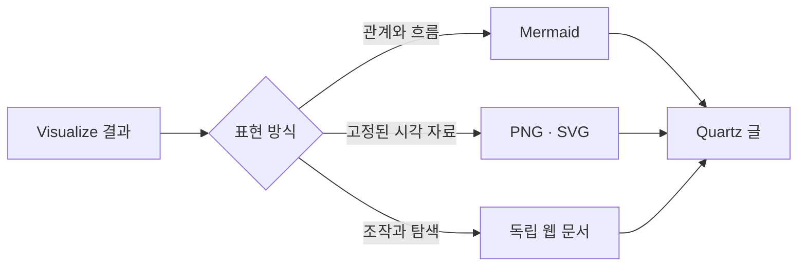

이 문서는 일반 지식 글 연재와 분리해 관리하는 **00번 운영 문서**다. `content/operations`에 두고, 이후 Quartz 글에 Visualize 결과를 적용할 때 표현 방식 선택부터 iframe 삽입, 모바일 검수, 실서비스 확인까지 참고하는 기준서로 계속 갱신한다.

Visualize로 만든 결과를 이 블로그에서도 그대로 보여 줄 수 있는지 실험한 결과, **정적 다이어그램과 이미지는 자연스럽게 호환되고, 조작 가능한 시각화는 독립된 웹 문서로 감싸서 삽입하면 작동한다.** 다만 Codex 대화 전용 표시 문법을 Markdown에 그대로 붙이는 방식은 사용할 수 없다.

아래에는 Mermaid와 이미지뿐 아니라 슬라이더, 선택 그리드, 지도, 단계별 UI가 포함된 기능 실험과, 실제 운영 중 발견한 iframe 자동 높이·차트 렌더링·모바일 QA 규칙을 함께 정리했다.

## 호환성 결론

| Visualize 결과            | Quartz 적용 방식     | 호환성        | 권장 용도                    |
| ------------------------- | -------------------- | ------------- | ---------------------------- |
| 구조·관계 다이어그램      | Mermaid 코드 블록    | 높음          | 개념 구조, 프로세스, 시퀀스  |
| 정적 차트·인포그래픽      | PNG 또는 SVG 첨부    | 높음          | 연구 결과, 대표 이미지, 공유 |
| 인터랙티브 차트·지도      | 독립 웹 문서 삽입    | 조건부        | 독자가 값을 바꾸는 설명      |
| Codex 대화 전용 표시 문법 | Markdown에 직접 삽입 | 호환되지 않음 | Codex 대화 안에서만 사용     |

가장 간단하고 안정적인 방식은 Mermaid다. 현재 블로그는 Obsidian Flavored Markdown을 통해 Mermaid 렌더링이 활성화되어 있다. 다음 다이어그램은 별도의 이미지 파일이 아니라 이 글의 코드 블록에서 직접 렌더링된다.



## Visualize가 표현하는 범위

이번 테스트에는 아홉 가지 표현 계열을 한 묶음으로 넣었다.

1. 구조와 관계 다이어그램
2. 선·막대·산점도·히스토그램
3. 병렬 작업 타임라인
4. 지리 데이터 지도
5. 조절 가능한 시나리오 시뮬레이션
6. 부분과 전체의 시간 배분
7. 밀집 범주 그리드와 선택 탐색
8. 비교표와 의사결정 매트릭스
9. 조작 가능한 UI 모형과 단계별 설명

정적인 결과만 보여 주는 데서 끝나지 않는다는 점이 중요하다. 슬라이더로 가정을 바꾸거나, 범주를 선택해 세부 정보를 확인하거나, 발행 단계를 눌러 상태 변화를 살펴보는 작은 탐색 도구도 만들 수 있다. [[notes/ontology-judge-loop-agent-validation|Judge Loop 설계]]처럼 관계와 순서가 핵심인 글에서는 정적 흐름도와 단계별 탐색을 함께 쓰는 방식이 특히 잘 맞는다.

## 직접 조작해 보기

아래 시각화에서 콘텐츠 투자 슬라이더, 주제 셀, 발행 단계 버튼을 직접 조작할 수 있다. 지도는 예시 국가 값을 색의 농도로 표시한다.

<iframe
  src="/attachments/visualize-capability-showcase/visualize-capability-atlas.htm"
  title="Visualize 지원 시각화 기능 지도"
  loading="lazy"
  sandbox="allow-scripts"
  style="display:block;width:100%;height:78vh;min-height:720px;border:1px solid currentColor;border-radius:12px;background:transparent"
></iframe>

[시각화를 새 화면에서 크게 열기](/attachments/visualize-capability-showcase/visualize-capability-atlas.htm)

이 기능 지도는 여러 시각화 계열을 한 화면에 모은 대형 데모라 제한된 뷰포트와 새 화면 링크를 의도적으로 유지한다. 한 글의 핵심 개념을 설명하는 소형 탐색기라면 아래에서 정리한 자동 높이 방식을 우선한다.

## 실제 발행에서 알아둘 점

인터랙티브 시각화가 모든 글의 기본값이 될 필요는 없다. 관계만 설명하면 Mermaid가 더 가볍고, 검색·RSS·SNS 공유까지 고려하면 PNG나 SVG가 더 안정적이다. 독자가 조건을 바꾸면서 결과를 비교해야 할 때 비로소 독립 웹 문서가 값을 한다.

독립 문서 방식에는 몇 가지 경계도 있다.

- 블로그 본문과 시각화는 서로 분리된 실행 영역이므로 블로그의 테마 전환이 즉시 동기화되지 않을 수 있다.
- 외부 모듈을 사용하는 지도는 네트워크가 차단된 환경에서 경계 데이터를 불러오지 못할 수 있다.
- Codex 대화에서 사용하는 전용 표시 지시문은 Quartz 문법이 아니므로, 독립 문서나 정적 자산으로 변환해야 한다.
- 본문 안에서 완결되는 탐색기는 내부 스크롤보다 콘텐츠 높이에 맞춘 iframe 자동 조절이 낫다. 반대로 매우 큰 지도나 대시보드는 제한된 뷰포트와 새 화면 링크를 의도적으로 사용할 수 있다.

## 2번 글 적용에서 배운 iframe 실전 규칙

[[notes/ontology-in-the-agentic-era|2번 글]]에 세 탭짜리 의미 계층 탐색기를 넣으면서 두 가지 실제 오류가 발생했다. 첫째, 모바일에서 iframe이 짧아 내부 스크롤이 생겼다. 이를 피하려고 초기 높이를 1,080~1,380px로 크게 잡자 이번에는 짧은 탭 아래에 긴 빈 공간이 남았다. 둘째, 막대 채움에 너비를 지정했지만 요소가 인라인 `span`이라 실제 막대가 보이지 않았다.

이 과정에서 얻은 핵심 교훈은 **iframe 높이를 예상하지 말고 현재 활성 콘텐츠를 실제 브라우저에서 측정해야 한다**는 것이다. 최종 구현은 다음 원칙을 따른다.

### 1. 큰 고정 높이를 안전장치로 쓰지 않는다

`height: 1380px`처럼 가장 긴 모바일 상태를 기준으로 고정하면 잘림은 줄지만, 짧은 탭에는 그 차이만큼 빈 공간이 남는다. 초기 높이는 첫 렌더링을 버틸 정도의 보통 값만 두고, 로드 직후 실제 높이로 교체한다.

```html
<iframe
  id="interactive-frame"
  src="/attachments/example/explorer.htm"
  scrolling="no"
  sandbox="allow-scripts allow-same-origin"
  style="display:block;width:100%;height:920px;overflow:hidden"
></iframe>
```

`allow-same-origin`은 블로그가 직접 관리하는 동일 출처 문서가 부모의 iframe 요소에 접근하기 위해 사용한다. 외부에서 받은 HTML이나 신뢰하지 않는 콘텐츠에는 `allow-scripts allow-same-origin` 조합을 적용하면 안 된다.

### 2. 동일 출처 문서는 자식이 자신의 iframe 높이를 직접 조절한다

이번 Quartz 환경에서는 Markdown 본문에 넣은 부모 페이지 메시지 수신 스크립트가 SPA 이동과 실행 시점에 따라 안정적으로 재실행되지 않았다. 동일 출처의 신뢰된 문서라면 자식 문서에서 `window.frameElement`를 사용해 자신의 iframe 높이를 직접 바꾸는 편이 단순하고 안정적이었다.

```js
let lastFrameHeight = 0
let resizeFrameRequest = 0

function reportHeight() {
  cancelAnimationFrame(resizeFrameRequest)
  resizeFrameRequest = requestAnimationFrame(() => {
    const root = document.getElementById("explorer")
    const bodyStyle = getComputedStyle(document.body)
    const padding =
      (Number.parseFloat(bodyStyle.paddingTop) || 0) +
      (Number.parseFloat(bodyStyle.paddingBottom) || 0)
    const height = Math.ceil(root.getBoundingClientRect().height + padding + 2)
    const frame = window.frameElement

    if (frame?.tagName === "IFRAME" && Math.abs(height - lastFrameHeight) > 1) {
      lastFrameHeight = height
      frame.style.height = `${height}px`
    }
  })
}

setTimeout(reportHeight, 0)
setTimeout(reportHeight, 250)
```

높이 차이가 1px보다 클 때만 갱신해 불필요한 반복을 막는다. `body`에는 기본 여백을 제거하고 `overflow: hidden`을 적용해 iframe 내부 스크롤바가 별도로 생기지 않게 한다.

### 3. 탭과 동적 상태가 바뀔 때마다 다시 측정한다

첫 화면만 맞으면 충분하지 않다. 탭별 콘텐츠 높이가 다르므로 활성 패널을 바꾼 직후와 레이아웃 적용이 끝난 직후에 다시 측정해야 한다.

```js
function activateTab(id) {
  tabs.forEach((tab) => tab.setAttribute("aria-selected", String(tab.dataset.tab === id)))
  panels.forEach((panel) => panel.classList.toggle("is-active", panel.id === id))
  reportHeight()
  setTimeout(reportHeight, 50)
}
```

슬라이더 결과 문구, 선택 항목의 세부 설명, 접고 펼치는 영역처럼 세로 길이를 바꾸는 모든 상호작용에도 같은 측정을 연결한다. 반대로 iframe 높이 변경 자체를 감시하는 과도한 `ResizeObserver`는 크기 변경이 다시 관찰을 일으키는 루프를 만들 수 있으므로, 상태가 바뀌는 명확한 지점에서 측정하는 방식을 우선한다.

### 4. CSS 막대의 채움 요소는 블록으로 만든다

인라인 `span`은 `width: 80%`가 의도대로 적용되지 않는다. 막대 채움에는 `display: block` 또는 `inline-block`을 명시한다.

```css
.bar-track {
  height: 10px;
  overflow: hidden;
  border-radius: 999px;
}

.bar-fill {
  display: block;
  height: 100%;
  width: 80%;
  border-radius: inherit;
}
```

“배경 트랙이 보인다”는 사실만으로 차트가 정상이라고 판단하면 안 된다. 실제 채움 너비를 브라우저에서 픽셀로 측정해야 한다.

### 5. 설명용 상대값은 측정 데이터처럼 보이지 않게 경계를 표시한다

독자가 조절하는 차트에는 숫자와 단계가 들어가기 쉽다. 논문이나 실험에서 측정한 값이 아니라 글의 질적 구분을 시각화한 경우, 도구 안과 본문 양쪽에 **설명용 상대값이며 성능 수치나 권고 임계값이 아님**을 표시한다.

## 다음 인터랙티브 글의 필수 검수 게이트

정적 빌드 성공만으로는 모바일 시각화가 정상이라고 말할 수 없다. 다음 작업에서는 아래 검사를 모두 통과해야 발행 완료로 본다.

1. **소스 검사:** HTML 파싱, JavaScript 구문, 중복 ID, `for`·`aria-controls`·스크립트 선택자의 대상 존재 여부를 확인한다.
2. **Quartz 검사:** 게시물 검증, `npm run check`, 전체 테스트, `npx quartz build`, 빌드 후 경로 검증을 수행한다.
3. **모바일 브라우저 검사:** 최소 390×844px 환경에서 첫 탭뿐 아니라 모든 탭을 실제로 눌러 본다.
4. **높이 검사:** iframe 높이와 활성 콘텐츠 높이 차이가 5px 이내인지 측정한다.
5. **스크롤·잘림 검사:** iframe 내부 세로 스크롤이 없고 활성 패널 하단이 뷰포트 안에 들어오는지 확인한다.
6. **가로 넘침 검사:** iframe과 부모 페이지 모두 `scrollWidth > innerWidth`가 아닌지 확인한다.
7. **차트 수치 검사:** 막대·점·선의 실제 픽셀 위치나 비율이 데이터와 일치하는지 확인한다.
8. **실서비스 재검사:** 로컬 빌드가 아니라 정확한 병합 커밋이 배포된 공개 URL을 캐시 무효화 쿼리와 함께 다시 검사한다.

2번 글의 최종 공개 페이지를 iPhone 390×844px 조건으로 검사했을 때, 다섯 가지 이동 탭은 약 922px, 형식성 비교는 806px, 도입 시나리오는 1,026px로 각각 자동 조절됐다. 모든 탭에서 내부 스크롤·잘림·가로 넘침이 없었고, 막대 비율도 `40% / 40% / 100% / 100% / 80%`로 확인했다. 이처럼 **글이 보인다**가 아니라 **모든 상태를 측정했다**가 최종 검수 기준이어야 한다.

따라서 이 블로그에서는 **Mermaid를 기본값으로, PNG·SVG를 안정적인 전달 수단으로, 인터랙티브 문서를 꼭 필요한 글에만 선택적으로 사용하는 방식**이 가장 현실적이다. 인터랙티브 문서를 선택했다면 현재 탭의 실제 높이에 맞춘 자동 조절과 모바일 실서비스 검수를 발행 계약에 포함해야 한다.
