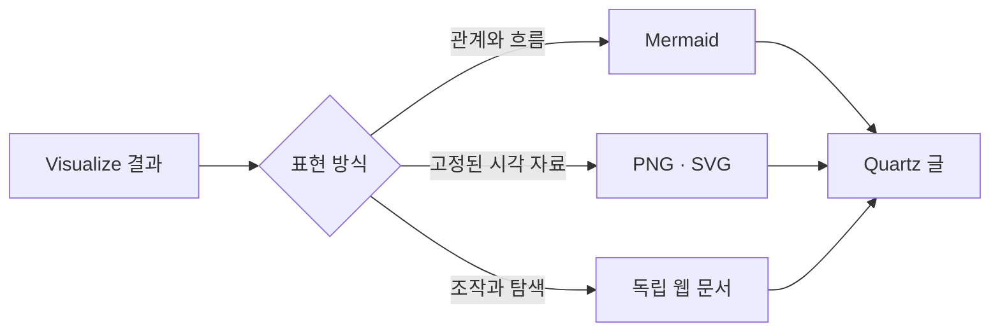

Visualize로 만든 결과를 이 블로그에서도 그대로 보여 줄 수 있는지 궁금했다. 결론부터 말하면 **정적 다이어그램과 이미지는 자연스럽게 호환되고, 조작 가능한 시각화는 독립된 웹 문서로 감싸서 삽입하면 작동한다.** 다만 Codex 대화 전용 표시 문법을 Markdown에 그대로 붙이는 방식은 사용할 수 없다.

이 글은 기능 소개가 아니라 실제 Quartz v5 발행 환경에서 확인하기 위한 호환성 실험이다. 아래에는 Mermaid와 이미지뿐 아니라 슬라이더, 선택 그리드, 지도, 단계별 UI가 포함된 시각화 전체를 직접 넣었다.

## 호환성 결론

| Visualize 결과            | Quartz 적용 방식     | 호환성        | 권장 용도                    |
| ------------------------- | -------------------- | ------------- | ---------------------------- |
| 구조·관계 다이어그램      | Mermaid 코드 블록    | 높음          | 개념 구조, 프로세스, 시퀀스  |
| 정적 차트·인포그래픽      | PNG 또는 SVG 첨부    | 높음          | 연구 결과, 대표 이미지, 공유 |
| 인터랙티브 차트·지도      | 독립 웹 문서 삽입    | 조건부        | 독자가 값을 바꾸는 설명      |
| Codex 대화 전용 표시 문법 | Markdown에 직접 삽입 | 호환되지 않음 | Codex 대화 안에서만 사용     |

가장 간단하고 안정적인 방식은 Mermaid다. 현재 블로그는 Obsidian Flavored Markdown을 통해 Mermaid 렌더링이 활성화되어 있다. 다음 다이어그램은 별도의 이미지 파일이 아니라 이 글의 코드 블록에서 직접 렌더링된다.

## Visualize가 표현하는 범위

이번 테스트에는 아홉 가지 표현 계열을 한 묶음으로 넣었다.

1. 구조와 관계 다이어그램
2. 선·막대·산점도·히스토그램
3. 병렬 작업 타임라인
4. 지리 데이터 지도
5. 조절 가능한 시나리오 시뮬레이션
6. 부분과 전체의 시간 배분
7. 밀집 범주 그리드와 선택 탐색
8. 비교표와 의사결정 매트릭스
9. 조작 가능한 UI 모형과 단계별 설명

정적인 결과만 보여 주는 데서 끝나지 않는다는 점이 중요하다. 슬라이더로 가정을 바꾸거나, 범주를 선택해 세부 정보를 확인하거나, 발행 단계를 눌러 상태 변화를 살펴보는 작은 탐색 도구도 만들 수 있다. [[notes/ontology-judge-loop-agent-validation|Judge Loop 설계]]처럼 관계와 순서가 핵심인 글에서는 정적 흐름도와 단계별 탐색을 함께 쓰는 방식이 특히 잘 맞는다.

## 직접 조작해 보기

아래 시각화에서 콘텐츠 투자 슬라이더, 주제 셀, 발행 단계 버튼을 직접 조작할 수 있다. 지도는 예시 국가 값을 색의 농도로 표시한다.

<iframe
  src="/attachments/visualize-capability-showcase/visualize-capability-atlas.htm"
  title="Visualize 지원 시각화 기능 지도"
  loading="lazy"
  sandbox="allow-scripts"
  style="display:block;width:100%;height:78vh;min-height:720px;border:1px solid currentColor;border-radius:12px;background:transparent"
></iframe>

[시각화를 새 화면에서 크게 열기](/attachments/visualize-capability-showcase/visualize-capability-atlas.htm)

## 실제 발행에서 알아둘 점

인터랙티브 시각화가 모든 글의 기본값이 될 필요는 없다. 관계만 설명하면 Mermaid가 더 가볍고, 검색·RSS·SNS 공유까지 고려하면 PNG나 SVG가 더 안정적이다. 독자가 조건을 바꾸면서 결과를 비교해야 할 때 비로소 독립 웹 문서가 값을 한다.

독립 문서 방식에는 몇 가지 경계도 있다.

- 블로그 본문과 시각화는 서로 분리된 실행 영역이므로 블로그의 테마 전환이 즉시 동기화되지 않을 수 있다.
- 긴 시각화는 본문 안에서 별도의 스크롤이 생길 수 있어 새 화면 링크를 함께 제공하는 편이 좋다.
- 외부 모듈을 사용하는 지도는 네트워크가 차단된 환경에서 경계 데이터를 불러오지 못할 수 있다.
- Codex 대화에서 사용하는 전용 표시 지시문은 Quartz 문법이 아니므로, 독립 문서나 정적 자산으로 변환해야 한다.

따라서 이 블로그에서는 **Mermaid를 기본값으로, PNG·SVG를 안정적인 전달 수단으로, 인터랙티브 문서를 꼭 필요한 글에만 선택적으로 사용하는 방식**이 가장 현실적이다. 이번 페이지가 정상적으로 보인다면 Visualize의 모든 주요 표현 계열을 Quartz 글 안에서 제공할 수 있다는 뜻이다.
