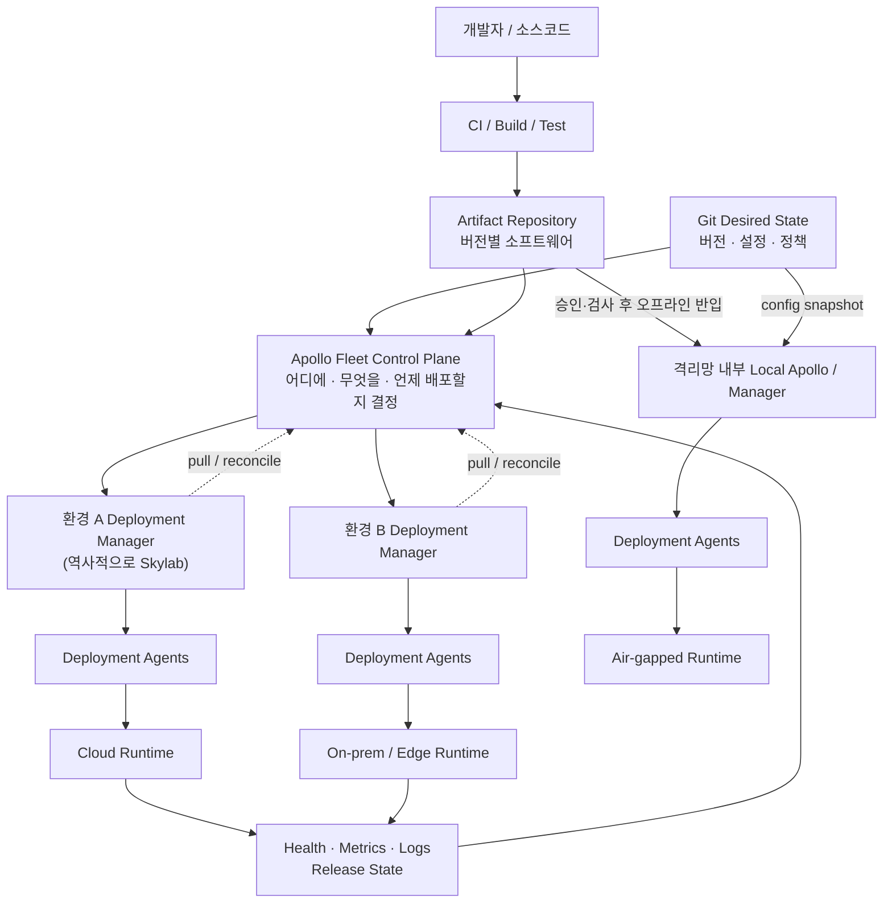
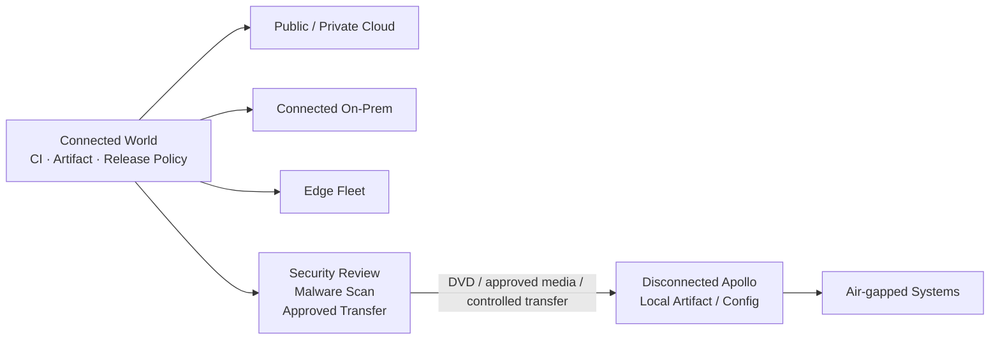
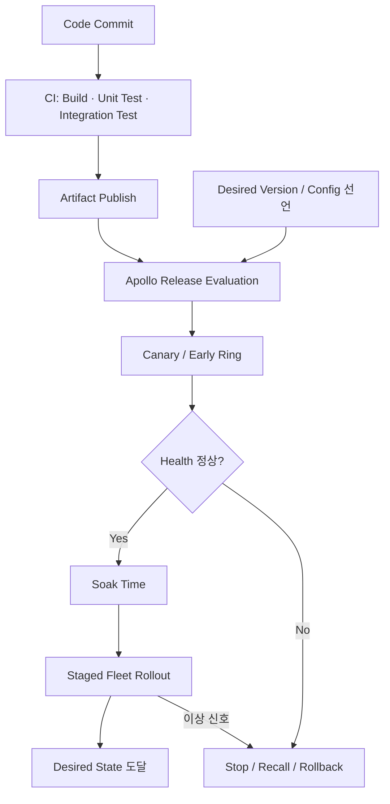
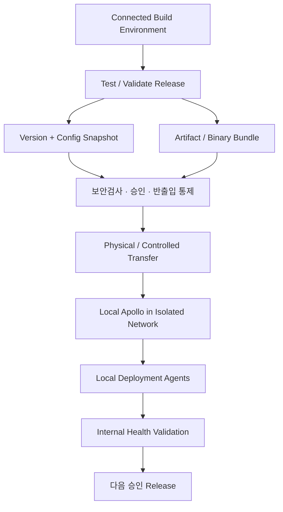

# 팔란티어 아폴로 심층 리서치: 클라우드부터 온프레미스·엣지·에어갭까지 하나의 소프트웨어 배포 체계

## 경영진 요약

**Palantir Apollo는 데이터 분석 도구가 아니라, 소프트웨어를 여러 운영 환경에 지속적으로 배포·업데이트·검증·롤백하기 위한 “소프트웨어 배포 및 운영 제어 계층”에 가깝다.** 원래 Palantir Foundry를 퍼블릭 클라우드 SaaS처럼 운영하기 위해 만들어졌지만, 온프레미스와 정부·기밀 환경까지 동일한 방식으로 관리할 필요 때문에 독립 플랫폼으로 발전했다. Palantir의 2020년 기술 설명은 Apollo를 애플리케이션과 기반 인프라 사이에 위치한 독립 계층으로 정의하며, 현재 Palantir도 Apollo를 Foundry와 AIP 설치를 뒷받침하는 배포 인프라로 설명하고 있다. 또한 기존 글에는 Apollo가 Palantir 내부 플랫폼만이 아니라 다른 소프트웨어 기업과 사내 엔지니어링 조직도 사용할 수 있는 제품군으로 확장됐다는 편집자 주가 추가되어 있다. citeturn37view6turn37view7turn46search0

초보자 관점에서 비유하면, **Jenkins·GitHub Actions 같은 CI가 “제품을 만드는 공장”이라면 Apollo는 완성된 소프트웨어를 수백·수천 개의 서로 다른 목적지에 안전하게 배송하고, 어느 버전을 어디에서 실행할지 통제하고, 문제가 생기면 회수하는 글로벌 물류·관제 시스템**이다. 특히 Apollo의 차별점은 일반적인 CD 시스템이 인터넷에 잘 연결된 Kubernetes·클라우드를 전제로 하는 것과 달리, 퍼블릭 클라우드, 연결된 온프레미스, 정부 전용 클라우드, 엣지 장비, 심지어 물리적으로 단절된 네트워크까지 하나의 운영 철학으로 다루려 했다는 데 있다. Palantir은 이를 “cloud, on-prem, classified networks”에 걸친 이기종 배포의 통합 관리라고 설명한다. citeturn37view7turn37view8

가장 중요한 구조적 특징은 **Desired State(원하는 버전·설정)를 중앙에서 선언하고, 각 환경이 자신의 현재 상태를 보고하며 필요한 변경 작업을 받아 실행하는 방식**이다. Palantir이 공개한 가장 상세한 아키텍처 자료에서는 Apollo가 여러 설치 환경을 관리하는 상위 control plane 역할을 하고, 각 환경의 배포 관리자였던 **Skylab**이 Apollo를 조회해 작업을 가져오는 pull 모델을 사용했다. 각 호스트의 deployment agent가 실제 설치·중지·설정·시작을 수행했다. 빌드 결과물은 artifact repository에 저장되고, 목표 버전과 설정은 Git 저장소에 선언되며, Apollo는 의존성·canary·soak time·blue/green·health signal을 이용해 릴리스를 점진적으로 전파하거나 recall/rollback한다. citeturn20view0

다만 **여기에는 중요한 공개정보 한계가 있다.** Apollo의 현행 2026년 제품 내부 topology, “Deployment Manager”라는 이름의 현재 제품 모듈, Apollo agent의 최신 구현, API 명세, 지원 OS 목록, 포트/FQDN 요구사항, 최소 CPU·메모리, Helm/Terraform 설치 절차, control-plane 자체의 HA topology와 RPO/RTO 등은 일반 공개 문서에서 상세히 확인하기 어렵다. 아래 아키텍처 설명은 따라서 **Palantir이 공개한 2020년 상세 엔지니어링 구조를 기준으로 하되, 2026년 현재 제품 포지셔닝과 교차검증하여 해석한 것**이다. 현재 Palantir의 AIPCon 10 자료가 Apollo를 여전히 Foundry/AIP의 deployment infrastructure로 설명한다는 점은 핵심 설계 철학의 연속성을 뒷받침하지만, 과거의 내부 명칭이 현재 API나 제품 모듈 이름과 동일하다고 보아서는 안 된다. citeturn20view0turn37view6turn46search0

**핵심 판단을 먼저 요약하면 다음과 같다.**

| 질문 | 결론 |
|---|---|
| Apollo는 Kubernetes인가? | 아니다. Kubernetes와 비슷한 선언적 운영 원칙을 사용하지만, 더 상위에서 여러 종류의 배포 환경을 통제하는 소프트웨어 배포·운영 플랫폼에 가깝다. citeturn20view0 |
| CI 도구인가? | 주 역할은 CI 자체보다 **CD·release orchestration·fleet management**다. 빌드 시스템이 artifact를 만든 뒤 Apollo가 배포 정책을 적용하는 구조가 공개돼 있다. citeturn20view0 |
| 클라우드만 지원하나? | 아니다. 클라우드, 연결형 온프레미스, 정부·기밀 환경, 엣지, 단절 네트워크가 핵심 설계 대상이다. citeturn37view7turn37view8 |
| 에어갭에서도 가능한가? | 가능하도록 설계됐다. 과거 공개 구조에서는 disconnected network 내부에 별도의 Apollo를 설치하고 승인된 artifact/config snapshot을 반입하는 방식이 설명됐다. citeturn20view0 |
| 업데이트가 자동인가? | connected 환경에서는 자동·점진 배포, health 검증, blue/green, recall/rollback이 핵심 기능으로 설명된다. citeturn37view8turn20view0 |
| 가격은 공개돼 있나? | 표준 Apollo list price는 공개 자료에서 확인되지 않는다. 기업 계약형 제품으로 보는 것이 타당하며 실제 조건은 견적·계약 범위에 의존한다. Microsoft Marketplace에 Apollo 항목은 공개된 바 있으나 표준화된 공개 가격표는 확인되지 않는다. citeturn15search13 |

## 제품의 정체성과 아키텍처

Apollo가 등장한 배경을 이해하는 것이 제품을 이해하는 가장 쉬운 방법이다. 초기 Gotham은 고객 소유 하드웨어와 기밀 네트워크에 설치되는 전통적인 온프레미스 엔터프라이즈 소프트웨어에 가까워 업그레이드가 드물고 수동적이었다. Foundry를 만들면서 Palantir은 수백 개 마이크로서비스로 구성되는 cloud-native SaaS 모델을 택했지만, 정부·국방 고객에게는 일반 퍼블릭 클라우드뿐 아니라 정부 전용 클라우드, 기밀 데이터센터, 물리적으로 단절된 환경도 필요했다. 그 결과 “한 클라우드에 하나의 SaaS를 운영하는 CD”가 아니라 **동일한 소프트웨어를 매우 다른 infrastructure boundary에 지속 배포하는 시스템**이 필요해졌고, 이것이 Apollo의 출발점이었다. citeturn37view6turn37view7

Palantir은 Apollo를 애플리케이션에서 분리된 standalone platform, 즉 애플리케이션과 infrastructure 사이의 계층이라고 설명했다. 따라서 Foundry가 “데이터·업무 애플리케이션이 실행되는 플랫폼”이고 AIP가 “AI를 운영 업무에 연결하는 플랫폼”이라면, Apollo는 **그 소프트웨어들이 어떤 환경에서 어떤 버전과 설정으로 살아 있어야 하는지를 책임지는 배포·운영 계층**이라고 이해하면 좋다. 2026년 AIPCon 자료에서도 Apollo는 “every Foundry and AIP installation” 뒤에 있는 deployment infrastructure로 소개되고 있다. citeturn37view7turn46search0

**공개 아키텍처를 사용자 질문의 구성요소에 매핑하면 다음과 같다.**

| 요청한 구성요소 | 공개 자료에서 확인되는 대응 개념 | 역할 | 중요한 주의점 |
|---|---|---|---|
| **Control Plane** | Apollo fleet control plane | 여러 설치 환경의 목표 버전·설정과 현재 상태를 비교하고 변경 작업을 결정한다. citeturn20view0 | 현재 제품의 실제 마이크로서비스 topology는 비공개다. |
| **Deployment Manager** | 역사적으로 환경별 **Skylab** | 하나의 Foundry/Gotham 설치에 속한 애플리케이션 lifecycle, 설정, host를 관리하고 Apollo에서 변경 작업을 가져온다. citeturn20view0 | “Skylab”은 2020 공개 아키텍처 명칭이다. 현행 Apollo 제품에서 동일 이름을 사용한다고 단정할 수 없다. |
| **Agents** | deployment agent | 각 machine에서 install/start/stop/configure/upgrade 같은 실제 lifecycle 명령을 수행한다. citeturn20view0 | 최신 agent protocol이나 OS compatibility matrix는 공개되지 않았다. |
| **Runtime** | 관리 대상 host/service runtime | Foundry·Gotham·AIP 또는 Apollo가 관리하는 애플리케이션 서비스가 실제 실행되는 곳이다. citeturn37view8turn46search0 | 공개자료에는 “Apollo Runtime”이란 독립 제품 모듈이 명확히 정의돼 있지 않다. |
| **Update Pipeline** | build system → artifact repository → Apollo rollout | artifact가 생성되면 Apollo가 버전을 인지하고 정책, 의존성, soak/canary 조건에 따라 fleet에 배포한다. citeturn20view0 | CI/build 자체를 Apollo가 모두 수행한다고 보면 안 된다. |
| **Configuration layer** | Git-based declarative configuration | 목표 버전·설정을 선언하고 merge/review 정책으로 변경을 통제한다. citeturn20view0 | 현행 외부 고객용 schema/API의 세부 규격은 공개 정보가 제한적이다. |
| **Observability / adjudication** | health, logs, metrics, rollout monitoring | 새 릴리스가 정상인지 판단하고 진행, 중단, recall/rollback을 결정하는 feedback loop를 만든다. citeturn20view0turn37view8 | 정확한 현행 metrics engine 구현은 비공개다. |

전체 구조를 개념적으로 그리면 아래와 같다. **이 그림은 현재 Palantir 공식 reference architecture를 그대로 복제한 것이 아니라, 공개된 2020년 Apollo/Skylab 설계와 현재 Apollo의 배포 역할을 종합해 단순화한 모델**이다. citeturn20view0turn46search0

여기서 가장 주목할 부분은 **pull-based control**이다. Palantir의 공개 설계에서는 각 환경의 Skylab이 Apollo에 자신의 현재 상태, 버전, 설정, health 등을 전달하고 필요한 upgrade task를 질의한다. 즉 중앙 Apollo가 모든 고객망에 inbound 관리 연결을 열어 직접 명령을 밀어 넣는 구조가 아니었다. 이는 방화벽·망분리·보안 경계가 강한 고객 환경에서 매우 유리한 설계다. citeturn20view0

서비스 패키징에도 명시적인 metadata가 사용됐다. 공개된 2020년 구조에서 **Service Layout Specification(SLS)**은 코드뿐 아니라 lifecycle script, hardware requirement, 기본 configuration 등을 포함해 하나의 서비스가 어떻게 실행되는지 표현했다. 업그레이드 시 환경 관리자가 artifact repository에서 새로운 SLS를 얻고, deployment agent에 기존 서비스를 중지시키고 configuration override를 적용한 뒤 새 버전을 시작하게 하는 형태였다. 다만 SLS 역시 공개된 역사적 구현이므로 현재 외부 Apollo SDK나 package format과 동일하다고 가정해서는 안 된다. citeturn20view0

Apollo가 단순한 “버전 배포기” 이상인 이유는 **dependency graph와 release safety를 고려한다는 점**이다. 공개 설계에서는 각 component가 허용되는 dependency version range를 선언할 수 있었고, Apollo가 그 의존성을 해석했다. 데이터베이스 migration처럼 downgrade가 불가능하거나 특정 순서를 반드시 거쳐야 하는 경우도 고려하며, 문제가 있는 릴리스는 관리자·개발자 또는 Apollo 자체 판단으로 recall할 수 있도록 설계됐다. citeturn20view0

결국 Apollo의 본질을 한 문장으로 압축하면 **“환경을 직접 하나씩 관리하는 DevOps에서, 소프트웨어 fleet의 desired state와 릴리스 위험을 중앙 정책으로 관리하는 Product Operations로 넘어가기 위한 플랫폼”**이라고 볼 수 있다. Palantir도 최근에는 Apollo의 의미를 단순 CI/CD보다 넓혀 소프트웨어 배포·패치·롤백·검증·거버넌스 문제로 확장하는 방향을 제시하고 있다. citeturn7search1turn37view6

## 운영 환경과 배포 모델

Apollo의 가장 큰 특징은 **“하나의 운영 환경을 잘 관리하는 것”보다 “서로 완전히 다른 환경을 하나의 소프트웨어 fleet처럼 관리하는 것”**에 있다. Palantir은 퍼블릭 클라우드뿐 아니라 cloud region 간 data residency, 여러 cloud provider, connected on-premises appliance, edge device, classified/disconnected environment까지 Apollo의 적용 범위로 설명해 왔다. citeturn37view8turn37view10

| 환경 | 전형적인 모델 | Apollo 관점의 강점 | 주요 제약 |
|---|---|---|---|
| **퍼블릭 클라우드** | 중앙 Apollo + 클라우드 runtime | 자동 배포, telemetry feedback, canary/blue-green, 빠른 업데이트에 가장 적합하다. citeturn37view8turn20view0 | cloud IAM, region, data residency, network boundary 설계가 필요하다. |
| **멀티클라우드** | cloud provider별 환경을 하나의 fleet으로 관리 | Palantir은 Apollo가 여러 cloud provider와 region에 동일 SaaS를 확장한다고 설명한다. citeturn37view8 | provider별 compute/network/storage 차이는 여전히 infrastructure 계층에서 해결해야 한다. |
| **Connected On-Premises** | 고객 데이터센터 내부 runtime + 환경 관리자, 중앙 Apollo와 제한적 연결 | 기존 수동 온프레미스 업그레이드를 SaaS식 연속 배포로 바꾸는 핵심 시나리오다. citeturn37view8 | 고객 hardware lifecycle, 방화벽, DNS, certificate, local storage 및 운영 책임이 남는다. |
| **정부·기밀 전용 환경** | 규제 boundary별 전용 Apollo 또는 관리 plane | 규제 경계를 넘지 않으면서 공통 release strategy를 유지할 수 있다. citeturn20view0turn26search6 | accreditation boundary마다 별도 설계·승인이 필요하다. |
| **Edge** | 중앙에서 artifact/policy 관리, edge의 local runtime에서 실행 | 중앙 software fleet와 현장 장비를 같은 release process로 연결한다. Palantir은 appliance와 edge device 지원을 명시하고 있다. citeturn37view8 | CPU·메모리·스토리지, 간헐적 연결, bandwidth, 물리 보안 문제가 커진다. |
| **Air-gapped / Disconnected** | 격리망 내부 Apollo + 승인된 artifact/config의 오프라인 반입 | 양방향 인터넷 연결 없이도 동일한 배포 원칙을 적용할 수 있다. citeturn20view0 | release latency, 물리 반입, malware scanning, 저장소 복제, 인력 비용이 크게 증가한다. |

**퍼블릭 클라우드.** 가장 상세한 공개 기술 자료가 작성된 2020년 당시 Palantir은 자사 dedicated Foundry/Gotham 환경 상당수가 AWS와 Azure에 위치한다고 설명했다. 또한 Apollo 제품 설명에서는 특정 provider 하나가 아니라 여러 cloud region과 provider에 걸친 multi-cloud 운영을 핵심 가치로 내세웠다. 그러나 2026년 현재 일반 공개 자료에서 “AWS의 어떤 서비스, Azure의 어떤 서비스, GCP의 어떤 서비스가 Apollo target으로 공식 지원된다”는 식의 완전한 compatibility matrix는 확인하기 어렵다. 따라서 **AWS와 Azure는 공개 기술자료에서 명시적으로 확인되지만, GCP를 포함한 모든 주요 cloud provider에 동일 수준의 현행 Apollo 지원을 단정하는 것은 피해야 한다.** citeturn20view0turn37view8

**온프레미스.** Apollo가 특히 독특한 지점이다. Palantir은 connected on-premises appliance에도 SaaS와 같은 upgrade automation을 적용한다고 설명한다. 개발팀 관점에서는 클라우드 고객과 온프레미스 고객을 위해 별도의 release branch를 운영하기보다는, Apollo가 환경 차이를 흡수하고 동일 제품을 각 환경의 조건에 맞게 배포하도록 하는 것이 목표다. citeturn37view8turn37view10

**Edge.** Palantir은 오래전부터 드론·차량·ruggedized server rack 같은 사례를 Apollo 설명에 사용했고, 2024년 Edgescale AI와의 협력에서도 Live Edge가 Apollo framework를 이용해 Virtual Compute Environment에서 실제 physical device까지 소프트웨어를 배포한다고 설명했다. 따라서 Apollo에서 edge는 단순 마케팅 개념이 아니라 “중앙 데이터센터에서 실행되지 않는 실제 현장 compute target”까지 software distribution domain에 포함하려는 전략이라고 볼 수 있다. citeturn37view7turn37view9turn46search4

**Air-gapped 환경**은 Apollo 아키텍처를 이해하는 데 특히 중요하다. Palantir의 상세 공개 자료에 따르면 초기에는 중앙 환경에서 검증된 version/configuration snapshot과 binary를 추출하여 격리망으로 옮기고, 내부 시스템이 이를 적용하는 방식이 사용됐다. 이후에는 Apollo 자체를 disconnected environment 내부에 설치할 수 있도록 구조가 발전했다. 즉 인터넷상의 중앙 Apollo와 항상 양방향 통신하는 것이 전제가 아니다. citeturn20view0

이 모델에는 현실적인 대가가 있다. 격리망에서는 인터넷 연결형 SaaS처럼 새 버전을 즉시 내보낼 수 없고, artifact·configuration·dependency 자체가 security boundary를 통과하기 위한 승인 절차를 거쳐야 한다. Palantir도 과거 disconnected deployment가 물리 매체, malware 검사, 사람에 의한 반입 때문에 connected cloud보다 훨씬 비싸고 어려웠다고 설명했다. Apollo는 이를 없애는 것이 아니라 **그 제한 조건 속에서도 배포를 반복 가능하고 관리 가능한 프로세스로 바꾸는 것**에 가깝다. citeturn20view0

## 설치·업그레이드·CI/CD

여기서 먼저 오해를 하나 제거할 필요가 있다. **Apollo는 일반적인 self-hosted 오픈소스 도구처럼 “Docker Compose 한 줄”이나 “Helm install”로 공개 설치할 수 있는 제품으로 문서화돼 있지 않다.** 현재 공개 Apollo 웹 자료와 Palantir의 기술 글에서는 제품 개념·운영 방식은 비교적 상세하지만, 다운로드 URL, 최소 시스템 요구사항, 공개 Helm chart, 설치용 Terraform module, 공개 포트 표와 같은 독립적인 self-service installation manual은 확인하기 어렵다. 따라서 실제 고객 설치는 Palantir과의 enterprise onboarding 및 해당 환경별 deployment documentation을 전제로 생각하는 편이 안전하다. citeturn37view6turn46search0

반대로 **Apollo가 설치된 뒤 소프트웨어가 업데이트되는 논리적 workflow**는 상당히 잘 공개돼 있다. build system이 component를 빌드해 artifact repository에 publish하고, Apollo는 새로운 version을 인지한다. 별도의 Git repository에는 각 환경 또는 fleet가 원하는 version/configuration이 선언된다. Apollo는 현재 상태와 목표 상태를 비교해 변경 작업을 계산하고, 환경 관리 계층은 그 작업을 받아 deployment agent를 통해 실행한다. citeturn20view0

Palantir의 공개 설명에서 Apollo는 unit test와 별도로 synthetic integration test, end-to-end test, canary와 performance/error 상태를 이용해 새 버전을 평가하고, 정해진 soak period 이후 점진적으로 더 많은 환경으로 전파한다. 위험한 버전은 recall하고 필요하면 rollback한다. 이 때문에 Apollo의 업데이트 모델은 단순 `deploy latest`보다 **progressive delivery + fleet reconciliation**에 가깝다. citeturn20view0turn37view8

**Blue/green과 zero-downtime 업그레이드**도 중요한 설계 요소다. Palantir은 Apollo가 staged blue-green upgrade를 수행하고 rollout 중 emergent issue를 발견하면 rollback한다고 설명했다. 다중 노드 서비스를 운영하는 경우 node를 순차적으로 교체하는 방식으로 서비스를 지속시키는 모델도 기술했다. 다만 “모든 애플리케이션이 무조건 무중단”이라는 뜻은 아니다. 애플리케이션이 stateless인지, 데이터베이스 migration이 backward-compatible한지, 충분한 replica가 있는지에 따라 실제 무중단 가능성이 결정된다. Apollo는 이를 자동화할 수 있는 orchestration 계층이지 애플리케이션 자체의 잘못된 upgrade semantics를 마법처럼 제거하지는 않는다. citeturn37view8turn20view0

**CI/CD 통합에서 역할 분담**은 아래처럼 보는 것이 정확하다.

| 단계 | 전통적인 CI/DevOps 도구 | Apollo 역할 |
|---|---|---|
| 소스 관리 | Git | 변경의 입력. Apollo가 source-control 자체를 대체하지 않는다. |
| Build | Jenkins, GitHub Actions, GitLab CI 등과 같은 CI 계층 | 공개 구조에서 build system의 산출물을 소비하는 쪽에 가깝다. citeturn20view0 |
| Unit/Integration Test | CI pipeline | Apollo release 판단 전 품질 신호의 일부가 될 수 있다. citeturn20view0 |
| Artifact 저장 | package/container/artifact repository | Apollo가 versioned artifact를 인지해 rollout 대상으로 삼는다. citeturn20view0 |
| Desired State | Git configuration | 어느 환경이 어떤 version/configuration이어야 하는지 선언한다. citeturn20view0 |
| Deployment | 환경별 script/Kubernetes CD 등 | Apollo의 핵심 영역. 환경별 deployment manager와 agent를 조정한다. citeturn20view0 |
| Progressive Delivery | 별도 Argo Rollouts/Spinnaker 등으로 구현할 수 있는 영역 | canary, soak, blue-green, health-based progression을 Apollo가 맡는 구조다. citeturn20view0turn37view8 |
| Fleet Rollback/Recall | 환경별 수동 또는 별도 도구 | fleet 차원의 release recall/rollback이 핵심 기능이다. citeturn20view0 |

따라서 **“Apollo가 Jenkins를 대체하느냐?”라는 질문에는 대체로 아니라고 답하는 것이 좋다.** 공개 아키텍처상 CI/build system은 별도로 존재하며 artifact를 publish한다. Apollo가 강한 부분은 그 다음 단계, 즉 “artifact A를 어떤 환경에 언제 배포할지, 의존성이 맞는지, 얼마나 오래 관찰할지, 실패하면 어디까지 회수할지”다. citeturn20view0

또한 Git에 목표 상태를 두고 environment가 상태를 reconcile하는 점은 오늘날 **GitOps와 매우 유사한 철학**이다. Palantir 자료에서는 Git repository의 변경에 merge policy와 code review를 적용해 segregation of duties를 구현한다고 설명한다. 다만 이를 이유로 Apollo를 “Argo CD와 같은 Kubernetes GitOps 제품”으로 동일시하면 안 된다. Apollo의 핵심 목적은 Kubernetes라는 단일 orchestration substrate가 아니라 서로 다른 cloud/on-prem/edge/disconnected target의 공통 release management이기 때문이다. citeturn20view0turn37view10

에어갭 upgrade는 별도 workflow를 생각해야 한다.

Palantir의 공개된 disconnected architecture에서는 이와 비슷하게 검증된 versions/configuration snapshot과 binaries를 격리망으로 이동시키고 내부 Apollo 계층이 이를 배포한다. 따라서 에어갭을 준비하는 조직은 Apollo 자체만 보는 것보다 **artifact export/import, malware scanning, cryptographic provenance, removable-media policy, local registry, local observability, patch SLA** 전체를 하나의 공급망으로 설계해야 한다. 앞부분은 Palantir의 공개 구조에 근거하며, signing·local registry·patch SLA는 그러한 구조를 실제 기업에서 안전하게 운영하기 위한 실무적 권고다. citeturn20view0

## 보안·관측성·장애 대응

Apollo 보안의 핵심은 암호화 기능 하나보다 **“변경을 누가 승인하고, 어떤 artifact가 어느 환경으로 가며, 중앙 관리 계층과 보안 영역 사이에 어떤 연결을 허용하고, 이상 배포를 얼마나 빨리 회수할 수 있는가”라는 software supply-chain control**에 있다. Palantir의 공개 설계에서는 desired configuration을 Git에 보관하고 merge/code-review 정책과 segregation of duties를 적용했으며, 환경 측에서 중앙 Apollo로 작업을 pull하는 구조를 사용했다. citeturn20view0

| 보안 영역 | 공개적으로 확인되는 Apollo 접근법 | 실무에서 반드시 추가 확인할 것 |
|---|---|---|
| **변경 승인** | Git 기반 declarative state와 review/merge policy, segregation of duties. citeturn20view0 | 실제 조직의 approver role, emergency change, break-glass 절차 |
| **네트워크 격리** | 환경 측 manager가 Apollo를 조회하는 pull 구조이며 중앙에서 관리망으로 직접 inbound가 필수는 아니었던 것으로 설명된다. citeturn20view0 | 현행 FQDN, TCP port, proxy, TLS/mTLS, certificate rotation |
| **에어갭** | disconnected network 내부에 Apollo를 설치하고 양방향 외부 연결 없이 운영하는 모델이 공개됐다. citeturn20view0 | media control, import approval, malware scanning, offline PKI |
| **Release safety** | dependency checking, canary, blue/green, health monitoring, recall/rollback. citeturn20view0turn37view8 | 누가 rollback 권한을 가지는지, 자동 중단 threshold |
| **로그의 데이터 경계** | 고객 데이터/user-generated content가 환경 밖으로 빠지지 않도록 safe/unsafe logging을 구분하는 설계가 공개됐다. citeturn20view0 | PII/PHI/classified data masking, retention, SIEM export 정책 |
| **감사·규정준수** | Palantir은 FedRAMP, SOC, ISO 등의 인증·승인을 보유하고 있으며 Apollo 관련 정부 환경의 compliance workflow도 공개했다. citeturn26search0turn26search6turn48news0 | 구매하는 정확한 offering과 accreditation boundary가 인증 범위에 포함되는지 |

**Authentication과 Authorization에는 공개정보 한계가 크다.** Palantir은 자사 보안 모델에서 granular access control을 강조하지만, 현재 공개 Apollo 자료만으로 Apollo console이 정확히 어떤 SAML/OIDC 조합과 IdP를 지원하는지, deployment agent identity가 어떻게 발급되는지, service credential rotation이나 workload identity가 어떤 방식인지까지 신뢰성 있게 확정하기 어렵다. 따라서 실제 보안 검토에서는 “SSO 되나요?” 수준을 넘어 IdP federation, MFA, RBAC/ABAC granularity, service account, certificate lifecycle, API token scope, break-glass account, audit export를 Palantir security architecture 문서에서 별도로 확인해야 한다. citeturn26search11

**Compliance 측면에서도 “Palantir이 FedRAMP High를 받았다 = 우리 Apollo 온프레미스 설치도 자동으로 FedRAMP High”라고 해석하면 안 된다.** Palantir은 2024년 자사 full product suite를 포함한 cloud offering의 FedRAMP High milestone을 발표했고, 기존 Moderate 및 DoD 관련 authorization을 확대해 왔다. 그러나 FedRAMP authorization은 특정 cloud service offering과 authorization boundary를 대상으로 하므로, 실제 구매 형태와 배포 환경의 scope를 확인해야 한다. citeturn48news0turn26search9

Palantir의 공개 Information Security 자료에는 SOC 1 Type II, SOC 2 Type II, SOC 3, ISO 27001, ISO 27017, ISO 27018, FedRAMP High 등의 compliance/accreditation 항목이 나열되어 있다. 이것은 Palantir의 전반적인 enterprise/security maturity를 평가하는 데는 중요하지만, 역시 **각 인증서의 적용 제품, region, hosting model과 Apollo 계약 범위를 확인해야 한다.** citeturn26search0

정부 보안에서 Apollo가 단순 installer 이상이라는 점도 주목할 만하다. Palantir은 IL6 security requirement와 Apollo의 관계를 설명하면서 compliance requirement를 Change Request process에 반영하는 접근을 공개했다. 즉 소프트웨어가 accreditation을 받은 뒤 고정되는 것이 아니라, 지속적으로 변경되는 SaaS의 release process 자체에 규정준수를 집어넣으려는 철학이다. citeturn26search6

**Observability**는 Apollo의 CD loop를 가능하게 하는 핵심 요소다. Apollo는 fleet 전체에서 어떤 component version이 실행 중인지, upgrade가 어디까지 진행됐는지, release가 정상인지 등을 중앙에서 볼 수 있도록 설계됐으며, Palantir은 이를 “single pane of glass” fleet monitoring으로 설명했다. citeturn37view8turn37view10

더 상세한 2020 기술 자료에서는 performance metric과 log뿐 아니라 automated event, distributed trace, thread dump, garbage-collection diagnostic 등을 장애 분석 수단으로 설명했다. 또한 connected 환경에서 중앙으로 수집 가능한 telemetry와 고객 데이터가 포함될 수 있는 민감 telemetry를 구분하고, disconnected 환경에는 log/metric database와 분석 도구를 내부에 배치했다. citeturn20view0

Palantir은 당시 운영 규모를 설명하면서 하루 수십 TB의 로그, 수천만 개 time series 같은 큰 수치를 공개하기도 했다. 이 숫자는 Apollo/Palantir 운영 플랫폼이 대규모 telemetry를 다뤄 온 증거로는 의미가 있지만 **2020년 시점의 내부 fleet 수치이지, 현재 Apollo 구매 고객에게 보장되는 capacity specification이나 SLA가 아니다.** 마찬가지로 Palantir이 2020년 Apollo가 주당 41,000회 이상의 fleet update를 처리한다고 소개했던 수치도 역사적 운영 사례이지 현재 throughput 보장치로 읽어서는 안 된다. citeturn20view0turn37view8

실제 장애가 발생했을 때는 Apollo의 구조상 아래 순서로 보는 것이 효율적이다.

| 확인 순서 | 질문 | 의미 |
|---|---|---|
| Desired State | 이 환경이 **어떤 version/config**이 되어야 하는가? | Git/정책 문제와 runtime 문제를 구분한다. citeturn20view0 |
| Observed State | 현재 실제 version과 configuration은 무엇인가? | reconciliation이 멈췄는지 확인한다. citeturn20view0 |
| Task 상태 | 환경 manager가 변경 작업을 가져왔는가? | control-plane/network 문제를 구분한다. citeturn20view0 |
| Artifact | 필요한 binary/package를 받을 수 있는가? | registry/repository 문제를 확인한다. citeturn20view0 |
| Dependency | version constraint나 migration barrier가 있는가? | “배포 안 됨”이 의도된 safety control인지 확인한다. citeturn20view0 |
| Health | canary에서 error/latency가 증가했는가? | rollout이 자동 중단된 원인을 확인한다. citeturn20view0 |
| Logs/Trace | 서비스 내부 장애인가? | application-level root cause를 조사한다. citeturn20view0 |
| Recall | 해당 release를 계속 진행해야 하는가? | 필요 시 release recall/rollback으로 blast radius를 제한한다. citeturn20view0turn37view8 |

이 관점은 매우 중요하다. 전통적인 운영자는 장애가 발생하면 먼저 서버에 SSH해서 로그를 보는 경향이 있지만, Apollo 같은 declarative fleet system에서는 **“원하는 상태 → 실제 상태 → reconciliation task → health decision → runtime” 순으로 내려가는 것이 더 자연스럽다.**

## 확장성·복원력·비용·지원

Apollo에서 scalability는 단순히 control plane 서버를 몇 대 늘리는 문제가 아니다. 더 중요한 것은 **배포 대상 수, 서비스 수, release frequency, environment heterogeneity가 증가해도 사람이 각각의 환경을 수동으로 업그레이드하지 않도록 하는 것**이다. Palantir은 수백 개 개별 서비스가 독립적으로 release되는 Foundry/Gotham을 Apollo가 조정한다고 설명했으며, cloud region·provider·on-prem·edge를 하나의 fleet에서 관리하는 것이 운영 확장의 핵심이라고 설명했다. citeturn37view8turn37view10

고가용성 측면에서 Apollo는 애플리케이션 서비스의 multi-node deployment와 blue/green·rolling upgrade를 이용해 서비스 중단을 줄이는 방식을 공개했다. 충분한 replica가 있는 서비스는 하나의 node를 새 버전으로 교체하고 health를 확인하면서 나머지를 차례로 변경하는 방식이 가능하다. citeturn20view0

그러나 **“Apollo control plane 자체가 어떻게 HA를 구현하는가”는 별개의 질문**이다. 공개 자료만으로 현재 Apollo control plane이 몇 개 replica를 가지는지, 어느 database를 사용하는지, consensus model이 무엇인지, region failure 때 active-active인지 active-passive인지, Apollo 자체의 backup·restore 및 RPO/RTO가 어떻게 보장되는지를 특정하기 어렵다. 이 부분은 enterprise architecture review에서 반드시 공식 HLD/LLD 및 SLA를 받아 검증해야 하는 대표적인 proprietary 영역이다.

Apollo를 사용하는 조직의 **실무적인 DR 설계**는 다음 네 가지를 별개로 잡는 것이 좋다. 이는 Palantir이 공개한 Git desired state, artifact repository, distributed environment 구조를 기반으로 한 설계 권고다. citeturn20view0

첫째, **control-plane DR**이다. Apollo 관리 계층 자체의 region/site failure를 어떻게 복구하는지 검증한다. 둘째, **artifact DR**로 승인된 각 release binary와 dependency를 secondary repository에서 복구할 수 있어야 한다. 셋째, **desired-state DR**로 Git configuration과 policy history를 보호해야 한다. 넷째, **workload DR**로 Apollo가 관리하는 애플리케이션의 database와 persistent data를 별도로 복구해야 한다. Apollo가 version을 다시 배포할 수 있다는 사실과 데이터가 복구된다는 것은 전혀 다른 문제다.

특히 **Apollo는 backup 제품이 아니다.** release artifact와 desired configuration을 복원하여 애플리케이션을 다시 설치하는 기능과, 애플리케이션의 business data를 point-in-time restore하는 기능을 구분해야 한다. 데이터베이스 replication, snapshot, object-storage backup, cross-region recovery는 관리 대상 workload의 architecture에서 별도로 설계되어야 한다.

**가격은 가장 불투명한 영역 중 하나다.** 조사한 공개 자료에서는 Apollo의 사용자당 가격, node당 가격, managed target당 가격 또는 월별 usage-based rate와 같은 표준 list price를 확인할 수 없었다. Microsoft Marketplace에 Apollo가 노출된 사례는 있지만 공개 검색 결과만으로 일반적인 표준 가격표를 추출하기는 어렵다. 따라서 실제 비용은 deployment scale, 지원 환경, 보안 인증 요구, professional services, 계약 규모 등에 따라 enterprise quote로 구성된다고 보는 것이 안전하다. citeturn15search13

Palantir 전체의 공공부문 procurement를 보면 enterprise agreement와 volume discount 같은 계약 모델이 실제 사용되고 있다. 예를 들어 미 육군은 2025년 여러 Palantir 계약을 하나의 enterprise agreement로 통합하고 volume-based discount를 적용하는 구조를 발표했다. 그러나 이것은 **Apollo 전용 가격표가 아니라 Palantir 전체 제품·서비스 조달 계약의 사례**이므로 Apollo 라이선스 모델을 직접 추론하는 근거로 사용해서는 안 된다. citeturn40news2

비용을 평가할 때는 단순 software license보다 아래의 **TCO 구조**가 더 중요하다.

| 비용 범주 | Connected Cloud | On-Prem | Edge | Air-Gap |
|---|---:|---:|---:|---:|
| Apollo 라이선스/계약 | 계약 의존 | 계약 의존 | 계약 의존 | 계약 의존 |
| Infrastructure 운영 | 중간 | 높음 | 장비 수에 따라 높음 | 높음 |
| Network 관리 | 상대적으로 낮음 | 중간 | 높음 | 매우 높음 |
| Artifact 배포 운영 | 자동화 용이 | 비교적 자동화 | 연결 품질에 영향 | 수동 승인 과정 때문에 높음 |
| Compliance 비용 | 산업에 따라 상이 | 높은 경우 많음 | 물리보안 포함 | 매우 높을 가능성 |
| Upgrade 인력 비용 | Apollo의 자동화 효과가 가장 큼 | 기존 수동 방식보다 줄일 가능성 | fleet 규모가 커질수록 가치 증가 | 완전히 제거되지는 않음 |

Palantir이 Apollo를 통해 “SaaS economics를 비-SaaS 환경에도 가져온다”고 강조하는 이유가 바로 이것이다. 라이선스가 저렴해서라기보다, 온프레미스 고객마다 별도 배포 엔지니어와 별도 product branch를 붙이는 운영 비용을 줄이고 **한 제품을 하나의 continuous release train으로 관리하는 경제성**을 노린다. citeturn37view8turn37view10

**Enterprise support** 역시 Apollo만의 공개된 Bronze/Silver/Gold 식 support tier나 응답시간 SLA 표는 확인하기 어렵다. 따라서 실제 구매 시에는 24×7 severity-1 response, Palantir 운영 책임 범위, customer-managed infrastructure의 책임 경계, upgrade escalation, security incident process, air-gap release frequency, designated technical account resources를 계약서에서 확인하는 것이 중요하다.

## 실제 사례·도입 체크리스트·정보 한계

가장 오래되고 규모가 큰 Apollo 사례는 **Palantir 자신**이다. Apollo는 애초에 Foundry SaaS를 운영하기 위한 내부 continuous-delivery infrastructure로 만들어졌고 이후 Gotham까지 확장됐다. 2020년 Palantir은 Apollo가 수백 개 component와 여러 deployment environment를 관리하며 당시 주당 41,000회 이상의 fleet update를 수행한다고 설명했다. 현재 2026년 Palantir의 AIPCon 콘텐츠도 Apollo를 Foundry와 AIP 설치를 뒷받침하는 배포 infrastructure라고 소개한다. 즉 Apollo는 고객에게 판매하기 전에 Palantir 자체의 SaaS 및 regulated-software operation을 위해 상당 기간 사용된 dogfooded infrastructure라는 점이 특징이다. citeturn37view8turn46search0

**2026년 Accenture 사례**는 Apollo가 Palantir 플랫폼 업데이트를 넘어 일반적인 enterprise software supply-chain 문제로 확장되고 있음을 보여주는 가장 흥미로운 최신 공개 사례다. AIPCon 10에서 Palantir과 Accenture는 Security Forge와 Apollo를 결합한 closed-loop cybersecurity 접근을 발표했다. Accenture 측 설명에 따르면 AI/agent pipeline으로 codebase의 vulnerability를 찾아 remediation을 생성하고 human engineer가 이를 adjudicate한 다음, Apollo를 사용해 patch를 fleet에 배포하는 모델이다. Palantir은 이를 software supply chain 보호, deployment automation, rapid rollback 사례로 소개했다. citeturn45search3turn45search4

이는 Apollo의 최근 전략 변화를 잘 보여준다. Apollo는 더 이상 “Palantir Foundry를 잘 업데이트하기 위한 내부 CD”라는 설명만으로는 부족하며, **enterprise software estate 자체를 ontology로 모델링하고 취약점→소유팀→remediation→deployment까지 연결하는 software distribution/governance layer**로 확장되는 방향을 보인다. 다만 Accenture 사례는 2026년 Palantir 행사에서 발표된 협력 사례이므로 독립적인 장기 production benchmark나 ROI 연구로 보는 것보다는 현재 제품 방향성을 보여주는 사례로 보는 것이 타당하다. citeturn45search4

**Edge에서는 Edgescale AI 사례**가 있다. Palantir은 2024년 Edgescale AI와의 협력을 발표하면서 Live Edge가 Apollo framework를 이용해 Virtual Compute Environment 전반과 physical device까지 software distribution을 수행한다고 설명했다. 이는 공장, 차량, 현장 compute 등 중앙 클라우드 밖의 장비 fleet에 Apollo의 배포 모델을 적용하는 방향을 보여준다. citeturn46search4

**정부·국방은 Apollo의 핵심 설계 원천**이다. Palantir의 상세 기술 자료는 classified/disconnected environment 내부에 Apollo를 두는 구조, FedRAMP 환경별 dedicated Apollo 운영, 일반 cloud와 disconnected network에서 동일한 rollout·recall 원칙을 유지하는 방식을 설명한다. Palantir은 이후 Apollo와 IL6 security requirement의 관계에서도 software change process에 compliance control을 내장하는 접근을 설명했다. citeturn20view0turn26search6

다만 여기서도 중요한 구분이 필요하다. **“미군이 Palantir을 사용한다”와 “특정 미군 사업에서 Apollo의 특정 기능을 이렇게 사용한다”는 서로 다른 수준의 증거다.** 공개된 고객 사례 대부분은 Foundry/Gotham/AIP 전체 솔루션을 설명하고 Apollo는 기반 배포 계층으로 등장한다. 따라서 Apollo 단독 제품의 외부 고객 수, deployment target 수, ROI, competitive win rate 같은 수치는 현재 공개 정보가 매우 부족하다.

초보자가 실제 Apollo 도입 검토를 시작한다면, 먼저 제품 demo보다 **운영환경 분류표**를 만드는 것이 좋다.

| 체크 항목 | 처음 정해야 할 질문 | 이유 |
|---|---|---|
| **환경 목록** | AWS/Azure, 데이터센터, 공장 edge, 기밀망이 각각 몇 개인가? | Apollo의 가치가 fleet heterogeneity에서 발생한다. citeturn37view8 |
| **연결 등급** | always-connected, intermittent, one-way, 완전 air-gap 중 무엇인가? | control-plane과 artifact architecture가 달라진다. citeturn20view0 |
| **Artifact 체계** | release binary/image/package의 authoritative repository는 어디인가? | Apollo CD의 핵심 입력이다. citeturn20view0 |
| **Desired State** | version과 environment configuration을 Git에서 관리할 수 있는가? | 선언적 reconciliation과 audit 기반이 된다. citeturn20view0 |
| **의존성** | 서비스 간 version dependency와 DB migration이 명시되어 있는가? | 안전한 자동 upgrade를 좌우한다. citeturn20view0 |
| **Release Ring** | dev → test → canary → production을 어떻게 나눌 것인가? | progressive rollout의 blast radius를 제한한다. citeturn20view0 |
| **Health 정의** | 어떤 latency/error/SLO이면 rollout을 중지할 것인가? | 자동화를 신뢰할 수 있으려면 성공 조건이 기계적으로 판단 가능해야 한다. citeturn20view0 |
| **Rollback** | application과 database를 모두 되돌릴 수 있는가? | binary rollback만으로 DB migration이 복구되지는 않는다. |
| **Identity** | 사람·CI·agent·service의 identity를 어떻게 분리할 것인가? | 최소권한·감사를 위해 필요하다. |
| **Network** | outbound endpoint와 proxy, certificate 정책은 무엇인가? | connected/on-prem의 가장 흔한 배포 장애 요소다. |
| **Air-gap 공급망** | 누가 artifact를 승인하고 어떤 방식으로 반입하는가? | offline 환경에서는 release logistics 자체가 보안 경계다. citeturn20view0 |
| **DR** | Apollo, Git, artifact, workload data의 RPO/RTO가 각각 얼마인가? | 네 종류의 복구 문제를 혼동하지 않기 위해서다. |
| **Compliance scope** | 실제 구매 deployment가 어느 인증 boundary에 포함되는가? | Palantir 전체 인증과 개별 설치 인증은 동일하지 않다. citeturn26search0turn48news0 |

Apollo PoC를 한다면 **처음부터 가장 복잡한 애플리케이션을 옮기지 않는 것**이 좋다. 작은 stateless service를 선택해 `v1 → v2 → bad v3 → rollback`까지 하나의 완전한 release loop를 검증하는 편이 제품의 진짜 가치를 파악하기 쉽다. 그다음 database migration이 있는 stateful workload, connected on-prem, intermittent edge, 마지막으로 air-gap 순서로 난도를 올리는 것이 합리적이다. 이는 Apollo가 강조하는 rollout/health/recall 구조를 실제 운영팀이 이해하는 데 가장 직접적인 검증법이다. citeturn20view0turn37view8

또한 **“설치 성공”을 PoC 성공 기준으로 잡으면 안 된다.** 더 의미 있는 질문은 다음과 같다. 새 버전이 자동으로 canary에 들어갔는가, 잘못된 release가 production 전체로 퍼지기 전에 중단되는가, 누가 어떤 변경을 승인했는지 감사 가능한가, 한 사이트가 offline이어도 나머지 fleet deployment가 진행되는가, 다시 online이 되었을 때 원하는 상태로 안전하게 converge하는가, air-gap에서 동일 version provenance를 유지할 수 있는가 등이다. 이런 질문들이 Apollo라는 제품의 본질에 더 가깝다. citeturn20view0

마지막으로 현재 공개정보의 확실성과 한계를 구분하면 다음과 같다.

| 항목 | 공개정보 확실성 | 판단 |
|---|---|---|
| Apollo의 목적: continuous software delivery/fleet management | **높음** | 공식 자료가 반복적으로 확인한다. citeturn37view7turn46search0 |
| Cloud/on-prem/classified/edge 지원 철학 | **높음** | 공식 제품·기술 자료에서 명시된다. citeturn37view8 |
| Air-gap용 local Apollo 모델 | **높음, 다만 역사적 상세** | 2020 기술 자료에 매우 구체적으로 설명돼 있다. citeturn20view0 |
| Pull-based per-environment manager 구조 | **높음, 역사적 architecture** | Skylab 기반 2020 구현에서 명확하다. citeturn20view0 |
| Agent가 host lifecycle을 실행 | **높음, 역사적 architecture** | deployment agent가 명시돼 있다. citeturn20view0 |
| 현재도 “Skylab/SLS” 이름을 그대로 사용하는가 | **낮음** | 현행 공개 제품 문서에서 확인하지 못했다. |
| 현행 Apollo 내부 microservice topology | **낮음** | 일반 공개 자료가 없다. |
| AWS/Azure 적용 | **높음/역사적으로 명시** | 공개 엔지니어링 자료에서 명시된다. citeturn20view0 |
| GCP 포함 모든 cloud의 동일 기능 support matrix | **불명확** | Apollo-specific 최신 matrix가 공개돼 있지 않다. |
| 현행 지원 OS/Kubernetes version | **불명확** | 공개 compatibility matrix를 확인하지 못했다. |
| SAML/OIDC, agent auth protocol 세부사항 | **불명확** | 공개 Apollo 보안 문서만으로 특정하기 어렵다. |
| 정확한 network port/FQDN | **불명확** | 고객용 deployment guide가 필요한 영역이다. |
| Apollo control-plane HA topology/RPO/RTO | **불명확** | 일반 공개 자료에서 확인되지 않는다. |
| 가격·라이선스 단위 | **불명확** | 공개 list price가 확인되지 않는다. |
| FedRAMP/SOC/ISO 보안 성숙도 | **높음, 단 scope 확인 필요** | Palantir 차원의 인증·authorization은 공개돼 있다. citeturn26search0turn48news0 |
| 실제 제3자 Apollo 사례 | **중간** | Accenture, Edgescale 등 공개 사례가 있지만 제품 단독 장기 benchmark는 많지 않다. citeturn45search4turn46search4 |

종합하면 Apollo의 기술적 해자는 **“CD 파이프라인 기능 하나하나가 세상에 없던 기능”인 데 있지 않다.** GitOps, canary, blue/green, agents, artifact repositories, Kubernetes 같은 개념 자체는 널리 존재한다. Apollo가 해결하려는 더 어려운 문제는 이들을 **퍼블릭 클라우드부터 온프레미스, 분류망, intermittent edge, 완전 air-gap까지 하나의 software distribution model로 추상화하고 지속 운영하는 것**이다. Palantir이 2026년 Apollo를 software supply-chain security와 AI 시대의 software distribution 문제까지 확장하는 것도 이 맥락에서 이해하는 것이 가장 정확하다. citeturn37view10turn45search4turn46search0

따라서 Apollo가 특히 매력적인 조직은 “Kubernetes에 앱 하나 배포하는 팀”보다 **동일 소프트웨어를 수십·수백 개 고객망·공장·정부망·edge site에 공급하면서도 patch velocity와 governance를 SaaS 수준으로 유지해야 하는 조직**이다. 반대로 모든 workload가 하나의 public-cloud Kubernetes cluster에 있고 기존 GitOps/CD 도구만으로 deployment complexity가 충분히 관리된다면 Apollo의 이종환경 추상화가 제공하는 추가 가치가 상대적으로 작을 수 있다. 이는 Apollo의 공개 설계 목표와 운영 사례에 기반한 분석적 판단이다. citeturn37view7turn37view8turn20view0

**3줄 요약**  
Apollo는 **클라우드·온프레미스·엣지·기밀망·에어갭을 하나의 desired-state와 release 정책으로 관리하려는 fleet-scale 소프트웨어 배포·운영 플랫폼**이다. citeturn37view8turn20view0  
핵심 기술은 **중앙 control plane + 환경별 manager/agent + artifact·Git desired state + canary/blue-green/health 기반 자동 rollout·recall**이며, 2020년 상세 구조의 명칭은 현재 제품에서 달라졌을 가능성이 있다. citeturn20view0turn46search0  
가장 큰 장점은 이종·격리 환경에서도 SaaS식 업데이트를 가능하게 하는 것이고, 가장 큰 불확실성은 **현행 설치 사양·network/auth 세부사항·HA/RPO/RTO·가격이 공개적으로 충분히 문서화되어 있지 않다는 점**이다.