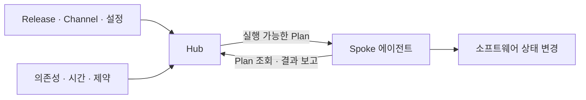

# Apollo 운영환경·설치·복구 책임 지도

## 결론과 사용 범위

Apollo의 가치를 검토할 때는 배포 기능의 개수보다 **동일 소프트웨어를 서로 다른 연결·보안 경계에서 변경하면서 어떤 책임을 공통화하고 무엇을 현장에 남길지**를 본다. 이 문서는 사용자가 보존을 요청한 보고서를 운영 판단에 재사용하도록 정리한 파생 분석이다. 제품 설치 표준이나 고객별 아키텍처를 대신하지 않는다.

[원문](../../research/palantir-apollo-operations-20260911/source-original.md)은 7개 절·9개 표·4개 Mermaid를 모두 보존한다. [출처 메모](../sources/palantir-apollo-operations-report-2026-09-11.md)와 [새 검증 원장](../../research/palantir-apollo-operations-20260911/README.md)의 S01–S14가 아래 제품 사실의 근거다. [독자용 심층 글](../../content/notes/온톨로지/palantir-apollo-operations-guide.md)은 각주·환경 비교·설치 표·네 현대 도식을 갖춘 설명본이며, [검증 플레이북](../playbooks/palantir-apollo-adoption-validation.md)은 실행 전 질문을 제공한다.

## 1. 제품 역할과 시간축을 분리한다

CI는 빌드·시험 결과물을 만들고, Apollo는 Product·Release·Channel과 환경 상태를 이용해 소프트웨어 변경을 조정한다(S01·S03). 현재 공개 구조는 Hub, Spoke, 에이전트, Plan, Constraints다. Product와 채널을 추적하고 적용 가능한 설정과 제약을 고려하므로 하나의 고정 Git target version으로만 설명하지 않는다(S02·S04).

원문의 2020 구조는 Apollo fleet control plane → 환경별 Skylab → host deployment agent → runtime으로 설명돼 있다. Git에 선언한 버전·설정과 SLS의 lifecycle script·하드웨어 요구·기본 설정도 역사적 구현의 설명이다. 그 개념적 역할은 유용하지만 현대 외부 API·모듈의 명칭과 같다고 가정하지 않는다. 원문의 첫 도식은 **L44–88**, 관련 표는 **L32–40**에 그대로 남아 있다.

설명용 개념 도식이며 포트·서버 배치·전체 내부 topology가 아니다. 현대 대응 도식과 세부 표는 공개 글의 「현재 구조는 Hub와 Spoke에서 출발합니다」에 있다.

## 2. 환경은 실행 위치·연결·승인 경계를 따로 기록한다

| 환경 | 공통화할 수 있는 대상 | 그대로 남는 책임 |
| --- | --- | --- |
| Public·multi-cloud | Release·채널·변경 판단 | 사업자별 IAM·region·network·storage·지원 범위 |
| Connected on-prem | 소프트웨어 버전·설정·관측 흐름 | 하드웨어, DNS·프록시·인증서, 고객 일정·운영자 |
| 정부·기밀 환경 | 승인 경계 안의 전달 절차 | offering별 심사·인가·변경 권한 |
| Intermittent edge | 연결 시 계획·상태 교환 | 장비 자원·대역폭·물리 보안·오래된 관측 |
| Air-gap | Hub 간 선택한 변경의 반입 | 검사·승인·전달, 내부 저장소·관측·복구 |

운영 분류이며 모든 대상의 지원 인증표가 아니다. 원문의 환경 표 **L102–109**와 두 번째 도식 **L119–138**을 보존했고, 새로운 사실은 S11의 Hub 간 반입 경로로 교정했다. AWS·Azure 등 특정 사업자의 역사적 적용이 모든 현행 관리형 서비스와 GCP까지의 동일 기능 보장을 뜻하지 않는다.

## 3. 설치 조건을 배포 모델의 범위 안에서 읽는다

Kubernetes Spoke는 CNCF 인증·커뮤니티 지원 배포판, 최소 3 compute node, x86_64, 초기 root 접근, 노드·control plane 통신, 기본 StorageClass·PV, egress 허용 목록과 환경 keypair·구성을 요구한다. **10 vCPU·16GB는 Spoke Control Plane 전체의 권장 자원**이지 노드당 최소치나 전체 workload 수요가 아니다(S05).

Helm 생애주기를 관리하는 `helm-chart-operator`, `apollo-auth-broker`, `expected-state-k8s` 등은 공개돼 있다(S06). wildcard Kubernetes RBAC 요구는 보안 검토 대상이며, 운영 편의를 이유로 권한 검토를 생략하지 않는다. 선택적 registry rewrite webhook의 TCP 9111을 전체 Apollo 방화벽 목록으로 잘못 축약하지 않는다.

원문의 설치 정보 부족 판단(L142–146)은 현대 문서로 일부 반증됐다. 그러나 모든 OS·장비·클라우드 서비스 지원, 전체 네트워크·agent 인증 사양, Hub 내부 HA와 계약 SLA까지 확보됐다는 뜻은 아니다.

## 4. 업데이트·승격·회수·복구를 다른 판단으로 기록한다

원문의 CI 역할표 **L181–190**와 세 번째 도식 **L148–173**은 빌드 이후 artifact·설정·canary·soak·rollout·recall 흐름을 보여준다. 현대 대응은 Product·Channel·Plan·Constraints와 승격 조건이다(S03·S04·S09).

Health를 제공하지 않는 Entity의 해당 승격 평가는 liveness와 시간에 의존하며 그 평가에서 실패를 판정할 수 없다(S09). 기술적으로 살아 있다는 사실과 업무 판단이 올바르다는 사실을 분리한다. Blue/green·rolling의 무중단 가능성은 replica·여유 자원·상태 관리·DB 호환성에도 달려 있다는 원문의 제한을 유지한다.

Recall은 Release의 추가 확산과 실행 중인 곳의 이탈 전략이다(S10). 실패한 Plan이 상태를 변경했다면 rollback Plan이 만들어지며, 자동·수동 suppression의 취급은 구별된다(S02·S04). 어느 경우든 소프트웨어 복원이 DB migration과 외부 업무 결과까지 취소한 것으로 기록하지 않는다.

## 5. 에어갭의 빠진 이미지를 별도 실패 사례로 본다

Source Hub에 artifact store 접근이 있으면 Bundle에 필요한 이미지를 넣을 수 있지만, 접근이 없으면 메타데이터만 묶일 수 있다. 이미지를 Target Hub 측 저장소로 옮기는 책임은 조직에 남는다(S11).

원문의 네 번째 도식 **L198–221**은 검증·snapshot·binary·검사·반입·local Apollo·내부 검증 순서다. 그대로 보존하되 현대 경로는 Source Hub → Bundle → 승인된 전달 → Target Hub → 내부 Plan, 그리고 조건부 별도 이미지 전달로 설명한다. 물리 매체가 모든 고객의 필수 방식인 것처럼 고정하지 않는다.

서명·출처, malware 검사, 반출입 통제, local registry·observability, patch SLA는 검토 항목이다. Apollo가 이 모든 조직 절차를 기본으로 대신한다고 주장하지 않는다. 인터넷 연결형의 즉시 배포와 에어갭의 승인 지연을 같은 지표로 비교하지 않는다.

## 6. 보안·관측·장애와 복구 책임을 잇는다

SAML federation 및 Palantir Auth 선택지, Team·자원 범위 RBAC는 공개돼 있다(S07·S08). 수동 변경 승인(S12), 환경 keypair(S05), 광범위한 Kubernetes 권한(S05)을 사람·CI·agent·service의 권한 책임으로 나눠 확인한다. 공개 SSO 지원을 모든 IdP·OIDC·agent credential lifecycle의 확인으로 확대하지 않는다.

원문의 보안 표 **L229–236**, 장애 확인 표 **L254–263**은 보존했다. 최신 triage는 채널·설정·제약 → Reported State 시점 → Plan → artifact → dependency·migration → Health → 로그·trace → 회수·복구로 재구성한다. 제약에 따른 대기, stale telemetry, 실행 실패, 업무 오류를 구분한다.

역사적 safe/unsafe logging, 내부 단절 관측, trace·thread dump·GC 진단과 큰 로그 규모는 원문 L225–250에 남긴다. 현재 고객의 데이터 경계·보존·SIEM·capacity는 별도 확인한다. 회사 인증과 구매하는 배포의 승인 경계 역시 다르다.

| 복구 책임 | 보존할 대상 | 실패 시 구별할 질문 |
| --- | --- | --- |
| 관리 계층 | Hub·Spoke 관리 기능·신뢰 | 관리 장애 중 서비스 실행과 신규 변경이 어떻게 달라지는가? 실제 동작 확인 필요. |
| Artifact | 승인된 이미지·패키지·의존성 | 저장소 손실 뒤 동일 Release를 확보할 수 있는가? |
| 구성·정책 | 설정·채널·권한·승인 이력 | 과거의 안전한 운영 조건을 재현할 수 있는가? |
| Workload data | DB·객체·업무 기록 | 데이터 손실·복구 시점과 외부 업무 보정을 누가 책임지는가? |

이 네 층은 원문 L273–279의 제안을 재사용한 것으로 공식 DR 등급이 아니다. 관리 계층의 HA, artifact·configuration 복원과 business-data 복원에 각기 RPO/RTO를 확인한다.

## 7. 비용·사례·도입 판단은 주장 상한을 유지한다

원문 TCO 표 **L287–294**의 높음·중간은 정성적 비용 압력이다. 기간·대상 수·연결·인력·장애 비용을 고정하지 않은 비교를 측정값으로 취급하지 않는다. 라이선스 외에 고객별 분기·현장 작업이 줄어드는지, 중앙 정책·보안 심사·저장소·관측 비용이 늘어나는지 함께 확인한다. 가격 단위·지원 tier·중대 장애 응답시간·이관 책임은 미확인이다.

Palantir 자체 운영, 2026 Accenture, 2024 Edgescale, 정부·국방 맥락은 원문 L300–312에 남긴다. 새로 확인한 Accenture·Live Edge 발표(S13–S14)는 협력 방향의 증거다. 독립 장기 ROI·고객 수·경쟁 승률로 확장하지 않는다. 원문의 2020 업데이트·로그 수치와 Security Forge 시연 세부는 재검증을 보류했다.

도입은 [플레이북](../playbooks/palantir-apollo-adoption-validation.md)에서 작은 격리 시험 서비스의 배포·실패·복구로 시작한다. 원문의 체크리스트 **L316–330**과 확실성 표 **L338–355**를 유지하되, 공개된 설치·인증 항목은 확인됨으로 바꾸고 가격·전체 지원·Hub HA는 미확인으로 남긴다. 설치 성공만으로 승격·중단·회수·재연결·반입 검증이 통과한 것은 아니다.

## 기존 지식과의 연결·기각한 대안

기존 34번 [Apollo 운영 변경 글](https://tteggu87.github.io/notes/%EC%98%A8%ED%86%A8%EB%A1%9C%EC%A7%80/palantir-apollo-operating-change)은 변경과 업무 책임의 입문 설명이므로 덮어쓰지 않는다. 이번 종합은 설치·운영환경·DR·TCO·도입 증거에 초점을 둔 후속 자료다. 기존 로컬 위키의 2026-09-09 Apollo 발표·출처와 Foundry·AIP use-case 플레이북을 읽었으며, 그 자료의 제품 사실·제안·실측 효과 구분을 재사용했다. 해당 탐색 경로는 수집 영수증에 기록한다.

원본의 모든 문장을 현행 사실로 재발행하는 안은 기각했다. 반대로 오류가 있는 대목과 역사적 수치를 삭제하는 안도 기각했다. 원본 보존 + 교정 원장 + 읽기용 종합으로 판단 근거를 남긴다.

## 3줄 요약

Apollo 도입의 단위는 설치 파일이 아니라 환경별 변경·관측·실패·복구의 책임이다.  
현행 Hub·Spoke·Plan, 공개 Kubernetes Spoke·SAML·RBAC 조건을 쓰되 역사적 구현과 미확인 계약을 섞지 않는다.  
작은 시험 서비스에서 반입 누락·Health 부재·회수·데이터 복구의 차이를 증거로 확인한 뒤 범위를 넓힌다.
